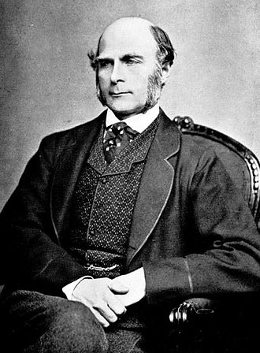
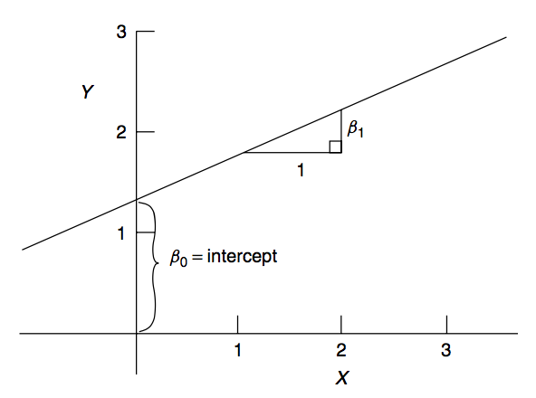
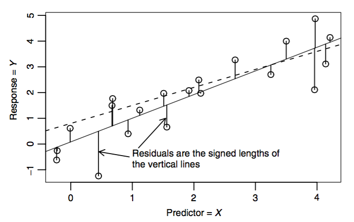
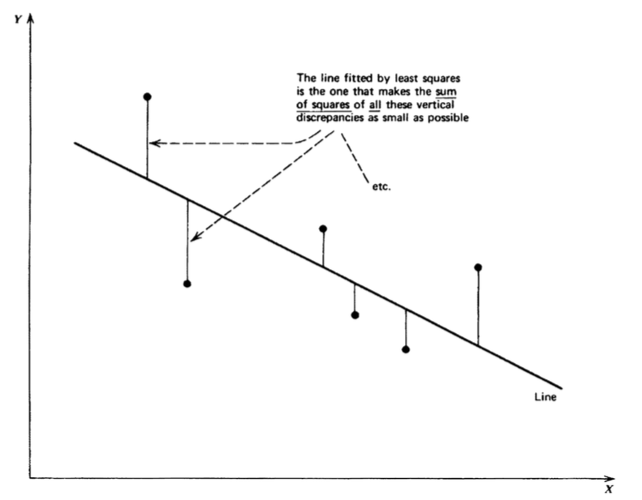
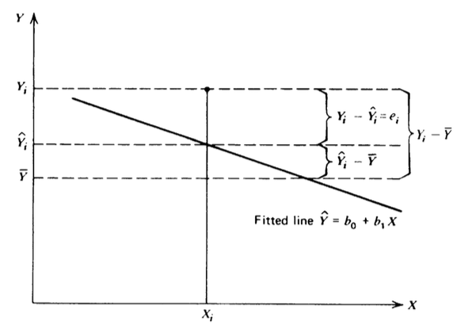
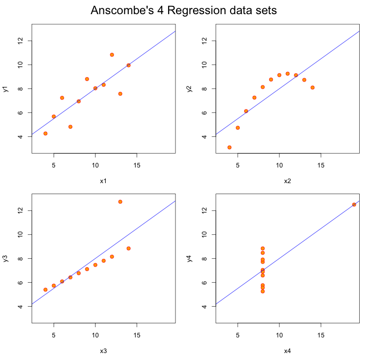
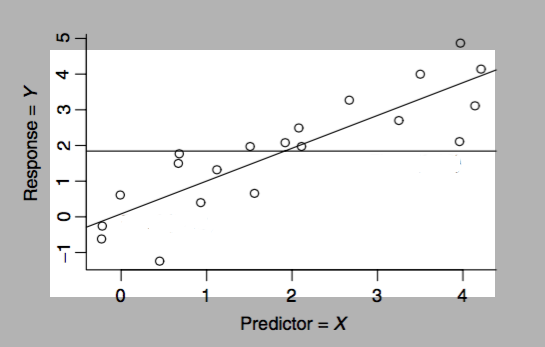

# Introdução

## Introdução

Análise de regressão é uma metodologia estatística que utiliza a relação entre duas ou mais variáveis de maneira que uma variável pode ser predita pela(s) outra(s).

É uma metodologia amplamente utilizada em diversas áreas, pois é de relativamente fácil interpretação.


## Francis Galton e os dados sobre altura {.build}

<center></center>


Galton inventou os conceitos de correlação e regressão.

> Em um de seus estudos, investigou a idéia de que filhos de pais altos eram altos, mas não tanto quanto seus pais. Filhos de pais mais baixos eram baixos, mas nem tanto quanto seus pais. 

> Ele se referiu a isso como "regressão para a média". Seus resultados foram publicados no artigo [Regression toward Mediocrity in Hereditary Stature](http://galton.org/essays/1880-1889/galton-1886-jaigi-regression-stature.pdf).

## Francis Galton e os dados sobre altura {.build}

O trabalho de Galton, publicado seu trabalho em 1886, ainda é relevante.

> Em 2009 pesquisadores compararam o modelo de Galton com modelos utilizando dados genômicos e o modelo de Galton se mostrou superior. Os resultados foram publicados no artigo [Predicting human height by Victorian and genomic methods](http://www.nature.com/ejhg/journal/v17/n8/full/ejhg20095a.html).

## {.build}

Considere que tenhamos interesse nas seguintes questões:

* Usar a altura dos pais para predizer a dos filhos.

> * Encontrar uma maneira simples de explicar a relação entre a altura média dos pais e a altura média dos filhos.

> * Investigar a variação na altura dos filhos que parece não estar relacionada com a altura dos pais (variação residual).

> * Descobrir quais as suposições são necessárias para generalizar as descobertas realizadas com os dados em mãos para outros dados. 

> * Por que filhos de pais muito altos tendem a ser altos, mas nem tanto quanto seus pais.

> * Por que filhos de pais muito baixos tendem a ser baixos, mas nem tanto quanto seus pais.

> Modelos de regressão podem nos ajudar a responder essas perguntas.


## Francis Galton e os dados sobre altura


```{r galton,fig.height=3.1,fig.width=8,message = F, warning = F,echo=FALSE, fig.align='center'}
library(UsingR); data(galton); library(reshape); long <- melt(galton)
g <- ggplot(long, aes(x = value, fill = variable)) 
g <- g + geom_histogram(colour = "black", binwidth=1) 
g <- g + facet_grid(. ~ variable)
g
```

* Dados de 1885, usados por Galton.

> * Observamos primeiramente as distribuições marginais: apenas dos pais, apenas dos filhos.

> * Alturas das mulheres foram multiplicadas por 1.08


## Encontrando o centro via mínimos quadrados {.build}

Considerando apenas as alturas dos filhos:

* Se você fosse tentar advinhar um valor para a altura de um dos filhos, utilizando apenas o histograma/dados dos filhos, como você faria?

> * Como descrever o "centro/meio"?

> * Um definição: seja $Y_i$ a altura do filho $i$ para $i = 1, \ldots, n = 928$, então definimos o centro como o valor de $\mu$ que minimiza $$\sum_{i=1}^n (Y_i - \mu)^2$$

> * É o centro de massa do histograma. 

> * Temos que $\mu = \bar Y$ (demonstrar!)

## Encontrando o centro via mínimos quadrados usando RStudio {.build}


```{r,echo=TRUE,eval=FALSE}
library(manipulate); library(ggplot2); library(UsingR)
data(galton)
library(manipulate); library(ggplot2); library(UsingR)
data(galton)

myHist <- function(mu){
  mse <- mean((galton$child - mu)^2)
  ggplot(galton, aes(x=child)) +
    geom_histogram(fill="salmon", colour="black", binwidth=1) +
    geom_vline(xintercept=mu, size = 3) +
    ggtitle(paste("mu = ", mu, ", MSE = ", round(mse, 2), sep = "")) +
    theme_bw()
}
manipulate(myHist(mu), mu = slider(62, 74, step = 0.5))
```

## A estimativa por mínimos quadrados é a média

```{r , fig.height=4, fig.width=4, fig.align='center',echo=FALSE}
xbarra = mean(galton$child)
mse <- mean((galton$child - xbarra)^2)
ggplot(galton, aes(x = child)) +
  geom_histogram(fill = "salmon", colour = "black", binwidth=1) +
  geom_vline(xintercept = mean(galton$child), size = 3) +
  ggtitle(paste("mu =",  round(xbarra,2), ", MSE =", round(mse, 2)))
```

$\bar{y}=`r round(xbarra, 2)`$

## Matematicamente {.smaller}

$$\begin{eqnarray} 
\sum_{i=1}^n (Y_i - \mu)^2 & = & \sum_{i=1}^n (Y_i - \bar Y + \bar Y - \mu)^2 \\ 
& = & \sum_{i=1}^n (Y_i - \bar Y)^2 + 2 \sum_{i=1}^n (Y_i - \bar Y) (\bar Y - \mu) + \sum_{i=1}^n (\bar Y - \mu)^2 \\ 
& = & \sum_{i=1}^n (Y_i - \bar Y)^2 + 2 (\bar Y - \mu) \sum_{i=1}^n (Y_i - \bar Y) + \sum_{i=1}^n (\bar Y - \mu)^2 \\ 
& = & \sum_{i=1}^n (Y_i - \bar Y)^2 + 2 (\bar Y - \mu) (\sum_{i=1}^n Y_i - n \bar Y) + \sum_{i=1}^n (\bar Y - \mu)^2 \\
& = & \sum_{i=1}^n (Y_i - \bar Y)^2 + \sum_{i=1}^n (\bar Y - \mu)^2\\ 
& \geq & \sum_{i=1}^n (Y_i - \bar Y)^2
\end{eqnarray}$$


## Utilizando os dados dos pais {.build}

* Será que utilizando a informação dos pais conseguimos uma predição melhor para a altura do filho?

> * Será que há alguma relação entre essas alturas? Como descobrir?

```{r, dependson="galton",fig.height=4,fig.width=4, fig.align='center',echo=FALSE}
ggplot(galton, aes(x = parent, y = child)) +
  geom_point() +
  theme_bw()
```

## Utilizando os dados dos pais

```{r freqGalton, dependson="galton",fig.height=5,fig.width=6,echo=FALSE,message=FALSE,warning=FALSE,fig.align='center'}
ggplot(galton, aes(parent, child)) +
  geom_hex() + theme_bw()
#library(dplyr)
#freqData <- as.data.frame(table(galton$child, galton$parent))
#names(freqData) <- c("child", "parent", "freq")
#freqData$child <- as.numeric(as.character(freqData$child))
#freqData$parent <- as.numeric(as.character(freqData$parent))
#ggplot(filter(freqData, freq > 0), aes(x = parent, y = child))  +
#  scale_size(range = c(2, 20), guide = "none" ) +
#  geom_point(colour="grey50", aes(size = freq+20, show_guide = FALSE)) +
#  geom_point(aes(colour=freq, size = freq)) +
#  scale_colour_gradient(low = "lightblue", high="white") +
#  theme_bw()
```

## Regressão pela origem {.build}

* Encontrar uma reta que melhor se ajusta aos pontos do gráfico.

> * $X_i$ é a altura média dos pais da criança $i$ e $Y_i$ é a altura da criança $i$.

> * $Y_i=\alpha+X_i\beta+\varepsilon_i$, isto é $\alpha+X_i\beta$ é a reta e $\varepsilon$ um termo de erro.

> * Precisamos encontrar o intercepto ($\alpha$) e o coeficiente angular ($\beta$) para definir a reta. Inicialmente, para simplificar, $\alpha=0$ (reta passa pela origem).

> * Procuramos $\beta$ que minimiza

$$\sum_{i=1}^n (Y_i - X_i \beta)^2$$

> * Estamos procurando uma reta, a partir da origem, que minimiza o quadrado das distâncias verticais dos pontos do gráfico até ela.


## 

```{r, echo = TRUE, eval = FALSE}
myPlot = function(beta){
  tmp = galton %>% mutate(parent=parent-mean(parent),
                          child=child-mean(child))
  mse = with(tmp, mean((child-(parent*beta))^2))
  ggplot(tmp, aes(parent, child)) +
    geom_hex() +
    geom_abline(intercept = 0, slope=beta) +
    ggtitle(paste("beta =", beta, " \t MSE =", round(mse, 4))) +
    theme_bw()
}
manipulate(myPlot(beta), beta=slider(0.44, 0.84, step=0.02))
```


## Solução direta pelo R 

```{r}
lm(I(child - mean(child))~ I(parent - mean(parent)) - 1, data = galton)
```

---
```{r, fig.height=6,fig.width=7,echo=FALSE,fig.align='center'}
fit = lm(child ~ parent -1, data=galton)
ggplot(galton, aes(parent, child)) +
  geom_hex() +
  geom_abline(slope=coef(fit)) +
  theme_bw()

# freqData <- as.data.frame(table(galton$child, galton$parent))
# names(freqData) <- c("child", "parent", "freq")
# freqData$child <- as.numeric(as.character(freqData$child))
# freqData$parent <- as.numeric(as.character(freqData$parent))
# g <- ggplot(filter(freqData, freq > 0), aes(x = parent, y = child))
# g <- g  + scale_size(range = c(2, 20), guide = "none" )
# g <- g + geom_point(colour="grey50", aes(size = freq+20, show_guide = FALSE))
# g <- g + geom_point(aes(colour=freq, size = freq))
# g <- g + scale_colour_gradient(low = "lightblue", high="white")                    
# lm1 <- lm(galton$child ~ galton$parent)
# g <- g + geom_abline(intercept = coef(lm1)[1], slope = coef(lm1)[2], size = 3, colour = grey(.5))
# g
```


# Regressão Linear Simples

## Modelo de Regressão Linear Simples {.build}


Em muitas situações a relação entre duas variáveis pode ser descrita por uma reta.

> Podemos assumir que a reta de regressão da variável $Y$ na variável $X$ tem a forma $\beta_0+\beta_1 X$. 

> Desta maneira, consideramos o modelo:

$$Y_i=\beta_0+\beta_1X_i+\varepsilon_i$$

ou seja, para um dado $X_i$, o valor correspondente de $Y_i$ consiste no valor $\beta_0+\beta_1X_i$ mais um termo $\varepsilon_i$, que é o incremento indicando a distância de $Y_i$ da reta $\beta_0+\beta_1X_i$.

##

<center></center>

## Estimação por Mínimos Quadrados {.build}

$\beta_0$, $\beta_1$ e $\varepsilon_i$ são desconhecidos.

$\varepsilon_i$ depende da observação $i$, mas $\beta_0$ e $\beta_1$ são constantes para todo $i$, portanto mais simples de serem estimados.


Suponha que tenhamos $n$ pares de observações: $(X_1,Y_1),(X_2,Y_2),\ldots,(X_n,Y_n)$.  Equação do modelo de regressão linear:

$$Y_i=\beta_0+\beta_1X_i+\varepsilon_i$$

A soma dos desvios ao quadrado de cada observação $Y_i$ até a reta $\beta_0+\beta_1X_i$ é dada por:

$$S=\sum_{i=1}^n\varepsilon_i^2 = \sum_{i=1}^n (Y_i-\beta_0-\beta_1X_i)^2$$


## Estimação por Mínimos Quadrados

<center></center>


## Estimação por Mínimos Quadrados

<center></center>


## Estimação por Mínimos Quadrados {.build}

Queremos encontrar $\hat{\beta}_0$ e $\hat{\beta}_1$ de tal forma que a reta resultante ao substituirmos esses valores no lugar de $\beta_0$ e $\beta_1$ minimiza a soma dos desvios ao quadrado.

$$\frac{\partial S}{\partial\beta_0}=-2\sum_{i=1}^n(Y_i-\beta_0-\beta_1X_i)$$

$$\frac{\partial S}{\partial\beta_1}=-2\sum_{i=1}^nX_i(Y_i-\beta_0-\beta_1X_i)$$

Igualamos cada equação acima a zero para encontrar $\hat{\beta}_0$ e $\hat{\beta}_1$ que minimizam $S$. 

## Estimação por Mínimos Quadrados {.build}


Equações normais:

$$\begin{eqnarray}
\sum_{i=1}^n(Y_i-\hat{\beta}_0-\hat{\beta}_1X_i)&=&0\\
\sum_{i=1}^nX_i(Y_i-\hat{\beta}_0-\hat{\beta}_1X_i)&=&0
\end{eqnarray}$$

ou

$$\begin{eqnarray}
\sum_{i=1}^n Y_i-n\hat{\beta}_0-\hat{\beta}_1\sum_{i=1}^nX_i&=&0\\
\sum_{i=1}^nX_iY_i-\hat{\beta}_0\sum_{i=1}^nX_i-\hat{\beta}_1\sum_{i=1}^nX_i^2&=&0
\end{eqnarray}
$$


## Estimação por Mínimos Quadrados {.build}

$$\hat{\beta}_1=\frac{\sum_{i=1}^n(X_i-\bar{X})(Y_i-\bar{Y})}{\sum_{i=1}^n(X_i-\bar{X})^2}$$

$$\hat{\beta}_0=\bar{Y}-\hat{\beta}_1\bar{X}$$

Obtemos então a **equação de regressão estimada**:

$$\hat{Y}_i=\hat{E}(Y\mid X=X_i)=\hat{\beta}_0+\hat{\beta}_1X_i=\bar{Y}+\hat{\beta}_1(X_i-\bar{X})$$

([vídeo](https://www.youtube.com/watch?v=COVQX8WZVA8&index=8&list=PLpl-gQkQivXjqHAJd2t-J_One_fYE55tC))


## Dados de Galton - estimação por mínimos quadrados

```{r, fig.height=5, fig.width=8, echo=FALSE,fig.align='center'}
library(UsingR)
data(galton)
library(dplyr); library(ggplot2)
freqData <- as.data.frame(table(galton$child, galton$parent))
names(freqData) <- c("child", "parent", "freq")
freqData$child <- as.numeric(as.character(freqData$child))
freqData$parent <- as.numeric(as.character(freqData$parent))
g <- ggplot(filter(freqData, freq > 0), aes(x = parent, y = child))
g <- g  + scale_size(range = c(2, 20), guide = "none" )
g <- g + geom_point(colour="grey50", aes(size = freq+20, show_guide = FALSE))
g <- g + geom_point(aes(colour=freq, size = freq))
g <- g + scale_colour_gradient(low = "lightblue", high="white")  
g
```

## Dados de Galton - estimação por mínimos quadrados {.build}

* Seja $Y_i$ a altura da criança $i$ e $X_i$ a altura média dos pais da criança $i$. 

> * Encontrar a "melhor reta" (que minimiza $S$) 

>  * $Y_i = \beta_0 + \beta_1 X_i$

> * Mínimos quadrados: minimizar
  $$
  S=\sum_{i=1}^n \{Y_i - (\beta_0 + \beta_1 X_i)\}^2
  $$

> * Resultado: $\hat{\beta}_1=\frac{\sum_{i=1}^n(X_i-\bar{X})(Y_i-\bar{Y})}{\sum_{i=1}^n(X_i-\bar{X})^2} = Cor(X,Y)\frac{DP(Y)}{DP(X)}$ e $\hat{\beta}_0=\bar{Y}-\hat{\beta}_1\bar{X}$.

## Usando o R

O R tem a função `lm` para ajuste de regressão linear.

```{r, fig.height=4,fig.width=4,echo=TRUE}
y <- galton$child
x <- galton$parent
beta1 <- cor(y, x) *  sd(y) / sd(x)
beta0 <- mean(y) - beta1 * mean(x)
rbind(c(beta0, beta1), coef(lm(y ~ x)))
```

## 

```{r, fig.height=5,fig.width=5,echo=FALSE,fig.align='center'}
g <- ggplot(filter(freqData, freq > 0), aes(x = parent, y = child))
g <- g  + scale_size(range = c(2, 20), guide = "none" )
g <- g + geom_point(colour="grey50", aes(size = freq+20, show_guide = FALSE))
g <- g + geom_point(aes(colour=freq, size = freq))
g <- g + scale_colour_gradient(low = "lightblue", high="white")  
g <- g + geom_smooth(method="lm", formula=y~x)
g
```

$\hat{\beta}_0=`r beta0`$ e $\hat{\beta}_1=`r beta1`$.

# Propriedades dos estimadores


## Suposições do modelo de regressão linear simples {.build}

Nenhuma suposição sobre distribuição de probabilidade foi feita até o momento.

A partir de agora iremos assumir:

1. $$Y_i=\beta_0+\beta_1X_i+\varepsilon_i\quad i=1,2,\ldots,n$$

2. $\varepsilon_i$ \e uma v.a. em que $E(\varepsilon_i)=0$ e $Var(\varepsilon_i)=\sigma^2$ desconhecida, para $i=1,2,\ldots,n$.

3. $\varepsilon_i$ e $\varepsilon_j$ são não-correlacionados para $i\neq j$, portanto $Cov(\varepsilon_i,\varepsilon_j)=0$ para $i\neq j$.

## Propriedades de $Y_i$ {.build}

O valor esperado para a resposta $Y_i$ é:

$$\begin{eqnarray}
E(Y_i) & = & E(\beta_0+\beta_1 X_i+\varepsilon_i)\\
&=&\beta_0+\beta_1X_i+E(\varepsilon_i)\\
&=&\beta_0+\beta_1X_i
\end{eqnarray}
$$

> A variância para a resposta $Y_i$ é:

$$\begin{eqnarray}
Var(Y_i) & = & Var(\beta_0+\beta_1 X_i+\varepsilon_i)\\
&=&Var(\varepsilon_i)=\sigma^2
\end{eqnarray}
$$

> A resposta $Y_i$ vem de uma distribuição de probabilidade com  $E(Y_i)=\beta_0+\beta_1X_i$ (**função de regressão**) e $Var(Y_i)=\sigma^2$. A resposta, $Y_i$ está acima ou abaixo da função de regressão por um termo de erro $\varepsilon_i$.

## Propriedades de $\hat{\beta}_1$

$$\begin{eqnarray}
\hat{\beta}_1 &=& \frac{\sum_{i=1}^n(X_i-\bar{X})(Y_i-\bar{Y})}{\sum_{i=1}^n(X_i-\bar{X})^2}\\
&=&\frac{1}{\sum_{i=1}^n(X_i-\bar{X})^2}\left(\sum_{i=1}^n(X_i-\bar{X})Y_i-\sum_{i=1}^n(X_i-\bar{X})\bar{Y}  \right)\\
&=&\frac{1}{\sum_{i=1}^n(X_i-\bar{X})^2}\left(\sum_{i=1}^n(X_i-\bar{X})Y_i-\underbrace{\sum_{i=1}^n(X_i-\bar{X})}_{0}\bar{Y}  \right)\\
&=& \frac{\sum_{i=1}^n\color{red}{(X_i-\bar{X})}Y_i}{\color{red}{\sum_{i=1}^n(X_i-\bar{X})^2}}=\sum_{i=1}^n\color{red}{a_i}Y_i
\end{eqnarray}$$

## Propriedades de $\hat{\beta}_1$

$$\begin{eqnarray}
E(\hat{\beta}_1) &=& E\left(\sum_{i=1}^na_iY_i\right)=\sum_{i=1}^na_iE(Y_i)\\
&=&\sum_{i=1}^na_i(\beta_0+\beta_1X_i)=\beta_0\sum_{i=1}^na_i+\beta_1\sum_{i=1}^na_iX_i\\
&=&\beta_0\underbrace{\sum_{i=1}^na_i}_0+\beta_1\underbrace{\sum_{i=1}^na_iX_i}_1\\
&=&\beta_1
\end{eqnarray}$$


## Propriedades de $\hat{\beta}_1$

$$\begin{eqnarray}
Var(\hat{\beta}_1) &=& Var\left(\sum_{i=1}^n a_iY_i \right)\\
&=&\sum_{i=1}^na_i^2Var(Y_i)=\sum_{i=1}^na_i^2\sigma^2\\
&=&\sigma^2\sum_{i=1}^na_i^2\\
&=&\frac{\sigma^2}{\sum_{i=1}^n(X_i-\bar{X})^2}
\end{eqnarray}$$


## Precisão de $\hat{\beta}_0$ {.build}

**Mostre$^1$** que

$$Var(\hat{\beta}_0) = \sigma^2\left (\frac{1}{n} + \frac{\bar{X}^2}{\sum_{i=1}^n(X_i-\bar{X})^2} \right)$$

**Mostre$^2$** que

$$Cov(\hat{\beta}_0,\hat{\beta}_1)= -\sigma^2\frac{\bar{X}}{\sum_{i=1}^n(X_i-\bar{X})^2}$$

**Mostre$^3$** que $E(\hat{\beta}_0)=\beta_0$.

## Propriedades dos estimadores

Não importa a distribuição de probabilidade de $\varepsilon_i$ (anteriormente definimos apenas os momentos nas suposições do modelo), o método de mínimos quadrados fornece estimadores não-viesados para $\beta_0$ e $\beta_1$.


## Análise de Variância {.build}

Quanto da variabilidade dos dados foi capturada pela reta ajustada?

> $$Y_i-\hat{Y}_i=Y_i-\bar{Y}-(\hat{Y}_i-\bar{Y})$$

> O resíduo $e_i=Y_i-\hat{Y}_i$ é a diferença entre:

 1. o valor observado $Y_i$ e a média $\bar{Y}$
 2. o valor ajustado $\hat{Y}_i$ e a média $\bar{\hat{Y}}=\bar{Y}$.


## Análise de Variância


<center></center>

## Análise de Variância

$$(Y_i-\bar{Y})=(\hat{Y}_i-\bar{Y})+(Y_i-\hat{Y}_i)$$

**Mostre$^4$** que elevando ambos os lados da equação ao quadrado e somando, temos:

$$\sum_{i=1}^n(Y_i-\bar{Y})^2=\sum_{i=1}^n(\hat{Y}_i-\bar{Y})^2+\sum_{i=1}^n(Y_i-\hat{Y}_i)^2$$


[comment]: <> (Draper capt 1 secao 1.3)


## Análise de Variância

$$
\underbrace{\sum_{i=1}^n(Y_i-\bar{Y})^2}_{SQT}=\underbrace{\sum_{i=1}^n(\hat{Y}_i-\bar{Y})^2}_{SQReg}
+\underbrace{\sum_{i=1}^n(Y_i-\hat{Y}_i)^2}_{SQE}$$

* **SQT** é a soma dos quadrados total (ajustada), representa a variação total de $Y$ em torno de sua média.

* **SQReg** é a soma de quadrados da regressão, representa a variação total de $\hat{Y}$ em torno de sua média.

* **SQE** é a soma dos quadrados do erro, representa a variação de $Y$ em torno da reta ajustada.

## Análise de Variância {.build}

Queremos avaliar quão bom é nosso modelo de regressão.

> Caso ideal: todas as observações se ajustam perfeitamente à reta. Neste caso: $SQE=\sum_{i=1}^n(Y_i-\hat{Y}_i)^2=0$.

> Para avaliar o modelo: observar quanto da $SQT$ está contida em $SQReg$ e quanto está na $SQE$.

> Podemos utilizar para avaliar o modelo: $$R^2=\frac{\sum_{i=1}^n(\hat{Y}_i-\bar{Y})^2}{\sum_{i=1}^n(Y_i-\bar{Y})^2}$$

conhecido como **coeficiente de determinação**, que é a proporção da variabilidade total explicada pelo modelo de regressão ajustado.

##

Cuidado!

```{r,echo=FALSE,eval=FALSE}
data(anscombe)
example(anscombe)
```

<center></center>

$R^2=0.66$ em todos os exemplos acima.

## Análise de Variância

Fonte de Variação  | gl        | SQ                                         
------------------ | ----------|--------------------------------------------
Regressão          |  $1$      | $SQReg=\sum_{i=1}^n(\hat{Y}_i-\bar{Y})^2$  
Erro               |  $n-2$    | $SQE=\sum_{i=1}^n(Y_i-\hat{Y})^2$          
Total (ajustada)   |  $n-1$    | $SQT=\sum_{i=1}^n(Y_i-\bar{Y})^2$          

## Análise de Variância {.build}

Utilizamos a tabela de análise de variância para comparar dois modelos:

1. $Y_i=\beta_0+\varepsilon_i\quad i=1,2,\ldots,n$

2. $Y_i=\beta_0+\beta_1X_i+\varepsilon_i\quad i=1,2,\ldots,n$

Para o modelo 1, vimos que $\hat{\beta}_0=\bar{Y}$, portanto a soma dos quadrados dos resíduos deste modelo é dada por:

$$\sum_{i=1}^n(Y_i-\hat{\beta}_0)^2=\sum_{i=1}^n(Y_i-\bar{Y})^2$$

Para o modelo 2, a soma dos quadrados dos resíduos é dada por:

$$\sum_{i=1}^n(Y_i-\hat{Y}_i)^2$$$


## Análise de Variância

<center></center>

Comparando modelo 1 (reta horizontal, $X$ e $Y$ não apresentam relação linear) com o modelo 2.


## $\sigma^2$ é desconhecido {.build}

Como $\sigma^2$ \e desconhecido, $Var(\hat{\beta}_0)$, $Var(\hat{\beta}_1)$ e $Cov(\hat{\beta}_0,\hat{\beta}_1)$  também são desconhecidos.

Um estimador não viesado para $\sigma^ 2$ é:

$$s^2=QME=\frac{SQE}{n-2}=\frac{\sum_{i=1}^n(Y_i-\hat{Y}_i)^2}{n-2}$$

[comment]: <> (Kutner 1.7 pag 24, Weisberg 2.3 pag 25)

## Agradecimento

* Slides criados por Samara F Kiihl / IMECC / UNICAMP

## Leitura

* Applied Linear Statistical Models: Seções 1.1 a 1.7, 2.1, 2.2.

* Caffo - [Regression Models for Data Science in R](https://leanpub.com/regmods): Introduction, Notation, Ordinary least squares, Regression to the mean, Statistical linear regression models, Residuals.

* Draper & Smith - [Applied Regression Analysis](http://onlinelibrary.wiley.com/book/10.1002/9781118625590): Capítulo 0, 1.1 a 1.3.

* Weisberg - [Applied Linear Regression](http://unicampbr.summon.serialssolutions.com/2.0.0/link/0/eLvHCXMwrV1NSwMxEB1EDyoFv22tSs5Ca5JdN9mTWLX0oljwXqZJCh5cy3YF_fdmku0KhXryGCZfhCQzTN57AUhkn_dW7oQURSaFUUamqDBVM41CckyN0M5wNOFP23w8Vs8jUs0Z_PWASqSJ9_m1_TAPAWXZjwyAW1sHtaTYJolf7l0ZHdW7QfKbdeH0DMjDl0F-M-vM166Fn5Zl3VCOIiIyOJrh3n_MaR-2HFEYDmDDFYew-9Qosy6O4CpcA4ySYm7B3gr2UvoTHRCy3wwLyyj6jOLNx3A5fHy9H_XiNCbzKEwxWY6TnEALCSBfVIFIZ9vAfCiHWjlhUU0pm6YxkQptluezG8wV78Dpmt460F2xVF9VYz1b264LOz66qGEu57BZlZ_uArbrtZqWP8hqnhA
): Capítulo 1, 2.1 a 2.5, 2.7.


<center></center>

