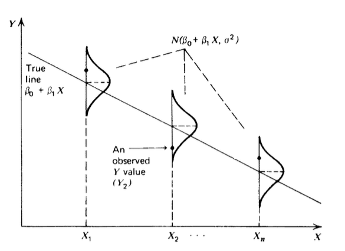
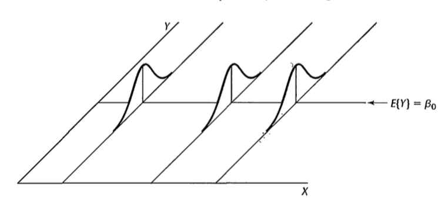

# Propriedades dos estimadores

## Suposições do modelo de regressão linear simples

Até o momento, apenas suposições sobre esperança, variância e correlação foram feitas. 

Desta forma, sabemos que os estimadores são não viesados e sabemos também quão precisos eles são. 

No entanto, para construirmos intervalos e confiança, precisamos conhecer a distribuição de probabilidade desses estimadores.

## Suposições do modelo de regressão linear simples {.build}

A partir de agora iremos assumir:

1. $Y_i=\beta_0+\beta_1X_i+\varepsilon_i\quad i=1,2,\ldots,n$

2. $\varepsilon_i$ \e uma v.a. que segue a distribuição **Normal** em que $E(\varepsilon_i)=0$ e $Var(\varepsilon_i)=\sigma^2$ desconhecida, para $i=1,2,\ldots,n$.

3. $\varepsilon_i$ e $\varepsilon_j$ são não-correlacionados para $i\neq j$, portanto $Cov(\varepsilon_i,\varepsilon_j)=0$ para $i\neq j$.

> A suposição 3 implica em independência entre as observações $i$ e $j$, $i\neq j$, no caso de normalidade. Desta maneira, utilizando as suposições 2 e 3, temos que $\varepsilon_i$'s são iid.


## Propriedades de $Y_i$ {.build}

Já tínhamos visto que valor esperado para a resposta $Y_i$ é:

$$
E(Y_i)=\beta_0+\beta_1X_i
$$

> E a variância para a resposta $Y_i$ é:

$$
Var(Y_i)=\sigma^2
$$

> Utilizando a suposição 2, temos que a resposta $Y_i$ vem de uma **distribuição Normal** com  $E(Y_i)=\beta_0+\beta_1X_i$ (**função de regressão**) e $Var(Y_i)=\sigma^2$. 

> A resposta, $Y_i$ está acima ou abaixo da função de regressão por um termo de erro $\varepsilon_i$ que segue a **distribuição Normal**.


## Propriedades de $Y_i$ 


<center></center>

## Distribuição amostral de $\hat{\beta}_1$ {.build}

$$\hat{\beta}_1=\frac{\sum_{i=1}^n(X_i-\bar{X})Y_i}{\sum_{i=1}^n(X_i-\bar{X})^2}$$

> Suponha que tenhamos $X_i$'s fixos, mas que observamos $Y_i$'s várias vezes. A cada vez $\hat{\beta}_1$ será diferente. 

> $\hat{\beta}_1$ muda conforme mudamos nossa amostra. Desta forma, devemos estudar sua distribuição amostral.

> A distribuição amostral de $\hat{\beta}_1$ dependerá das suposições que fizermos para o modelo de regressão.


## Distribuição amostral de $\hat{\beta}_1$ {.build}


Vimos que, sem suposição de distribuição de probabilidade, apenas com o momentos definidos, temos que:

$$E(\hat{\beta}_1)=\beta_1$$

$$Var(\hat{\beta}_1)=\frac{\sigma^2}{\sum_{i=1}^n(X_i-\bar{X})^2}$$

> Se supomos que $\varepsilon_i\underset{iid}{\sim}\mathcal{N}(0,\sigma^2)$, temos:

$$\hat{\beta}_1\sim\mathcal{N}\left(\beta_1,\frac{\sigma^2}{\sum_{i=1}^n(X_i-\bar{X})^2}\right)$$


## Distribuição amostral de $\hat{\beta}_1$ {.build}

Padronizando, temos que:

$$\frac{\hat{\beta}_1-\beta_1}{\sqrt{Var(\hat{\beta}_1)}}\sim\mathcal{N}(0,1)$$

> Problema: $Var(\hat{\beta}_1)$ depende de $\sigma^2$, portanto é desconhecida.

## Relembrando distribuição $t$-Student {.build}

Sejam $Z\sim\mathcal{N}(0,1)$ e $V\sim\chi^2_{\nu}$, **independentes**, então

$$T=\frac{Z}{\sqrt{V/\nu}}\sim t_{\nu}$$


> **Mostre$^1$** que

$$\frac{\hat{\beta}_1-\beta_1}{\sqrt{\widehat{Var(\hat{\beta}_1)}}}\sim\mathcal{t}_{n-2}$$

em que $$\widehat{Var(\hat{\beta}_1)}=\frac{s^2}{\sum_{i=1}^n(X_i-\bar{X})^2}\quad \mbox{e} \quad s^2=\frac{\sum_{i=1}^n(Y_i-\hat{Y}_i)^2}{n-2}$$

[coment]: <> (lecture_2.pdf)

# Intervalos de confiança para os estimadores


## Intervalo de confiança para $\beta_1$ {.build}

$$\hat{\beta}_1=\frac{\sum_{i=1}^n(X_i-\bar{X})Y_i}{\sum_{i=1}^n(X_i-\bar{X})^2}$$

$$\widehat{Var(\hat{\beta}_1)}=\frac{s^2}{\sum_{i=1}^n(X_i-\bar{X})^2}$$


Um intervalo de $100(1-\alpha)\%$ de confiança para $\beta_1$ é dado por:

$$\begin{eqnarray}
IC(\beta_1, 1-\alpha) &=& \left[\hat{\beta}_1 -t_{n-2,\alpha/2}\sqrt{\frac{s^2}{\sum_{i=1}^n(X_i-\bar{X})^2}};\right.\\
& &\left. \hat{\beta}_1 +t_{n-2,\alpha/2}\sqrt{\frac{s^2}{\sum_{i=1}^n(X_i-\bar{X})^2}}\right]
\end{eqnarray}$$

## Intervalo de confiança para $\beta_0$ {.build}

Especificamente, para o intercepto, temos que:

$$\hat{\beta}_0=\bar{Y}-\hat{\beta}_1\bar{X}$$

$$\widehat{Var(\hat{\beta}_0)} = s^2\left (\frac{1}{n} + \frac{\bar{X}^2}{\sum_{i=1}^n(X_i-\bar{X})^2} \right)$$

## Intervalo de confiança para $\beta_0$

Um intervalo de $100(1-\alpha)\%$ de confiança para $\beta_0$ é dado por:

$$\begin{eqnarray}
IC(\beta_0, 1-\alpha) &=& \left[\hat{\beta}_0 -t_{n-2,\alpha/2}\sqrt{s^2\left (\frac{1}{n} + \frac{\bar{X}^2}{\sum_{i=1}^n(X_i-\bar{X})^2} \right)};\right.\\
& &\left. \hat{\beta}_0 +t_{n-2,\alpha/2}\sqrt{s^2\left (\frac{1}{n} + \frac{\bar{X}^2}{\sum_{i=1}^n(X_i-\bar{X})^2} \right)}\right]
\end{eqnarray}$$

## Como encontrar $t_{n-2,\alpha/2}$
$$T\sim t_{n-2}$$
$$P(-t_{n-2,\alpha/2} < T < t_{n-2,\alpha/2}) = 1-\alpha$$

<center>
```{r, echo=FALSE, results='hide', fig.height=4, fig.width=6,message=FALSE,warning=FALSE}
library(openintro, verbose=FALSE)
par(mar=c(2, 4, 1, 1) + 0.1)
normTail(U = 2,L=-2,
         col = COL[1],
         xlim = c(-3, 3),
         axes  =  FALSE,
         lwd  =  2)
at <- c(-2, 0,2)
labels <- expression(-t[alpha/2], 0,t[alpha/2])
axis(1, at, labels, cex.axis = 1)
yMax <- 0.4

text(0, yMax * 0.4, labels= expression('área '* 1-alpha), cex = 1.2)
arrows(2.5, yMax / 2,
       2.5, yMax / 10,
       length = 0.1,
       col = COL[1],
       lwd = 1.5)
text(2.5, yMax / 2, labels= expression('área '* alpha/2),
     pos = 3,
     cex = 1.2,
     col = COL[1])


arrows(-2.5, yMax / 2,
       -2.5, yMax / 10,
       length = 0.1,
       col = COL[1],
       lwd = 1.5)
text(-2.5, yMax / 2, labels= expression('área '* alpha/2),
     pos = 3,
     cex = 1.2,
     col = COL[1])
```
</center>


## Distribuição $t$-student e Normal Padrão

Para $n$ grande a distribuição $t$-student se aproxima da normal padrão $N(0,1)$.

<center>
```{r, echo=FALSE, fig.height=4.5, fig.width=6}
library(RColorBrewer)
mycol <- brewer.pal(8,"Dark2")

par(mar=c(4, 4, 1, 2) + .1)
curve(dnorm(x, mean=0, sd=1), -5, 5, bty="l", ylim=c(0, 0.4), yaxs = "i", xaxs="i", 
      main="", ylab="f(x)", cex.lab=1.3, cex.axis=1.3, 
      cex.main=1.3, col=1, lwd=2, las=1)
curve(dt(x, df=3), -5, 5, n=1000, col=mycol[4], lwd=2, add=TRUE)
curve(dt(x, df=5), -5, 5, col=mycol[3], lwd=2, add=TRUE)
curve(dt(x, df=10), -5, 5, col=mycol[1], lwd=2, add=TRUE)
legend("topright", legend=c("N(0,1)","t(n=3)","t(n=5)","t(n=10)"),
       lwd=2, col=c(1, mycol[c(4,3,1,6)]), cex=1, bty="n")
```
</center>

# Teste de Hipóteses

## Revisão: Testes de Hipóteses

* Hipótese nula: $H_0$

* Hipótese alternativa: $H_a$

* Estatística do teste

* Nível de significância

* Região de rejeição

## Revisão: Testes de Hipóteses

Erros:

* Erro do Tipo I: $H_0$ é rejeitada quando é verdadeira. A probabilidade do erro tipo I é $\alpha$ (nível de significância do teste).

* Erro do Tipo II: $H_0$ não é rejeitada quando $H_a$ é verdadeira. A probabilidade do erro tipo II é $\beta$.


Decisão       | $H_0$ é verdadeira | $H_a$ é verdadeira
------------- | ------------------ | ------------------
Aceita $H_0$  | Correto            | Erro Tipo II
Rejeita $H_0$ | Erro Tipo I        | Correto


## Teste de Hipóteses para $\beta_1$

* $H_0$: $\beta_1=0$

* $H_a$: $\beta_1\neq 0$

<center></center>

## Teste de Hipóteses para $\beta_1$ {.build}

> Usaremos como estatística do teste nosso estimador: $\hat{\beta}_1$.

> Se o valor observado, isto é, a estimativa $\hat{\beta}_1$ estiver longe de 0, temos evidências contra $H_0$.

> Quão longe? 

> Temos que levar em conta a distribuição de probabilidade do estimador $\hat{\beta}_1$ quando $H_0$ é verdadeira:

$$\frac{\hat{\beta}_1-\beta_1}{\sqrt{\widehat{Var(\hat{\beta}_1)}}}\overset{H_0:\beta_1=0}{=}\frac{\hat{\beta}_1}{\sqrt{\widehat{Var(\hat{\beta}_1)}}}\overset{H_0:\beta_1=0}{\sim}\mathcal{t}_{n-2}$$

## Exemplo: Empresa Toluca {.build}

A empresa Toluca fabrica equipamentos de refrigeração e peças de reposição. 

> No passado, uma das peças de reposição era produzida periodicamente em lotes de tamanhos variável.

> Para reduzir os custos, o diretor da empresa queria que se determinasse o tamanho ótimo do lote.

> Para descobrir o tamanho ideal do lote é de extrema importância avaliar a relação entre tamanho do lote de total de horas trabalhadas na produção do mesmo.

> Para tanto, avaliou-se o tamanho do lote e o número de horas para 25 lotes recentemente produzidos.

## Exemplo: Empresa Toluca

$V1$: tamanho do lote

$V2$: horas trabalhadas para produzir o lote

10 primeiras observações do conjunto de dados:

```{r,echo=FALSE}
#dados <- read.table("http://www.stat.ufl.edu/%7Errandles/sta4210/Rclassnotes/data/textdatasets/KutnerData/Chapter%20%201%20Data%20Sets/CH01TA01.txt")
dados <- read.table("./dados/CH01TA01.txt")
dados[1:10,]
```

## Exemplo: Empresa Toluca {.build}

$Y_i$: horas trabalhadas para produzir o lote $i$

$X_i$: tamanho do lote $i$

$Y_i=\beta_0+\beta_1X_i+\varepsilon_i$

```{r,echo=FALSE,fig.height=3.5, fig.width=5,fig.align='center',warning=FALSE,message=FALSE}
library(ggplot2)
ggplot(dados,aes(x=V1,y=V2))+geom_point(shape=1) + ylab("Horas trabalhadas")+xlab("Tamanho do lote")
```

## Exemplo: Empresa Toluca

```{r,echo=FALSE}
fit <- lm(V2 ~ V1,data=dados)
summary(fit)
```

## Exemplo: Empresa Toluca {.build}

$\hat{\beta_1}=`r round(fit$coef[2],2)`$

$\hat{\beta_0}=`r round(fit$coef[1],2)`$

Estimamos que o número médio de horas trabalhadas aumenta em $`r round(fit$coef[2],2)`$ para cada unidade adicional produzida no lote.

Esta estimativa se aplica a tamanhos de lote utilizados na análise: `r min(dados$V1)` a `r max(dados$V1)`.

$\hat{E}(Y|X)=\hat{Y}=`r round(fit$coef[1],2)`+`r round(fit$coef[2],2)`X$.

Desta forma, com a equação acima, podemos estimar o número esperado de horas trabalhadas para qualquer tamanho de lote.

## Exemplo: Empresa Toluca {.build}

Por exemplo, segundo o modelo ajustado:

* para um lote de tamanho 30, temos que o número esperado de horas trabalhadas é `r round(fit$coef[1]+fit$coef[2]*30,2)`.

* para um lote de tamanho 40, temos que o número esperado de horas trabalhadas é `r round(fit$coef[1]+fit$coef[2]*40,2)`.

Observe que este valores são esperados e que há uma variabilidade ao redor desde valor.

Por exemplo: para lotes de tamanho 30, o valor esperado é `r round(fit$coef[1]+fit$coef[2]*30,2)`, mas chegamos a observar `r dados$V2[dados$V1==30]` nos dados.

Para lotes de tamanho 40, o valor esperado é `r round(fit$coef[1]+fit$coef[2]*40,2)`, mas chegamos a observar `r dados$V2[dados$V1==40]` nos dados.


## Exemplo: Empresa Toluca

```{r,echo=FALSE,fig.align='center'}
library(ggplot2)
ggplot(dados,aes(x=V1,y=V2))+geom_point(shape=1) + geom_smooth(method=lm,se=FALSE) + ylab("Horas trabalhadas")+xlab("Tamanho do lote")
```


# Predição

## Predição {.build}

A função ajustada, $\hat{Y}_i=\hat{E}(Y\mid X=X_i)$ pode ser usada para obter valores para a variável resposta para qualquer valor da variável preditora.


> É importante distinguir dois problemas diferentes: predição e estimação de valores ajustados.

> Em predição, temos uma nova observação cujo valor da variável preditora é $X^*$, possivelmente uma observação futura, não utilizada nas estimativas dos parâmetros.

> Queremos saber o valor de $Y^*$ correspondente, mas que ainda não foi observado.


## Predição {.build}

Podemos usar a reta estimada de maneira que uma predição pontual de $Y^*$, indicada por $\tilde{Y}^*$ é dada por:

> $$\tilde{Y}^*=\hat{\beta}_0+\hat{\beta}_1X^*_i$$

> Quão precisa é esta estimativa? 

$$Var(\tilde{Y}^*\mid X=X^*_i)=\sigma^2+\sigma^2\left( \frac{1}{n}+\frac{(X^*_i-\bar{X})^2}{\sum_{i=1}^n(X_i-\bar{X})^2} \right)$$

> (ver [seção 2.6.3](http://site.ebrary.com/lib/unicamp/reader.action?ppg=52&docID=10867127&tm=1457111302091))

## Exemplo: precificação de diamantes

```{r,message=FALSE,warning=FALSE}
library(UsingR); data(diamond)
y <- diamond$price; x <- diamond$carat; n <- length(y)
beta1 <- cor(y, x) * sd(y) / sd(x)
beta0 <- mean(y) - beta1 * mean(x)
e <- y - beta0 - beta1 * x
sigma <- sqrt(sum(e^2) / (n-2)) 
ssx <- sum((x - mean(x))^2)
seBeta0 <- (1 / n + mean(x) ^ 2 / ssx) ^ .5 * sigma 
seBeta1 <- sigma / sqrt(ssx)
tBeta0 <- beta0 / seBeta0; tBeta1 <- beta1 / seBeta1
pBeta0 <- 2 * pt(abs(tBeta0), df = n - 2, lower.tail = FALSE)
pBeta1 <- 2 * pt(abs(tBeta1), df = n - 2, lower.tail = FALSE)
coefTable <- rbind(c(beta0, seBeta0, tBeta0, pBeta0), c(beta1, seBeta1, tBeta1, pBeta1))
colnames(coefTable) <- c("Estimate", "Std. Error", "t value", "P(>|t|)")
rownames(coefTable) <- c("(Intercept)", "x")
```


## Exemplo: precificação de diamantes

```{r}
coefTable
fit <- lm(y ~ x); 
summary(fit)$coefficients
```

## Exemplo: precificação de diamantes

IC para o intercepto:
```{r}
sumCoef <- summary(fit)$coefficients
sumCoef[1,1] + c(-1, 1) * qt(.975, df = fit$df) * sumCoef[1, 2]
```

Equivalente:
```{r}
confint(fit)[1,]
```

## Exemplo: precificação de diamantes


IC para o aumento de preço para 0.1 carat de aumento no tamanho do diamante:
```{r}
(sumCoef[2,1] + c(-1, 1) * qt(.975, df = fit$df) * sumCoef[2, 2]) / 10
```

Equivalente:
```{r}
confint(fit)[2,]/10
```

Com 95% de confiança, estimamos que um aumento de 0.1 carat no tamanho do diamante resulta em um aumento médio entre `r round((sumCoef[2,1] - qt(.975, df = fit$df) * sumCoef[2, 2]) / 10, 1)` e `r round((sumCoef[2,1] + qt(.975, df = fit$df) * sumCoef[2, 2]) / 10, 1)` dólares.


## Exemplo: precificação de diamantes
 Agora, vamos verificar a precisão quando fazemos predições.
 
```{r, fig.height=4.5, fig.width==5, echo = FALSE, results='hide',fig.align='center'}
library(ggplot2)
newx = data.frame(x = seq(min(x), max(x), length = 100))
p1 = data.frame(predict(fit, newdata= newx,interval = ("confidence")))
p2 = data.frame(predict(fit, newdata = newx,interval = ("prediction")))
p1$interval = "confidence"
p2$interval = "prediction"
p1$x = newx$x
p2$x = newx$x
dat = rbind(p1, p2)
names(dat)[1] = "y"

g = ggplot(dat, aes(x = x, y = y))
g = g + geom_ribbon(aes(ymin = lwr, ymax = upr, fill = interval), alpha = 0.2) 
g = g + geom_line()
g = g + geom_point(data = data.frame(x = x, y=y), aes(x = x, y = y), size = 4)
g
```


## Discussão {.build}

Lembrem que tínhamos dois problemas diferentes: predição e estimação de valores ajustados.

> * Em rosa temos o intervalo para a reta estimada (valor esperado).
> * Em azul temos o intervalo para predição de valores pontuais.
> * Ambos os intervalos têm comprimento variável para diferentes valores de $X$.
> * Ambos os intervalos apresentam menor comprimento perto de $\bar{X}$.
> * A confiança na reta ajustada é maior, portanto seu IC tem menor comprimento
> * O intervalo para a predição incorpora a variabilidade dos dados ao redor da reta.


## Exemplo: usando a função `predict` do R

```{r,echo=TRUE}
x <- rnorm(15)
y <- x + rnorm(15)
predict(lm(y ~ x))
```

## Exemplo: usando a função `predict` do R {.smaller}

```{r,echo=TRUE}
new <- data.frame(x = seq(-3, 3, 0.5))
predict(lm(y ~ x), new, se.fit = TRUE)
```

## Exemplo: usando a função `predict` do R {.smaller}

```{r,echo=TRUE,fig.align='center'}
pred.w.plim <- predict(lm(y ~ x), new, interval = "prediction")
pred.w.clim <- predict(lm(y ~ x), new, interval = "confidence")
matplot(new$x, cbind(pred.w.clim, pred.w.plim[,-1]),
        lty = c(1,2,2,3,3), type = "l", ylab = "predicted y")
```


## Leituras sobre suposição de normalidade

* [The Importance of the Normality Assumption in Large Public Health Data Sets](http://rctdesign.org/techreports/arphnonnormality.pdf)

* [The Assumption(s) of Normality](http://www2.psychology.uiowa.edu/faculty/mordkoff/GradStats/part%201/I.07%20normal.pdf)

* [Understanding Regression Assumptions](https://us.sagepub.com/en-us/sam/understanding-regression-assumptions/book3056)


[coment]: <> (https://onlinecourses.science.psu.edu/stat501/node/271)

## Agradecimento

* Slides criados por Samara F Kiihl / IMECC / UNICAMP

## Leitura

* Applied Linear Statistical Models: 1.8, 2.1-2.9.

* Caffo - [Regression Models for Data Science in R](https://leanpub.com/regmods): Regression Inference.

* Draper & Smith - [Applied Regression Analysis](http://onlinelibrary.wiley.com/book/10.1002/9781118625590): 1.4, 1.5, 3.1.

* Weisberg - [Applied Linear Regression](http://unicampbr.summon.serialssolutions.com/2.0.0/link/0/eLvHCXMwrV1NSwMxEB1EDyoFv22tSs5Ca5JdN9mTWLX0oljwXqZJCh5cy3YF_fdmku0KhXryGCZfhCQzTN57AUhkn_dW7oQURSaFUUamqDBVM41CckyN0M5wNOFP23w8Vs8jUs0Z_PWASqSJ9_m1_TAPAWXZjwyAW1sHtaTYJolf7l0ZHdW7QfKbdeH0DMjDl0F-M-vM166Fn5Zl3VCOIiIyOJrh3n_MaR-2HFEYDmDDFYew-9Qosy6O4CpcA4ySYm7B3gr2UvoTHRCy3wwLyyj6jOLNx3A5fHy9H_XiNCbzKEwxWY6TnEALCSBfVIFIZ9vAfCiHWjlhUU0pm6YxkQptluezG8wV78Dpmt460F2xVF9VYz1b264LOz66qGEu57BZlZ_uArbrtZqWP8hqnhA
): Capítulo 2.

<center></center>
<center>[xkcd](http://xkcd.com)</center>
