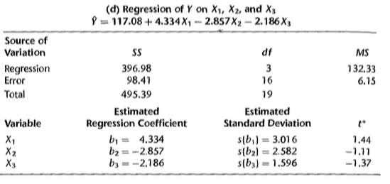
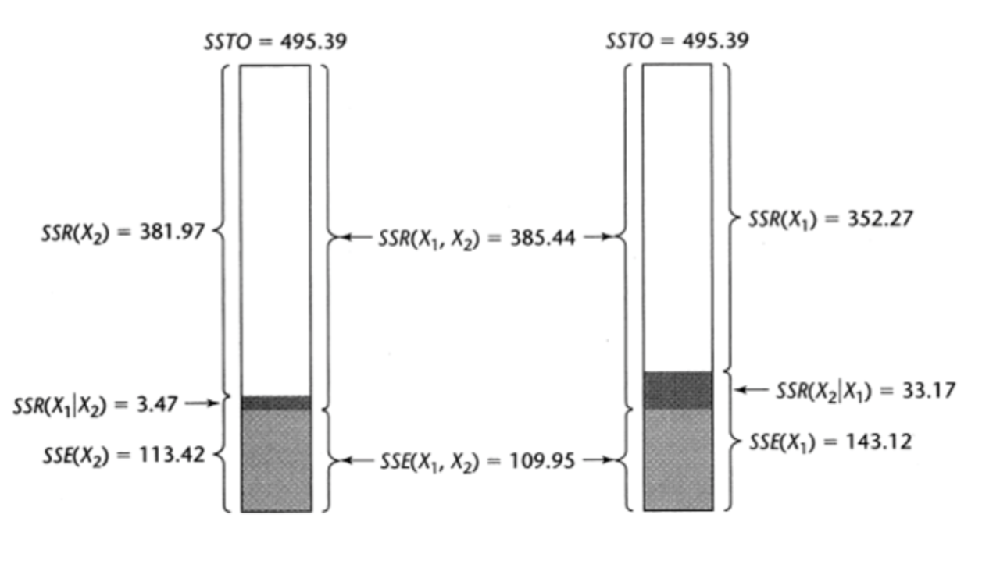

# Soma extra de quadrados

## Motivação {.build}

* Verificar a redução na soma de quadrados do erro quando uma ou mais variáveis preditoras são adicionadas no modelo de regressão, dado que outras variáveis preditoras já estão incluídas no modelo. 


* Equivalentemente, podemos utilizar a soma extra de quadrados para medir o aumento na soma de quadrados da regressão ao adicionarmos uma ou mais preditoras no modelo.

* Em resumo, a soma extra de quadrados pode nos auxiliar na decisão de inclusão ou retirada de variáveis no modelo.

## Exemplo - Relação entre gordura corporal e 3 medidas corporais.


```{r, echo=TRUE}
dat = read.table('./dados/fat.txt')
colnames(dat) <- c("X1","X2","X3","Y")
str(dat)
```
$Y$: taxa de gordura corporal;  $X1$:  Espessura da dobra cutânea do tríceps; $X2$: Circunferência da coxa; e $X3$: Circunferência do meio do braço

## Exemplo: Regressão de $Y$ em $X_1$


```{r,echo=TRUE}
attach(dat)
modelo1 <- lm(Y ~X1)
summary(modelo1)$coefficients
anova(modelo1)
```

## Exemplo: Regressão de $Y$ em $X_2$

```{r,echo=TRUE}
modelo2 <- lm(Y ~X2)
summary(modelo2)$coefficients
anova(modelo2)
```

## Exemplo: Regressão de $Y$ em $X_1$ e $X_2$ {.smaller}

```{r,echo=TRUE}
modelo12 <- lm(Y ~ X1 + X2)
summary(modelo12)$coefficients
anova(modelo12)
```
## Exemplo: Soma extra de quadrados

Quando ambos $X_1$ e $X_2$ estão no modelo, temos que $SQE(X_1,X_2)=109.95$, que é menor do que com apenas $X_1$ no modelo, $SQE(X_1)=143.12$.

Esta diferença é denominada **soma extra de quadrados**:

$$\begin{eqnarray}
SQReg(X_2\mid X_1) &=& SQE(X_1)-SQE(X_1,X_2)\\
                   &=& 143.12-109.95=33.17
\end{eqnarray}$$

Equivalentemente:

$$\begin{eqnarray}
SQReg(X_2\mid X_1) &=& SQReg(X_1,X_2)-SQReg(X_1) \\
                   &=& 385.44-352.27=33.17
\end{eqnarray}$$


## Exemplo: Soma extra de quadrados

```{r,echo=TRUE}
modelo12 <- lm(Y ~ X1 + X2)
anova(modelo12)
```

Na tabela, a linha $X_2$ contém $SQReg(X_2\mid X_1)$.


## Exemplo: Regressão de $Y$ em $X_1$, $X_2$ e $X_3$

<center>

</center>

$$SQReg(X_1,X_2,X_3)=396.98$$

$$SQE(X_1,X_2,X_3)=98.41$$


## Exemplo: Regressão de $Y$ em $X_1$, $X_2$ e $X_3$ {.smaller}

```{r,echo=TRUE}
modelo123 <- lm(Y ~ X1 + X2 + X3)
summary(modelo123)$coefficients
anova(modelo123)
```

## Exemplo: Soma extra de quadrados

Quando $X_1$, $X_2$ e $X_3$ estão no modelo, temos que $SQE(X_1,X_2,X_3)=98.41$, que é menor do que com apenas $X_1$ e $X_2$ no modelo, $SQE(X_1,X_2)=109.95$.

Esta diferença é denominada **soma extra de quadrados**:

$$\begin{eqnarray}
SQReg(X_3\mid X_1, X_2) &=& SQE(X_1,X_2)-SQE(X_1,X_2,X_3)\\
                        &=&109.95-98.41=11.54
\end{eqnarray}$$

Equivalentemente:

$$\begin{eqnarray}
SQReg(X_3\mid X_1,X_2) &=& SQReg(X_1,X_2,X_3)-SQReg(X_1,X_2)\\
                       &=&396.98-385.44=11.54
\end{eqnarray}$$    

## Exemplo: Soma extra de quadrados

```{r,echo=TRUE}
modelo123 <- lm(Y ~ X1 + X2 + X3)
anova(modelo123)
```

Na tabela, a linha $X_2$ contém $SQReg(X_2\mid X_1)$.

Na tabela, a linha $X_3$ contém $SQReg(X_3\mid X_1, X_2)$.


## Exemplo: Soma extra de quadrados

Podemos avaliar, também, a adição de mais de uma variável ao mesmo tempo. Por exemplo, podemos avaliar o efeito de incluir $X_2$ e $X_3$ a um modelo com apenas $X_1$:

$$\begin{eqnarray}
SQReg(X_2, X_3\mid X_1) &=& SQE(X_1)-SQE(X_1,X_2,X_3)\\
                        &=&143.12-98.41=44.71
\end{eqnarray}$$


Equivalentemente:

$$\begin{eqnarray}
SQReg(X_2, X_3\mid X_1) &=& SQReg(X_1,X_2,X_3)-SQReg(X_1)\\
                       &=&396.98-352.27=44.71
\end{eqnarray}$$     


## Exemplo: Soma extra de quadrados

```{r,echo=TRUE}
modelo1 <- lm(Y ~X1)
modelo123 <- lm(Y ~X1 + X2 + X3)

anova(modelo1,modelo123)
```

$$SQReg(X_2, X_3\mid X_1)=44.71$$

## Soma extra de quadrados

Em geral, se temos $X_1$ e $X_2$ no modelo, podemos escrever:

$$SQReg(X_1,X_2)=SQReg(X_1)+SQReg(X_2\mid X_1)$$

ou, dado que a ordem de entrada das variáveis é arbitrária no modelo, temos:

$$SQReg(X_1,X_2)=SQReg(X_2)+SQReg(X_1\mid X_2)$$


## Exemplo

<center>

</center>


## Soma extra de quadrados

Se temos $X_1$, $X_2$ e $X_3$ no modelo, podemos escrever, por exemplo:

$$\begin{eqnarray}
SQReg(X_1,X_2,X_3)&=&SQReg(X_1)+SQReg(X_2\mid X_1)\\
&+&SQReg(X_3\mid X_1,X_2)
\end{eqnarray}$$

$$\begin{eqnarray}
SQReg(X_1,X_2,X_3) &=& SQReg(X_2)+SQReg(X_3\mid X_2) \\
&+&SQReg(X_1\mid X_2,X_3) \end{eqnarray}$$

$$SQReg(X_1,X_2,X_3)=SQReg(X_1)+SQReg(X_2,X_3\mid X_1)$$


## Teste para $\beta_k$ usando soma extra de quadrados


* $H_0$: $\beta_k=0$.

* $H_1$: $\beta_k\neq0$.

Vimos que podemos usar a seguinte estatística do teste:

$$t^*=\frac{\hat{\beta}_k}{\sqrt{\widehat{Var(\hat{\beta}_k)}}}\overset{\mbox{sob $H_0$}}{\sim}t_{n-p}$$

## Teste para $\beta_k$ usando soma extra de quadrados

Equivalentemente, podemos utilizar soma extra de quadrados para o mesmo teste de hipóteses.

Estatística do teste:

$$\begin{eqnarray}
F^*=
&&\frac{SQReg(X_k\mid X_1,\ldots, X_{k-1},X_{k+1},\ldots,X_{p-1})}{1}\div\frac{SQE(X_1,\ldots,X_{p-1})}{n-p}\\
&\overset{\mbox{sob $H_0$}}{\sim}&F_{1,n-p}
\end{eqnarray}$$

## Exemplo:  Regressão de $Y$ em $X_1$, $X_2$ e $X_3$

Queremos testar se $X_3$ pode ser excluída do modelo.

```{r,echo=TRUE}
modelo12 <- lm(Y ~X1 + X2)
modelo123 <- lm(Y ~X1 + X2 + X3)
anova(modelo12,modelo123)
```

$F^*=`r round(anova(modelo12,modelo123)[2,5],2)`$. Não encontramos evidências para rejeitar $H_0$: $\beta_3=0$.

## Teste para vários $\beta_k$'s usando soma extra de quadrados


* $H_0$: $\beta_q=\beta_{q+1}=\ldots=\beta_{p-1}=0$.

* $H_1$: pelo menos um $\beta_q,\ldots,\beta_{p-1}$ não é zero.

(por conveniência, a notação assume que os últimos $p-q$ coeficientes do modelo serão testados)


Estatística do teste:

$$\begin{eqnarray}
F^*&=&\frac{SQReg(X_q,\ldots, X_{p-1}\mid X_1,\ldots,X_{q-1})}{p-q}\div\frac{SQE(X_1,\ldots,X_{p-1})}{n-p}\\
&\overset{\mbox{sob $H_0$}}{\sim}&F_{p-q,n-p}
\end{eqnarray}$$


## Exemplo:  Regressão de $Y$ em $X_1$, $X_2$ e $X_3$

Queremos testar se $X_2$ e $X_3$ podem ser excluídas do modelo.

```{r,echo=TRUE}
modelo1 <- lm(Y ~ X1)
modelo123 <- lm(Y ~ X1 + X2 + X3)
anova(modelo1,modelo123)
```

$F^*=`r round(anova(modelo1,modelo123)[2,5],2)`$. 

# Coeficiente de Determinação Parcial

## Motivação

Para avaliar o modelo: observar quanto da $SQT$ está contida em $SQReg$ e quanto está na $SQE$.

Podemos utilizar para avaliar o modelo: $$R^2=\frac{\sum_{i=1}^n(\hat{Y}_i-\bar{Y})^2}{\sum_{i=1}^n(Y_i-\bar{Y})^2}=\frac{SQReg}{SQT}$$

conhecido como **coeficiente de determinação**, que é a proporção da variabilidade total explicada pelo modelo de regressão ajustado.

O **coeficiente de determinação parcial** irá avaliar a contribuição marginal de alguma(s) preditora(s), dado que as demais já estão no modelo.


## Caso de duas variáveis preditoras {.build}

$$Y_i=\beta_0+\beta_1X_{i1}+\beta_2X_{i2}+\varepsilon_i$$

* Coeficiente de determinação parcial entre $Y$ e $X_1$, dado que $X_2$ já está no modelo:

$$R^2_{Y 1\mid 2} = \frac{SQE(X_2)-SQE(X_1,X_2)}{SQE(X_2)}=\frac{SQReg(X_1\mid X_2)}{SQE(X_2)}$$


* Coeficiente de determinação parcial entre $Y$ e $X_2$, dado que $X_1$ já está no modelo:

$$R^2_{Y 2\mid 1} = \frac{SQE(X_1)-SQE(X_1,X_2)}{SQE(X_1)}=\frac{SQReg(X_2\mid X_1)}{SQE(X_1)}$$

## Exemplos

$$R^2_{Y 1\mid 2 3}=\frac{SQReg(X_1\mid X_2,X_3)}{SQE(X_2,X_3)}$$

$$R^2_{Y 2\mid 1 3}=\frac{SQReg(X_2\mid X_1,X_3)}{SQE(X_1,X_3)}$$

$$R^2_{Y 3\mid 1 2}=\frac{SQReg(X_3\mid X_1,X_2)}{SQE(X_1,X_2)}$$

$$R^2_{Y 4\mid 1 2 3}=\frac{SQReg(X_4\mid X_1,X_2,X_3)}{SQE(X_1,X_2,X_3)}$$

## Exemplo: Gordura corporal {.smaller}

```{r,echo=TRUE,warning=FALSE,message=FALSE}
SQE1 <- deviance(modelo1) #SQE modelo só com X1
SQE2 <- deviance(modelo2) #SQE modelo só com X2
SQE12 <- deviance(modelo12) #SQE modelo com X1 e X2
SQE123 <- deviance(modelo123) #SQE modelo com X1 X2 e X3

SQReg2.1 <- SQE1-SQE12 # SQReg(X2|X1)
SQReg3.12 <- SQE12-SQE123 # SQReg(X3|X1,X2)


RY2.1  <- SQReg2.1/SQE1 # Coef. det. parcial de Y com X2 dado X1 no modelo
RY2.1


RY3.12  <- SQReg3.12/SQE12 # Coef. det. parcial de Y com X3 dado X1 e X2 no modelo
RY3.12

```

## Exemplo: Gordura corporal


Quando $X_2$ é adicionada ao modelo contendo apenas $X_1$, a $SQE(X_1)$ é reduzida em 23%. A inclusão de $X_2$ no modelo explica 23% da variação em $Y$ que não pode ser explicada apenas por $X_1$.

Quando $X_3$ é adicionada ao modelo contendo $X_1$ e $X_2$, a $SQE(X_1,X_2)$ é reduzida em 10%. Isto é, 10% da variação em $Y$ que não pode ser explicada pelo modelo com $X_1$ e $X_2$ é explicada pela inclusão de $X_3$ no modelo.


## Propriedades {.build}

O coeficiente de determinação parcial assume valores entre 0 e 1.

> Outra maneira de obter $R^2_{Y 1\mid 2}$:

   * Obtenha os resíduos da regressão de $Y$ em $X_2$: $e_i(Y\mid X_2)$.
   
   * Obtenha os resíduos da regressão de $X_1$ em $X_2$: $e_i(X_1\mid X_2)$.
   
   * Calcule $R^2$ entre $e_i(Y\mid X_2)$ e $e_i(X_1\mid X_2)$.

O diagrama de dispersão de $e_i(Y\mid X_2)$ versus $e_i(X_1\mid X_2)$ fornece uma representação gráfica da relação entre $Y$ e $X_1$, ajustada por $X_2$. É também chamado de *added variable plot* ou **gráfico de regressão parcial**.
   
   
# Regressão Múltipla Padronizada   

## Motivação {.build}

Erros de precisão numérica quando 

 * $\mathbf{X}^T\mathbf{X}$ tem determinante próximo de 0.
 
 * elementos de $\mathbf{X}^T\mathbf{X}$ diferem substancialmente em ordem de magnitude.
 
Para cada um dos problemas, há soluções propostas. 

Veremos inicialmente o problema de ordem de magnitude.

## Transformação de correlação

Ao utilizarmos a transformação de correlação, obtemos que todos os elementos de $\mathbf{X}^T\mathbf{X}$ variam entre $1$ e $-1$.

Isto acarreta menos problemas de arredondamento para inverter $\mathbf{X}^T\mathbf{X}$.

## Falta de comparabilidade entre coeficientes {.build}

Em geral, não podemos comparar os coeficientes de regressão entre si, dado que não estão nas mesmas unidades.

Exemplo:

   $$\hat{Y}=200+20000X_1+0.2X_2$$
   
Pode-se pensar que apenas $X_1$ é relevante no modelo.   
   
Mas suponha que:

$Y$: dólares

$X_1$: milhares de dólares

$X_2$: centavos de dólares

## Falta de comparabilidade entre coeficientes {.build}

O efeito na resposta média do aumento de 1000 dólares em $X_1$ (1 unidade de aumento, $X_1$ está em milhares) quando $X_2$ é constante, é de 20000 dólares.

O efeito na resposta média do aumento de 1000 dólares em $X_2$ (100000 unidades de aumento, $X_2$ está em centavos) quando $X_1$ é constante, é de 20000 dólares.


Transformação de correlação evita este tipo de comparação equivocada.

## Transformação de correlação {.build .smaller}

Padronização usual:

$$\frac{Y_i-\bar{Y}}{s_Y}$$

$$\frac{X_{ik}-\bar{X}_k}{s_k}\,,\quad k=1,2,\ldots, p-1$$


em que:

$$s_Y=\sqrt{\frac{\sum_i(Y_i-\bar{Y})^2}{n-1}}$$

$$s_k=\sqrt{\frac{\sum_i(X_{ik}-\bar{X}_k)^2}{n-1}}\,, \quad k=1,2,\ldots, p-1$$

## Transformação de correlação 

A transformação de correlação é uma função das variáveis padronizadas:

$$Y_i^*=\frac{1}{\sqrt{n-1}}\left(\frac{Y_i-\bar{Y}}{s_Y}\right)$$

$$X_{ik}^*=\frac{1}{\sqrt{n-1}}\left(\frac{X_{ik}-\bar{X}_k}{s_k}\right)\,, \quad k=1,2,\ldots, p-1$$


## Modelo de Regressão Padronizado

$$Y^*_i=\beta_1^*X_{i1}^*+\ldots+\beta_{p-1}^*X_{i,p-1}^*+\varepsilon_i^*$$

Relação com modelo de regressão múltipla usual:

$$\beta_k=\left(\frac{s_Y}{s_k}\right)\beta_k^*\,,\quad k=1,2,\ldots,p-1$$

$$\beta_0=\bar{Y}-\beta_1\bar{X}_1-\ldots - \beta_{p-1}\bar{X}_{p-1}$$

## Modelo de Regressão Padronizado {.build}

$$\mathbf{X}^*_{n\times p-1}=\left(
\begin{array}{ccccc}
X_{11}^* & X_{12}^* & \ldots & X_{1,p-1}^* \\
X_{21}^* & X_{22}^* & \ldots & X_{2,p-1}^*  \\
\vdots & \vdots & \vdots\\
X_{n1}^* & X_{n2}^* & \ldots & X_{n,p-1}^*
\end{array}
\right)
$$

Seja a matriz de correlação de $\mathbf{X}$:

$${r_{XX}}_{p-1\times p-1}=\left(
\begin{array}{cccc}
1 & r_{12} & \ldots & r_{1,p-1} \\
r_{21} & 1 & \ldots & r_{2,p-1} \\
\vdots & \vdots & \vdots\\
r_{p-1,1} & r_{p-1,2} & \ldots & 1
\end{array}
\right)
$$

## Modelo de Regressão Padronizado {.build}

em que $r_{jk}$ é o coeficiente de correlação entre $X_j$ e $X_k$.

$$\begin{eqnarray}
\sum X_{ij}^*X_{ik}^*&=&\sum \left[\frac{1}{\sqrt{n-1}}\left(\frac{X_{ij}-\bar{X}_j}{s_j}\right)\right] \frac{1}{\sqrt{n-1}}\left(\frac{X_{ik}-\bar{X}_k}{s_k}\right)\\
 &=& \frac{1}{n-1}\frac{\sum(X_{ij}-\bar{X}_j)(X_{ik}-\bar{X}_k)}{s_js_k}\\
 &=&\frac{\sum(X_{ij}-\bar{X}_j)(X_{ik}-\bar{X}_k)}{\sqrt{\sum(X_{ij}-\bar{X}_j)^2\sum(X_{ik}-\bar{X}_k)^2}}\\
 &=&r_{jk}
\end{eqnarray}$$


## Modelo de Regressão Padronizado {.build}

Portanto, temos que:

$$\mathbf{X}^{*T}\mathbf{X}^*=r_{XX}\,.$$

De maneira similar:

$$\mathbf{X}^{* T}\mathbf{Y}^*_{p-1\times1}=r_{YX}$$

em que $r_{YX}$ é o vetor de correlações entre $\mathbf{Y}$ e cada coluna de $\mathbf{X}$.

## Modelo de Regressão Padronizado {.build}

Equações normais:

$$\mathbf{X}^{*T}\mathbf{X}^*\hat{\boldsymbol\beta}^*=\mathbf{X}^{*T}\mathbf{Y}$$

Estimador de mínimos quadrados:

$$\hat{\boldsymbol\beta}^*=(\mathbf{X}^{*T}\mathbf{X}^*)^{-1}\mathbf{X}^{*T}\mathbf{Y}$$

Equivalentemente:

$$\hat{\boldsymbol\beta}^*=r_{XX}^{-1}r_{YX}\,.$$

## Exemplo

```{r,echo=TRUE,message=FALSE,warning=FALSE}
#ds = read.csv("http://www.math.smith.edu/r/data/help.csv")
ds = read.csv("help.csv")

female = subset(ds, female==1)

lm1 = lm(pcs ~ mcs + homeless, data=female)

summary(lm1)$coefficients
```

## Exemplo

```{r,echo=TRUE,message=FALSE,warning=FALSE}
library(QuantPsyc)
lm.beta
```

## Exemplo

```{r,echo=TRUE}
lm.beta(lm1)
```

Uma mudança de 1 desvio-padrão em `mcs` tem mais do que o dobro de impacto de uma mudança de 1 desvio-padrão em `homeless`.


## Exemplo: Dwaine Studios

$Y$: vendas

$X_1$: população

$X_2$: renda per capita

```{r,echo=TRUE}
dados <- read.table("./dados/CH07TA05.txt")
colnames(dados) <- c("Y","X1","X2")
dados
```

## Exemplo: Dwaine Studios

Modelo usual, sem padronização:

```{r,echo=TRUE}
modelo <- lm(Y ~ X1+X2,data=dados)
summary(modelo)$coefficients
```

## Exemplo: Dwaine Studios

Modelo padronizado:

```{r,echo=TRUE}
dadosPadrao <- as.data.frame(scale(dados)/sqrt(dim(dados)[1]-1))
modeloPadrao <- lm(Y ~ X1+X2-1,data=dadosPadrao)
summary(modeloPadrao)$coefficients
```

## Exemplo: Dwaine Studios
Ou, diretamente, pelo comando:

```{r,echo=TRUE}
lm.beta(modelo)
```

Note que o comando apenas libera as estimativas (sem erro-padrão, testes, etc...)

## Agradecimento

* Slides criados por Samara F Kiihl / IMECC / UNICAMP

## Leitura

* Applied Linear Statistical Models: Seções 7.1-7.5.

* Draper & Smith - [Applied Regression Analysis](http://onlinelibrary.wiley.com/book/10.1002/9781118625590): Capítulo 6.

* Weisberg - [Applied Linear Regression](http://unicampbr.summon.serialssolutions.com/2.0.0/link/0/eLvHCXMwrV1NSwMxEB1EDyoFv22tSs5Ca5JdN9mTWLX0oljwXqZJCh5cy3YF_fdmku0KhXryGCZfhCQzTN57AUhkn_dW7oQURSaFUUamqDBVM41CckyN0M5wNOFP23w8Vs8jUs0Z_PWASqSJ9_m1_TAPAWXZjwyAW1sHtaTYJolf7l0ZHdW7QfKbdeH0DMjDl0F-M-vM166Fn5Zl3VCOIiIyOJrh3n_MaR-2HFEYDmDDFYew-9Qosy6O4CpcA4ySYm7B3gr2UvoTHRCy3wwLyyj6jOLNx3A5fHy9H_XiNCbzKEwxWY6TnEALCSBfVIFIZ9vAfCiHWjlhUU0pm6YxkQptluezG8wV78Dpmt460F2xVF9VYz1b264LOz66qGEu57BZlZ_uArbrtZqWP8hqnhA
): Seções 6.1-6.3 

* Faraway - [Linear Models with R](http://www.maths.bath.ac.uk/~jjf23/LMR/): Seções 3.1 e 3.2.


<center>

</center>


