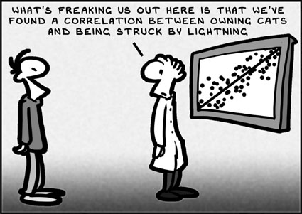

# Multicolinearidade

## Video anterior

* Sempre teremos algum grau multicolinearidade entre os dados

* Alteração nas estimativas dos parâmetros

* Menor soma extra de quadrados de regressão

* Aumento dos erros padrões das estimativas do parâmetros

## Introdução {.smaller}

Vamos considerar o modelo de regressão linear múltipla:

$$Y_i = \beta_1 X_{i1} + \beta_2 X_{i2} + \epsilon_i, \;\; i = 1,\dots, n, \;\; \epsilon_i \; iid \;  \sim N(0, \sigma^2)$$
em que $X_1$ e $X_2$ são variáveis tranformadas via transformação de correlação (ou seja estão centradas no 0 e limitadas entre -1 e 1).

A matrix de desenho do modelo é data por

$$\mathbf{X}=\left(
\begin{array}{cc}
X_{11} & X_{12} \\
X_{21} & X_{22} \\
\vdots & \vdots \\
X_{n1} & X_{n2}
\end{array}
\right) \;\; e \;\; \mathbf{X}^T\mathbf{X}=\left(
\begin{array}{ccccc}
\sum X^2_{i1} & \sum X_{i1} X_{i2} \\
\sum X_{i1} X_{i2} & \sum X^2_{i2} \\
\end{array}
\right) 
= 
\left(
\begin{array}{ccccc}
1 & r_{12} \\
r_{12} & 1 \\
\end{array}
\right) 
$$
Daí temos que 

$$Var(\hat{\beta})= \sigma^2(\mathbf{X}^T\mathbf{X})^{-1} = \left(
\begin{array}{ccccc}
\frac{\sigma^2}{1-r^2_{12}} & -\frac{\sigma^2r_{12}}{1-r^2_{12}} \\
-\frac{\sigma^2r_{12}}{1-r^2_{12}} & \frac{\sigma^2}{1-r^2_{12}} \\
\end{array}
\right)  $$

Portanto quanto forte a correlação entre $X_1$ e $X_2$ maior as $Var{\hat{\beta_1}}$ e $Var{\hat{\beta_1}}$.


## Efeito nos coeficientes de regressão

$X_1$: tríceps

$X_2$: coxa

$X_3$: antebraço

$Y$: gordura corporal


```{r,echo=FALSE}
dat = read.table('./dados/fat.txt')
colnames(dat) <- c("X1","X2","X3","Y")
dat
```

## Exemplo

```{r,echo=FALSE,fig.align='center',fig.height=5,fig.width=7}
panel.cor <- function(x, y, digits=2, prefix="", cex.cor, ...)
{
    usr <- par("usr"); on.exit(par(usr))
    par(usr = c(0, 1, 0, 1))
    r <- abs(cor(x, y))
    txt <- format(c(r, 0.123456789), digits=digits)[1]
    txt <- paste(prefix, txt, sep="")
    if(missing(cex.cor)) cex.cor <- 0.8/strwidth(txt)
    text(0.5, 0.5, txt)
}
pairs(dat,upper.panel=panel.cor,lower.panel=panel.smooth)
```

```{r,echo=FALSE}
modelo1 <- lm(Y ~ X1, data=dat)
beta11 <- round(summary(modelo1)$coef[2,1],3)
sbeta11 <- round(summary(modelo1)$coef[2,2],3)
modelo2 <- lm(Y ~ X2, data=dat)
beta21 <- round(summary(modelo2)$coef[2,1],3)
sbeta21 <- round(summary(modelo2)$coef[2,2],3)
modelo12 <- lm(Y ~ X1+ X2, data=dat)
beta12 <- round(summary(modelo12)$coef[2,1],3)
beta22 <- round(summary(modelo12)$coef[3,1],3)
sbeta12 <- round(summary(modelo12)$coef[2,2],3)
sbeta22 <- round(summary(modelo12)$coef[3,2],3)
modelo123 <- lm(Y ~ X1+ X2 +X3, data=dat)
beta13 <- round(summary(modelo123)$coef[2,1],3)
beta23 <- round(summary(modelo123)$coef[3,1],3)
sbeta13 <- round(summary(modelo123)$coef[2,2],3)
sbeta23 <- round(summary(modelo123)$coef[3,2],3)
```


## Efeito no desvio-padrão da estimativa


Variável no modelo | $\hat{\beta}_1$  | $\hat{\beta}_2$
-------------------|------------------|-----------------
$X_1$              | `r sbeta11`      |
$X_2$              |                  | `r sbeta21`
$X_1$, $X_2$       | `r sbeta12`      | `r sbeta22`
$X_1$, $X_2$, $X_3$| `r sbeta13`      | `r sbeta23`


## Efeito nos valores ajustados e preditos


Variável no modelo | $QME$  
-------------------|----------------
$X_1$              | `r round(anova(modelo1)[2,3],2)`
$X_1$, $X_2$       | `r round(anova(modelo12)[3,3],2)`  
$X_1$, $X_2$, $X_3$| `r round(anova(modelo123)[4,3],2)`

$QME$ diminui conforme variáveis são adicionadas ao modelo (caso usual).

## Efeito nos valores ajustados e preditos {.build}

A precisão do valor ajustado não é tão afetada quando inserimos ou não uma variável preditora muito correlacionada com outra já no modelo.

Por exemplo, se considerarmos apenas o modelo com $X_1$, o valor estimado de gorduta corporal para $X_1=25$ é:

```{r,echo=FALSE}
yhat <- predict(modelo1,newdata=data.frame(X1=25),se.fit=TRUE)
```

$$\hat{Y}=`r round(yhat$fit,3)`\quad\quad\sqrt{\widehat{Var(\hat{Y})}}=`r round(yhat$se.fit,3)`$$


Quando incluímos $X_2$, altamente correlacionada à $X_1$, temos:

```{r,echo=FALSE}
yhat <- predict(modelo12,newdata=data.frame(X1=25,X2=50),se.fit=TRUE)
```

$$\hat{Y}=`r round(yhat$fit,3)`\quad\quad\sqrt{\widehat{Var(\hat{Y})}}=`r round(yhat$se.fit,3)`$$

quando $X_1=25$ e $X_2=50$, por exemplo.

## Efeito nos testes simultâneos de $\beta_k$


Considere os dados sobre gordura corporal e o modelo com $X_1$ e $X_2$ no modelo.

Queremos testar $H_0$: $\beta_1=\beta_2=0$.

Calculamos:

$$t_1=\frac{\hat{\beta}_1}{\sqrt{\widehat{Var}(\hat{\beta}_1)}}\quad\quad t_2=\frac{\hat{\beta}_2}{\sqrt{\widehat{Var}(\hat{\beta}_2)}}$$

e não rejeitamos $H_0$ se ambos $|t_1|$ e $|t_2|$ forem menores do que $t_{n-3,\alpha/4}=`r round(qt(0.05/4,df=dim(dat)[1]-3,lower.tail=FALSE),2)`$

para $\alpha=0.05$.

## Exemplo {.smaller}

```{r,echo=FALSE}
summary(modelo12)
```

Não rejeitamos $H_0$.

## Exemplo {.smaller}

```{r,echo=FALSE}
anova(modelo12)
modelo0 <- lm( Y ~ 1,data=dat)
modelo12 <- lm(Y ~ X1 + X2,data=dat)
anova(modelo0,modelo12)
```


## Exemplo {.build}

Se utilizarmos o teste $F$ para $H_0:\beta_1=\beta_2=0$, temos:

$$F_{obs}=\frac{QMReg}{QME}=\frac{`r round(anova(modelo0,modelo12)[2,4],2)`/`r anova(modelo0,modelo12)[2,3]`}{`r round(anova(modelo0,modelo12)[2,2],2)`/`r anova(modelo0,modelo12)[2,1]`}=`r round(anova(modelo0,modelo12)[2,5],2)`$$

Sob $H_0$ a estatística do teste tem distribuição $F(`r anova(modelo0,modelo12)[2,3]`,`r anova(modelo0,modelo12)[2,1]`)$, de maneira que o valor crítico para $\alpha=0.05$ é $`r round(qf(0.95,anova(modelo0,modelo12)[2,3],anova(modelo0,modelo12)[2,1]),2)`$.

Encontramos evidências para rejeitar $H_0$.

Resultado contrário ao obtido com os testes $t$ com correção de Bonferroni.

## Como lidar com a multicolinearidade

* Coletar mais dados

* Eliminação de variáveis explicativas

* Transformação de variáveis explicativas

* Componentes principais

## Agradecimento

* Slides criados por Samara F Kiihl / IMECC / UNICAMP


## Leitura

* Applied Linear Statistical Models: Seção 7.6.

* Faraway - [Linear Models with R](http://www.maths.bath.ac.uk/~jjf23/LMR/): Seção 7.3.


<center>

</center>
