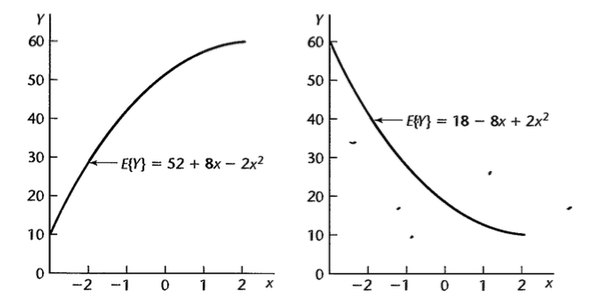
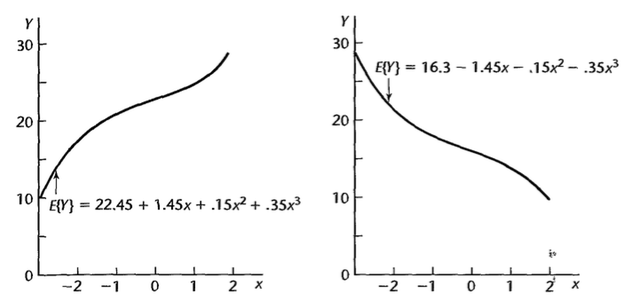
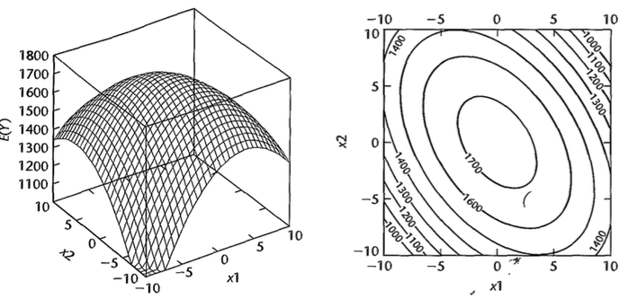
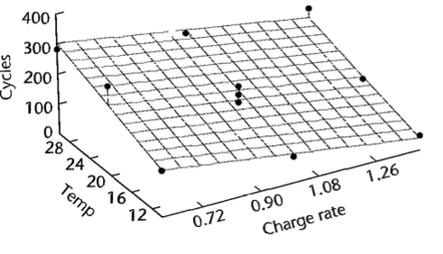
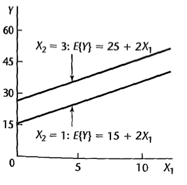
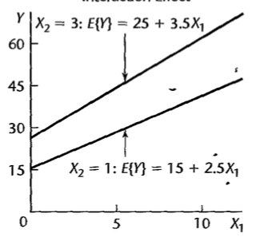
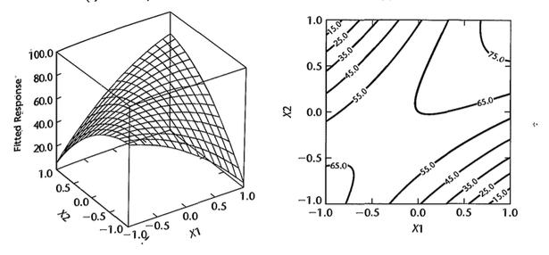
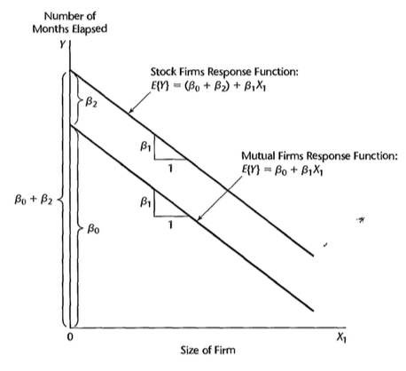
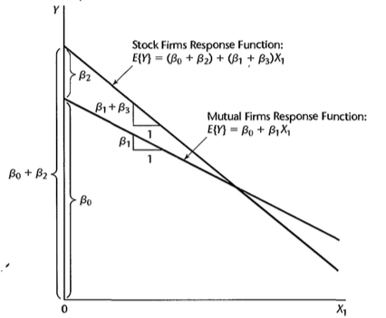
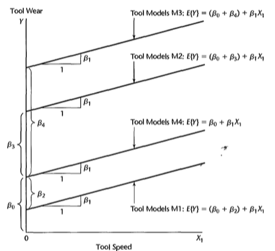

```{r, include=FALSE}
library(tidyverse)
library(readr)
library(knitr)
library(kableExtra)
library(latex2exp)
```

# Modelo de Regressão Polinomial

## Introdução {.build}

Podemos considerar funções polinomiais como um caso particular do modelo de regressão linear já visto.

## Modelo com um preditor - segunda ordem {.build}

$$Y=\beta_0+\beta_1X_*+\beta_2X_*^2+\varepsilon$$

em que $X_*=X-\bar{X}$.

Função de resposta quadrática.

$\beta_0$: valor esperado de $Y$ quando $X_*$ é zero, isto é, $X=\bar{X}$.

$\beta_1$: coeficiente de efeito linear.

$\beta_2$: coeficiente de efeito quadrático.


## Exemplo

<center>

</center>


## Modelo com um preditor - terceira ordem {.build}

$$Y=\beta_0+\beta_1X_*+\beta_2X_*^2+\beta_3X_*^3+\varepsilon$$

em que $X_*=X-\bar{X}$.

Exemplos:

<center>

</center>

## Modelo com dois preditores - segunda ordem {.build}


$$Y=\beta_0+\beta_1X_{1*}+\beta_2X_{1*}^2+\beta_3X_{2*}+\beta_4X_{2*}^2+\beta_5X_{1*}X_{2*}+\varepsilon$$

em que $X_{1*}=X_1-\bar{X}_1$ e $X_{2*}=X_2-\bar{X}_2$.


## Exemplo

$$E(Y)=1740-4X_{1*}^2-3X_{2*}^2-3X_{1*}X_{2*}$$


<center>

</center>

## Método hierárquico de ajuste de modelo {.build}

Pode-se começar com um modelo de segunda ou terceira ordem e ir testando se os coeficientes de ordem maiores são significativos.

Por exemplo:

$$Y=\beta_0+\beta_1X_{*}+\beta_2X_*^2+\beta_3X_*^3+\varepsilon$$

Para testar se $\beta_3=0$ podemos utilizar $SQReg(X_*^3\mid X_*,X_*^2)$. Se quisermos testar se $\beta_2=\beta_3=0$: $SQReg(X_*^2,X_*^3\mid X_*)=SQReg(X_*^2\mid X_*)+SQReg(X_*^3\mid X_*, X_*^2)$

Se um termo de ordem mais alta é mantido no modelo, os de ordem mais baixa devem obrigatoriamente ser mantidos também.

## Exemplo

$Y$: número de ciclos

$X_1$: carga, $X_{1*}=(X_1-\bar{X}_1)/0.4$.

$X_2$: temperatura, $X_{2*}=(X_2-\bar{X}_2)/10$.

```{r,echo=TRUE, message=FALSE, warning=FALSE}
dados = read_table(file.path("dados", "CH08TA01.txt"),
                   col_names = c("Y", "X1", "X2")) %>% 
  mutate(x1 = (X1 - mean(X1))/0.4,
         x2 = (X2 - mean(X2))/10)
```

## Exemplo

```{r, echo=FALSE}
kable(dados, align=rep('c', 5)) %>%
  kable_styling(bootstrap_options = c("striped", "hover")) %>%
  column_spec(1:5, width="5em", border_left = TRUE, border_right = TRUE)
```

## Exemplo {.build}

```{r,echo=FALSE}
cor1 <- cor(dados$X1,dados$X1^2)
cor2 <- cor(dados$X2,dados$X2^2)
cor1a <- cor(dados$x1,dados$x1^2)
cor2a <- cor(dados$x2,dados$x2^2)
```

Correlação entre $X_1$ e $X_1^2$: `r round(cor1,2)`.

Correlação entre $X_{1*}$ e $X_{1*}^2$: `r round(cor1a,2)`.

Correlação entre $X_2$ e $X_2^2$: `r round(cor2,2)`.

Correlação entre $X_{2*}$ e $X_{2*}^2$: `r round(cor2a,2)`.

## Exemplo

$$Y=\beta_0+\beta_1X_{1*}+\beta_2X_{2*}+\beta_3X_{1*}^2+\beta_4X_{2*}^2+\beta_5X_{1*}X_{2*}+\varepsilon$$


```{r,echo=TRUE}
modelo <- lm(Y ~ x1 + x2 + I(x1^2) + I(x2^2) + I(x1*x2),data=dados)
summary(modelo)$coef
```


## Exemplo

```{r,echo=FALSE,fig.align='center',fig.width=5.5,fig.height=5.5,message=FALSE,warning=FALSE}
tibble(x=fitted(modelo), y=resid(modelo)) %>%
  ggplot(aes(x, y)) + geom_point() +
  xlab(TeX('$\\hat{Y}$')) + ylab(TeX('$Y-\\hat{Y}$')) +
  theme_bw()
```

## Exemplo

```{r,echo=FALSE,fig.align='center',fig.width=5,fig.height=5}
tibble(x=resid(modelo)) %>%
  ggplot(aes(sample=x)) + stat_qq() + stat_qq_line() +
  xlab("Quantis Teóricos") + ylab("Quantis Amostrais") +
  theme_bw()
```

## Exemplo {.smaller}


```{r,echo=TRUE,warning=FALSE,message=FALSE}
library(alr3)
pureErrorAnova(modelo)
```

Não rejeitamos $H_0$, isto é, não encontramos evidências para rejeitar que o modelo de segunda ordem é um bom ajuste

## Exemplo {.build .smaller}

Será que um modelo de primeira ordem já seria suficiente?

$$Y=\beta_0+\beta_1X_{1*}+\beta_2X_{2*}+\beta_3X_{1*}^2+\beta_4X_{2*}^2+\beta_5X_{1*}X_{2*}+\varepsilon$$


$H_0$: $\beta_3=\beta_4=\beta_5=0$.

$H_a$: pelo menos um entre $\beta_3, \beta_4$ e $\beta_5$ é diferente de zero.

```{r,echo=FALSE}
anova(modelo)
```

## Exemplo

* $H_0$: $\beta_q=\beta_{q+1}=\ldots=\beta_{p-1}=0$.

* $H_1$: pelo menos um $\beta_q,\ldots,\beta_{p-1}$ não é zero.

(por conveniência, a notação assume que os últimos $p-q$ coeficientes do modelo serão testados)

Estatística do teste:

$$\begin{eqnarray}
F^*&=&\frac{SQReg(X_q,\ldots, X_{p-1}\mid X_1,\ldots,X_{q-1})}{p-q}\div\frac{SQE(X_1,\ldots,X_{p-1})}{n-p}\\
&\overset{\mbox{sob $H_0$}}{\sim}&F_{p-q,n-p}
\end{eqnarray}$$


## Exemplo {.build .smaller}

$p=`r length(coef(modelo))`$

$n = `r dim(dados)[1]`$

$q=3$

$$F^*=\frac{SQReg(X_{1*}^2,X_{2*}^2,X_{1*}X_{2*}\mid X_{1*},X_{2*})/`r length(coef(modelo))-3`}{SQE(X_{1*},X_{2*},X_{1*}^2,X_{2*}^2,X_{1*}X_{2*})/`r dim(dados)[1]-length(coef(modelo))`}\overset{\mbox{sob $H_0$}}{\sim}F_{`r length(coef(modelo))-3`,`r dim(dados)[1]-length(coef(modelo))`}$$


$$\begin{eqnarray}
SQReg(X_{1*}^2,X_{2*}^2,X_{1*}X_{2*}\mid X_{1*},X_{2*}) &=& SQReg(X_{1*}^2\mid X_{1*},X_{2*})\\
&+& SQReg(X_{2*}^2\mid X_{1*},X_{2*},X_{1*}^2)\\
&+&SQReg(X_{1*}X_{2*}\mid X_{1*},X_{2*},X_{1*}^2,X_{2*}^2)\\
&=&`r round(anova(modelo)[3,2],1)` + `r round(anova(modelo)[4,2],1)` +`r anova(modelo)[5,2]`\\
&=& `r round(anova(modelo)[3,2],1) + round(anova(modelo)[4,2],1) + anova(modelo)[5,2]`
\end{eqnarray}$$

$$F_{obs}=\frac{`r round(anova(modelo)[3,2],1) + round(anova(modelo)[4,2],1) + anova(modelo)[5,2]`/`r length(coef(modelo))-3`}{`r round(anova(modelo)[6,3],1)`}=`r ((round(anova(modelo)[3,2],1) + round(anova(modelo)[4,2],1) + anova(modelo)[5,2])/(length(coef(modelo))-3))/ round(anova(modelo)[6,3],1)`$$

Comparando com $F(0.95;`r length(coef(modelo))-3`,`r dim(dados)[1]-length(coef(modelo))`)=`r round(qf(.95,df1=length(coef(modelo))-3,df2=dim(dados)[1]-length(coef(modelo))),2)`$, não encontramos evidências contra a hipótese nula.


## Exemplo

```{r,echo=TRUE}
modeloreduz <- lm(Y ~ x1 + x2,data=dados)
anova(modeloreduz, modelo)
```

## Exemplo {.build}

Modelo de primeira ordem:

$$Y=\beta_0+\beta_1X_{1*}+\beta_2X_{2*}+\varepsilon$$

```{r,echo=TRUE}
modelo1 <- lm(Y ~ x1 + x2,data=dados)
summary(modelo1)$coef
```

## Exemplo {.build}

Modelo de primeira ordem (variáveis nas escalas originais):


$$Y=\beta_0+\beta_1X_{1}+\beta_2X_{2}+\varepsilon$$

```{r,echo=TRUE}
modelo1 <- lm(Y ~ X1 + X2,data=dados)
summary(modelo1)$coef
```

## Exemplo


<center>

</center>


# Modelo de Regressão com Interação

## Efeitos de interação {.build}

Um modelo de regressão com $p-1$ variáveis preditoras com efeitos aditivos tem função de regressão da forma:

$$E(Y)=f_1(X_1)+f_2(X_2)+\ldots+f_{p-1}(X_{p-1})$$

em que $f_1,f_2,\ldots,f_{p-1}$ podem ser quaisquer funções.

Por exemplo:

$$E(Y)=\underbrace{\beta_0+\beta_1X_1+\beta_2X_1^2}_{f_1(X_1)}+\underbrace{\beta_3X_2}_{f_2(X_2)}$$

O efeito de $X_1$ e $X_2$ em $Y$ é **aditivo**.

## Efeitos de interação {.build}

Já no exemplo a seguir, o efeito não é aditivo, há efeito de interação:


$$E(Y)=\beta_0+\beta_1X_1+\beta_2X_1^2+\beta_3X_2+\beta_3X_1X_2$$


Outro exemplo:

$$E(Y)=\beta_0+\beta_1X_1+\beta_2X_2+\beta_3X_3+\beta_4X_1X_2+\beta_5X_1X_3$$

O efeito de uma variável sobre $Y$ irá depender do nível da variável com a qual ela interage.

## Interpretação: interação e efeitos lineares {.build}

$$Y=\beta_0+\beta_1X_1+\beta_2X_2+\beta_3X_1X_2+\varepsilon$$

Suponha que $X_1=a$:

$$E(Y)=\beta_0+\beta_1a+\beta_2X_2+\beta_3aX_2$$

Suponha que $X_1=a+1$:

$$E(Y)=\beta_0+\beta_1(a+1)+\beta_2X_2+\beta_3(a+1)X_2$$

Diferença no valor esperado de $Y$ quando aumentamos $X_1$ em 1 unidade:

$$\beta_0+\beta_1(a+1)+\beta_2X_2+\beta_3(a+1)X_2 - (\beta_0+\beta_1a+\beta_2X_2+\beta_3aX_2)$$

$$=\beta_1+\beta_3X_2$$

## Interpretação: interação e efeitos lineares {.build}

$$Y=\beta_0+\beta_1X_1+\beta_2X_2+\beta_3X_1X_2+\varepsilon$$

Suponha que $X_2=a$:

$$E(Y)=\beta_0+\beta_1X_1+\beta_2a+\beta_3X_1a$$

Suponha que $X_2=a+1$:

$$E(Y)=\beta_0+\beta_1X_1+\beta_2(a+1)+\beta_3X_1(a+1)$$

Diferença no valor esperado de $Y$ quando aumentamos $X_2$ em 1 unidade:

$$\beta_0+\beta_1X_1+\beta_2(a+1)+\beta_3X_1(a+1) - (\beta_0+\beta_1X_1+\beta_2a+\beta_3X_1a)$$

$$=\beta_2+\beta_3X_1$$

## Interpretação: interação e efeitos lineares {.build}

$$Y=\beta_0+\beta_1X_1+\beta_2X_2+\beta_3X_1X_2+\varepsilon$$

Diferença no valor esperado de $Y$ quando aumentamos $X_1$ em 1 unidade:

$$\frac{\partial E(Y)}{\partial X_1}=\beta_1+\beta_3X_2$$

Diferença no valor esperado de $Y$ quando aumentamos $X_2$ em 1 unidade:

$$\frac{\partial E(Y)}{\partial X_2}=\beta_2+\beta_3X_1$$


## Interpretação: interação e efeitos lineares {.build}

Modelo aditivo:

$$E(Y)=10+2X_1+5X_2$$

$\beta_1$: mudança no valor esperado de $Y$ quando $X_1$ aumenta em 1 unidade, mantendo $X_2$ constante.

<center>

</center>

Mantendo $X_2$ constante: não importa se $X_2=1$ ou $X_2=3$ o efeito é sempre $\beta_1$ no valor esperado quando $X_1$ aumenta em 1 unidade (retas paralelas).

## Interpretação: interação e efeitos lineares {.build}

Modelo com interação:

$$E(Y)=10+2X_1+5X_2 +0.5X_1X_2$$

Se $X_2=1$:

$$E(Y)=10+2X_1+5\times1 +0.5X_1\times 1=15+2.5X_1$$

Se $X_2=3$:

$$E(Y)=10+2X_1+5\times3 +0.5X_1\times 3=25+3.5X_1$$

## Interpretação: interação e efeitos lineares {.build}

Para avaliarmos o efeito de 1 unidade de aumento em $X_1$, devemos considerar o valor de $X_2$ (retas não paralelas).

<center>

</center>

## Interpretação: interação e efeitos curvilinear {.build}

Exemplo:

$$E(Y)=65+3X_1+4X_2-10X_1^2-15X_2^2+35X_1X_2$$

<center>

</center>

## Interpretação: interação e efeitos curvilinear {.build}


Se $X_1=1$:

$$E(Y)=65+3\times 1+4X_2-10\times(1^2)-15X_2^2+35\times 1\times X_2$$

$$E(Y)=58+39X_2-15X_2^2$$

Se $X_1=-1$:

$$E(Y)=65+3\times (-1)+4X_2-10\times(-1^2)-15X_2^2+35\times (-1)\times X_2$$

$$E(Y)=52-31X_2-15X_2^2$$

## Interpretação: interação e efeitos curvilinear

```{r,echo=FALSE,fig.align='center', fig.width=5,fig.height=5}
curve(58+39*x-15*x*x,xlab=TeX('$X_2$'),ylab=TeX('E(Y)$'),xlim=c(-1,1),col="red")
curve(52-31*x-15*x*x,xlab=TeX('$X_2$'),ylab=TeX('E(Y)$'),xlim=c(-1,1),add=TRUE,col="blue")
legend(x=-0.5,y=18,col=c("red","blue"),legend=c(TeX('$X_1=1$'),TeX('$X_1=-1$')),lty=1)
```

## Exemplo

$X_1$: tríceps, $X_{1*}=X_1-\bar{X}_1$.

$X_2$: coxa, $X_{2*}=X_2-\bar{X}_2$.

$X_3$: antebraço, $X_{3*}=X_1-\bar{X}_3$.

$Y$: gordura corporal

```{r, echo=FALSE, message=FALSE}
dat = read_table(file.path("dados", "fat.txt"),
           col_names=c("X1", "X2", "X3", "Y")) %>% 
  mutate(x1 = X1-mean(X1),
         x2 = X2-mean(X2),
         x3 = X3-mean(X3))
```

## Exemplo

```{r, echo=FALSE}
kable(dat, align=rep("c", 7)) %>%
  kable_styling(bootstrap_options = c("striped", "hover")) %>%
  column_spec(1:7, width="4em", border_left = TRUE, border_right = TRUE)
```


## Exemplo {.smaller}

$$E(Y)=\beta_0+\beta_1X_{1*}+\beta_2X_{2*}+\beta_3X_{3*}+\beta_4X_{1*}X_{2*}+\beta_5X_{1*}X_{3*}+\beta_6X_{2*}X_{3*}+\varepsilon$$

```{r,echo=TRUE}
modelo <- lm(Y ~ x1 + x2 + x3 + I(x1*x2) + I(x1*x3) + I(x2*x3),data=dat)
summary(modelo)$coef
```

## Exemplo

```{r,echo=TRUE}
anova(modelo)
```

## Exemplo {.build}

$H_0$: $\beta_4=\beta_5=\beta_6=0$

$H_1$: pelo menos um dentre $\beta_4,\beta_5,\beta_6$ é diferente de 0.

$p=`r length(coef(modelo))`$

$n = `r dim(dat)[1]`$

$q=4$

$$F^*=\frac{SQReg(X_{1*}X_{2*},X_{1*}X_{3*},X_{2*}X_{3*}\mid X_{1*},X_{2*},X_{3*})/`r length(coef(modelo))-4`}{SQE(X_{1*},X_{2*},X_{3*},X_{1*}X_{2*},X_{1*}X_{3*},X_{2*}X_{3*})/`r dim(dat)[1]-length(coef(modelo))`}\overset{\mbox{sob $H_0$}}{\sim}F_{`r length(coef(modelo))-4`,`r dim(dat)[1]-length(coef(modelo))`}$$

## Exemplo {.smaller}

$$\begin{eqnarray}
SQReg(X_{1*}X_{2*},X_{1*}X_{3*},X_{2*}X_{3*}\mid X_{1*},X_{2*},X_{3*}) &=& SQReg(X_{1*}X_{2*}\mid X_{1*},X_{2*},X_{3*})\\
&+& SQReg(X_{1*}X_{3*}\mid X_{1*},X_{2*},X_{3*},X_{1*}X_{2*})\\
&+&SQReg(X_{2*}X_{3*}\mid X_{1*},X_{2*},X_{3*},X_{1*}X_{2*},X_{1*}X_{3*})\\
&=&`r round(anova(modelo)[4,2],1)` + `r round(anova(modelo)[5,2],1)` +`r anova(modelo)[6,2]`\\
&=& `r round(anova(modelo)[4,2],1) + round(anova(modelo)[5,2],1) + anova(modelo)[6,2]`
\end{eqnarray}$$

$$F_{obs}=\frac{`r round(anova(modelo)[4,2],1) + round(anova(modelo)[5,2],1) + anova(modelo)[6,2]`/`r length(coef(modelo))-4`}{`r round(anova(modelo)[7,3],1)`}=`r ((round(anova(modelo)[4,2],1) + round(anova(modelo)[5,2],1) + anova(modelo)[6,2])/(length(coef(modelo))-4))/ round(anova(modelo)[7,3],1)`$$

Comparando com $F(0.95;`r length(coef(modelo))-4`,`r dim(dat)[1]-length(coef(modelo))`)=`r round(qf(.95,df1=length(coef(modelo))-4,df2=dim(dat)[1]-length(coef(modelo))),2)`$, não encontramos evidências contra a hipótese nula.


## Exemplo

```{r,echo=TRUE}
modeloreduz <- lm(Y ~ x1 + x2 + x3,data=dat)
anova(modeloreduz,modelo)
```


# Preditores Qualitativos

## Exemplo: Seguros

$Y$ = meses até a implementação

$X_1$ = tamanho da firma (em milhões de dólares)

$$\begin{eqnarray}
X_2 = \begin{cases} 1, & \mbox{se a firma tem açoes na bolsa} \\ 0, & \mbox{caso contrário} \end{cases}
\end{eqnarray}$$

$$Y=\beta_0+\beta_1X_1+\beta_2X_2+\varepsilon$$


$$E(Y)=\beta_0+\beta_1X_1+\beta_2X_2$$

## Exemplo: Seguros {.build}

$$E(Y)=\beta_0+\beta_1X_1+\beta_2X_2$$

Se a firma não tem ações na bolsa, então $X_2=0$:

$$E(Y)=\beta_0+\beta_1X_1$$


Se a firma tem ações na bolsa, então $X_2=1$:

$$E(Y)=(\beta_0+\beta_2)+\beta_1X_1$$


## Exemplo: Seguros


<center>

</center>


## Exemplo: Seguros

```{r, echo=FALSE, message=FALSE}
dados = read_table(file.path("dados", "CH08TA02.txt"),
                   col_names=c("Y", "X1", "X2"))
modelo <- lm(Y ~ ., data=dados)
kable(summary(modelo)$coef, align=rep('c', 4), digits=4) %>%
  kable_styling(bootstrap_options = c("striped", "hover")) %>%
  column_spec(1:4, width="6em", border_right = TRUE)
```


## Exemplo: Seguros

```{r,echo=FALSE,warning=FALSE,message=FALSE,fig.align='center',fig.width=5,fig.height=5}
ggplot(dados, aes(X1, Y, colour=factor(X2))) +
  geom_point() +
  geom_abline(colour='red',
              intercept=coef(modelo)[1],
              slope=coef(modelo)[2]) +
  geom_abline(colour='cyan',
              intercept=coef(modelo)[1]+coef(modelo)[3],
              slope=coef(modelo)[2]) +
  labs(colour = "Ações") +
  theme_bw()
```


## Exemplo: Seguros {.build}

Incluindo termo de interação:

$$Y=\beta_0+\beta_1X_1+\beta_2X_2+\beta_3X_1X_2+\varepsilon$$


$$E(Y)=\beta_0+\beta_1X_1+\beta_2X_2+\beta_3X_1X_2$$


Se a firma não tem ações na bolsa, então $X_2=0$:

$$E(Y)=\beta_0+\beta_1X_1$$


Se a firma tem ações na bolsa, então $X_2=1$:

$$E(Y)=(\beta_0+\beta_2)+(\beta_1+\beta_3)X_1$$


## Exemplo: Seguros


<center>

</center>


## Exemplo: Seguros

```{r,echo=FALSE}
modelo <- lm(Y ~ X1 + X2 + I(X1*X2),data=dados)
kable(summary(modelo)$coef, align=rep('c', 4), digits=4) %>%
  kable_styling(bootstrap_options = c("striped", "hover")) %>%
  column_spec(1:4, width="6em", border_right = TRUE)
```


## Exemplo: Seguros

```{r,echo=FALSE,warning=FALSE,message=FALSE,fig.align='center',fig.width=5,fig.height=5}
ggplot(dados, aes(X1, Y, colour=factor(X2))) +
  geom_point() +
  geom_abline(colour='red',
              intercept=coef(modelo)[1],
              slope=coef(modelo)[2]) +
  geom_abline(colour='cyan',
              intercept=coef(modelo)[1]+coef(modelo)[3],
              slope=coef(modelo)[2]+coef(modelo)[4]) +
  labs(colour = "Ações") +
  theme_bw()
```


## Variável preditora com mais de duas classes {.build}

Exemplo: Desgaste ($Y$), velocidade ($X_1$) e modelo de uma peça.

Existem 4 tipos de modelos: M1, M2, M3 e M4.

Definimos 3 variáveis "dummy":

$$\begin{eqnarray}
X_2 = \begin{cases} 1, & \mbox{se M1} \\ 0, & \mbox{caso contrário} \end{cases}
\end{eqnarray}$$

$$\begin{eqnarray}
X_3 = \begin{cases} 1, & \mbox{se M2} \\ 0, & \mbox{caso contrário} \end{cases}
\end{eqnarray}$$

$$\begin{eqnarray}
X_4 = \begin{cases} 1, & \mbox{se M3} \\ 0, & \mbox{caso contrário} \end{cases}
\end{eqnarray}$$

## Variável preditora com mais de duas classes {.build}

$$E(Y)=\beta_0+\beta_1X_1+\beta_2X_2+\beta_3X_3+\beta_4X_4$$

Se a peça é do tipo M4:

$$E(Y)=\beta_0+\beta_1X_1+\beta_2\times0+\beta_3\times0+\beta_4\times0=\beta_0+\beta_1X_1$$


Se a peça é do tipo M1:

$$E(Y)=\beta_0+\beta_1X_1+\beta_2\times1+\beta_3\times0+\beta_4\times0=(\beta_0+\beta_2)+\beta_1X_1$$

Se a peça é do tipo M2:

$$E(Y)=\beta_0+\beta_1X_1+\beta_2\times0+\beta_3\times1+\beta_4\times0=(\beta_0+\beta_3)+\beta_1X_1$$

Se a peça é do tipo M3:

$$E(Y)=\beta_0+\beta_1X_1+\beta_2\times0+\beta_3\times0+\beta_4\times1=(\beta_0+\beta_4)+\beta_1X_1$$


## Variável preditora com mais de duas classes {.build}

O modelo de primeira ordem implica no fato de que o efeito da velocidade é linear e com o mesmo coeficiente angular para todos os modelos de peça. Temos diferentes interceptos para cada modelo.


<center>

</center>


## Variável preditora com mais de duas classes {.build}

* $\beta_1$: mudança esperada no desgaste da peça ($Y$) para cada unidade de aumento na velocidade ($X_1$), considerando mesmo modelo de peça.

* $\beta_2$: diferença esperada do desgaste da peça entre modelos M1 e M4, considerando a mesma velocidade.

* $\beta_3$: diferença esperada do desgaste da peça entre modelos M2 e M4, considerando a mesma velocidade.

* $\beta_4$: diferença esperada do desgaste da peça entre modelos M3 e M4, considerando a mesma velocidade.


## Variável preditora com mais de duas classes {.build}

Qual a diferença esperada do desgaste da peça entre modelos M3 e M2, mantendo a mesma velocidade?

Para modelo M3:

$$E(Y)=(\beta_0+\beta_4)+\beta_1X_1$$


Para modelo M2:

$$E(Y)=(\beta_0+\beta_3)+\beta_1X_1$$


A diferença entre M3 e M2, mantendo a mesma velocidade:

$$(\beta_0+\beta_4)+\beta_1X_1 - [(\beta_0+\beta_3)+\beta_1X_1] = \beta_4-\beta_3$$


## Variável preditora com mais de duas classes {.build}

Após obtermos estimativas: $\hat{\beta}_4-\hat{\beta}_3$ e devemos também fornecer o erro-padrão da estimativa.

Lembre que:

$$Var(\hat{\beta}_4-\hat{\beta}_3)=Var(\hat{\beta}_4)+Var(\hat{\beta}_3)-2Cov(\hat{\beta}_4,\hat{\beta}_3)$$


## Exemplo: Fábrica de sabão

```{r, echo=FALSE, message=FALSE}
dados = read_table(file.path("dados", "CH08TA05.txt"),
                   col_names=c("Y", "X1", "X2"))
dados = as.data.frame(dados)
```

$Y$: resíduo de sabão

$X_1$: velocidade

$$\begin{eqnarray}
X_2 = \begin{cases} 1, & \mbox{se produção na linha 1} \\ 0, & \mbox{caso contrário} \end{cases}
\end{eqnarray}$$

## Exemplo: Fábrica de Sabão

```{r, echo=FALSE, results='asis'}
# kable(list(dados[1:9,],
#            dados[10:18,],
#            dados[-(1:18),]),
#       align=rep('c', 3)) %>%
#   kable_styling(bootstrap_options = c("striped", "hover")) %>% 
#  column_spec(1:3, width="15em", border_left = TRUE, border_right = TRUE)
kable(dados[1:15,],
      align=rep('c', 3)) %>%
  kable_styling(bootstrap_options = c("striped", "hover")) %>% 
  column_spec(1:3, width="15em", border_left = TRUE, border_right = TRUE)
```

## Exemplo: Fábrica de sabão


```{r,echo=FALSE,fig.align='center',fig.width=5,fig.height=5}
ggplot(dados, aes(X1, Y, colour=factor(X2))) +
  geom_point() +
  theme_bw() +
  labs(colour="Linha")
```

## Exemplo: Fábrica de sabão {.build}

Iremos ajustar um modelo assumindo que:

* a relação entre a quantidade de resíduo e velocidade é linear para as duas linhas de produção;

* retas diferentes para as duas linhas de produção;

* as variâncias dos termos de erros ao redor de cada reta são iguais.


$$Y=\beta_0+\beta_1X_1+\beta_2X_2+\beta_3X_1X_2+\varepsilon$$


Para a linha 1: $E(Y)=(\beta_0+\beta_2)+(\beta_1+\beta_3)X_1$.

Para a linha 2: $E(Y)=\beta_0+\beta_1X_1$.

## Exemplo: Fábrica de sabão {.smaller}

```{r,echo=TRUE}
modelo <- lm(Y ~ X1 + X2 + I(X1*X2), data=dados)
summary(modelo)$coef
anova(modelo)
```

## Exemplo: Fábrica de sabão

```{r,echo=FALSE,warning=FALSE,message=FALSE,fig.align='center',fig.width=5,fig.height=5}
plot(y=dados[dados$X2==1,"Y"],x=dados[dados$X2==1,"X1"],xlab="X1",ylab="Y")
points(y=dados[dados$X2==0,"Y"],x=dados[dados$X2==0,"X1"],pch=2)
abline(a=coef(modelo)[1],b=coef(modelo)[2],lty=2)
abline(a=(coef(modelo)[1]+coef(modelo)[3]),b=(coef(modelo)[2]+coef(modelo)[4]),lty=1)
legend("topleft",legend=c("linha 1","linha 2"),lty=c(1,2))
```


## Exemplo: Fábrica de sabão {.build}

Se quisermos testar a hipótese nula de que temos apenas uma reta para representar as duas linhas:

$H_0$: $\beta_2=\beta_3=0$

$H_a$: pelo menos um entre $\beta_2$ e $\beta_3$ é diferente de zero.

Estatística do teste:

$$\begin{eqnarray}
F^*&=&\frac{SQReg(X_q,\ldots, X_{p-1}\mid X_1,\ldots,X_{q-1})}{p-q}\div\frac{SQE(X_1,\ldots,X_{p-1})}{n-p}\\
&\overset{\mbox{sob $H_0$}}{\sim}&F_{p-q,n-p}
\end{eqnarray}$$


## Exemplo: Fábrica de sabão {.build .smaller}

$p=`r length(coef(modelo))`$

$n = `r dim(dados)[1]`$

$q=2$

$$F^*=\frac{SQReg(X_2,X_1X_2\mid X_1)/`r length(coef(modelo))-2`}{SQE(X_1,X_2,X_1X_2)/`r dim(dados)[1]-length(coef(modelo))`}\overset{\mbox{sob $H_0$}}{\sim}F_{`r length(coef(modelo))-2`,`r dim(dados)[1]-length(coef(modelo))`}$$


$$\begin{eqnarray}
SQReg(X_2,X_1X_2\mid X_1) &=& SQReg(X_2\mid X_1) + SQReg(X_1X_2\mid X_1,X_2\\
&=&`r round(anova(modelo)[2,2],1)` + `r round(anova(modelo)[3,2],1)`\\
&=& `r round(anova(modelo)[2,2],1) + round(anova(modelo)[3,2],1)`
\end{eqnarray}$$

$$F_{obs}=\frac{`r round(anova(modelo)[2,2],1) + round(anova(modelo)[3,2],1)`/`r length(coef(modelo))-2`}{`r round(anova(modelo)[4,3],1)`}=`r ((round(anova(modelo)[2,2],1) + round(anova(modelo)[3,2],1))/(length(coef(modelo))-2))/ round(anova(modelo)[4,3],1)`$$

Comparando com $F(0.95;`r length(coef(modelo))-2`,`r dim(dados)[1]-length(coef(modelo))`)=`r round(qf(.95,df1=length(coef(modelo))-2,df2=dim(dados)[1]-length(coef(modelo))),2)`$, encontramos evidências contra a hipótese nula.

## Exemplo: Fábrica de sabão


```{r,echo=TRUE}
modeloreduz <- lm(Y ~ X1, data=dados)
anova(modeloreduz,modelo)
```


## Exemplo: Fábrica de sabão {.build}

Se quisermos testar a hipótese nula de que para as duas linhas de produção o coeficiente angular é o mesmo:

$H_0$: $\beta_3=0$

$H_a$: $\beta_3\neq0$.

$p=`r length(coef(modelo))`$

$n = `r dim(dados)[1]`$

$q=3$

$$F^*=\frac{SQReg(X_1X_2\mid X_1, X_2)/`r length(coef(modelo))-3`}{SQE(X_1,X_2,X_1X_2)/`r dim(dados)[1]-length(coef(modelo))`}\overset{\mbox{sob $H_0$}}{\sim}F_{`r length(coef(modelo))-3`,`r dim(dados)[1]-length(coef(modelo))`}$$


## Exemplo: Fábrica de sabão

$$F_{obs}=\frac{`r round(anova(modelo)[3,2],1)`/`r length(coef(modelo))-3`}{`r round(anova(modelo)[4,3],1)`}=`r  round(anova(modelo)[3,2],1)/(length(coef(modelo))-3)/ round(anova(modelo)[4,3],1)`$$

Comparando com $F(0.95;`r length(coef(modelo))-3`,`r dim(dados)[1]-length(coef(modelo))`)=`r round(qf(.95,df1=length(coef(modelo))-3,df2=dim(dados)[1]-length(coef(modelo))),2)`$, não encontramos evidências contra a hipótese nula.

## Agradecimento

* Slides criados por Samara F Kiihl / IMECC / UNICAMP

## Leitura

* Applied Linear Statistical Models: Seções 8.1-8.3, 8.5-8.7.

* Faraway - [Linear Models with R](http://www.maths.bath.ac.uk/~jjf23/LMR/): Capítulo 14.

* Draper & Smith - [Applied Regression Analysis](http://onlinelibrary.wiley.com/book/10.1002/9781118625590): Capítulo 12.


