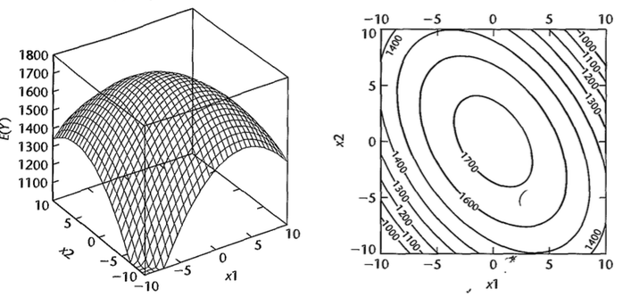
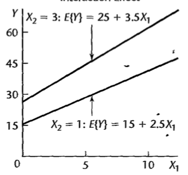
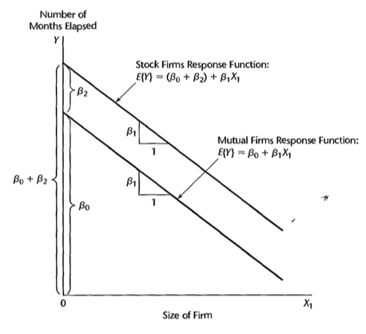
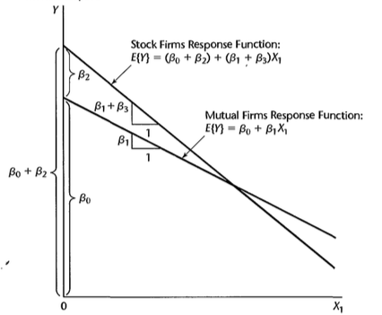

```{r, include=FALSE}
library(tidyverse)
library(readr)
library(knitr)
library(kableExtra)
library(latex2exp)
library(readxl)
```

# Modelo de Regressão Polinomial

## Introdução 

Podemos considerar funções polinomiais como um caso particular do modelo de regressão linear já visto.

Por exemplo, quando temos uma única variável preditora, podemos escrever $Y$ como um função polinomial de $X$ de grau $q$.

$$Y=\beta_0+\beta_1X+\beta_2X^2+\dots+\beta_2X^q + \varepsilon$$

## Regressão Polinomial - Multicolinearidade

Em regressão polinomial a matriz desenho do modelo $\mathbf{X}$ é formada por colunas que são potências de uma mesma variável; 

Essa construção implica no mau condicionamento da matriz, ou seja, na quase dependência linear de suas colunas; 

Uma medida corretiva consiste em usar os dados centrados (ou seja, substituir $X$ por $X_*
= X − \bar{X}$).


## Exemplo : Concentração de madeira dura em celulose e força de tração do papel Kraft {.smaller}

```{r, echo = F, fig.align='center', fig.width=4.5}

x <- c(1, 1.5, 2, 3, 4, 4.5, 5, 5.5, 6, 6.5, 7,8, 9, 10, 11, 12, 13, 14, 15)

y <- c(6.3, 11.1, 20.0, 24.0, 26.1, 30.0, 33.8, 34.0, 38.1, 39.9, 42.0, 46.1, 53.1, 52.0,  52.5, 48.0, 42.8, 27.8, 21.9)

plot(x, y, xlab = "Concentração de madeira dura (%)", ylab = "Resistência à tração (psi)", font.lab = 2)

x2 <- x*x
x3 <- x2*x
x4 <- x2*x2
r12 <- cor(cbind(x,x2,x3,x4))


x_c <- x - mean(x)
x_c2 <- (x_c)^2
x_c3 <- (x_c)^3
x_c4 <- (x_c)^4

r_c12 <- cor(cbind(x_c, x_c2, x_c3, x_c4))
```

## Padronizando a variável $X$ {.smaller}

Correlação entre $X$, $X^2$, $X^3$, $X^4$ 
```{r, echo = F}
round(r12,3)
```
Seja $X_* = X - \bar{X}$

Correlação entre $X_*$, $X_*^2$, $X_*^3$, $X_*^4$

```{r, echo = F}
round(r_c12,3)
```


## Ajuste regressão linear simples {.smaller}

```{r, echo = F, fig.align='center', fig.width=9}

m1 <- lm(y ~ x_c)
round(summary(m1)$coefficients,5)
par(mfrow = c(1,2))
plot(x_c, y, xlab = "Concentração de madeira dura padronizada", ylab = "Resistência à tração (psi)", font.lab = 2,
     main = paste("R2 =", round(summary(m1)$"r.squared",4)))
points(x_c, predict(m1), type = "b", col = "red", pch = 19, lwd = 2)
qqnorm(residuals(m1), col = "red",
       xlab = "Quantis teóricos da distr. normal padrão",
       ylab = "Quantis empíricos dos resíduos", font.lab = 2,
       main = "Gráfico quantil-quantil")
qqline(residuals(m1))
```


## Ajuste polinômio grau 2 {.smaller}

```{r, echo = F, fig.align='center', fig.width=9}

m2 <- lm(y ~ x_c + x_c2)
round(summary(m2)$coefficients,6)
par(mfrow = c(1,2))
plot(x_c, y, xlab = "Concentração de madeira dura padronizada", ylab = "Resistência à tração (psi)", font.lab = 2,
     main = paste("R2 =", round(summary(m2)$"r.squared",4)))
points(x_c, predict(m1), type = "b", col = "red", pch = 19, lwd = 2)
points(x_c, predict(m2), type = "b", col = "blue", pch = 19, lwd = 2)

qqnorm(residuals(m2), col = "blue",
       xlab = "Quantis teóricos da distr. normal padrão",
       ylab = "Quantis empíricos dos resíduos", font.lab = 2,
       main = "Gráfico quantil-quantil")
qqline(residuals(m2))

```

## Ajuste polinômio grau 3 {.smaller}

```{r, echo = F, fig.align='center', fig.width=9}

m3 <- lm(y ~ x_c + x_c2 + x_c3)
round(summary(m3)$coefficients,5)
par(mfrow = c(1,2))
plot(x_c, y, xlab = "Concentração de madeira dura padronizada", ylab = "Resistência à tração (psi)", font.lab = 2,
     main = paste("R2 =", round(summary(m3)$"r.squared",4)))
points(x_c, predict(m1), type = "b", col = "red", pch = 19, lwd = 2)
points(x_c, predict(m2), type = "b", col = "blue", pch = 19, lwd = 2)
points(x_c, predict(m3), type = "b", col = "orange", pch = 19, lwd = 2)

qqnorm(residuals(m3), col = "orange",
       xlab = "Quantis teóricos da distr. normal padrão",
       ylab = "Quantis empíricos dos resíduos", font.lab = 2,
       main = "Gráfico quantil-quantil")
qqline(residuals(m3))
```

## Ajuste polinômio grau 4 {.smaller}

```{r, echo = F, fig.align='center', fig.width=9}

m4 <- lm(y ~ x_c + x_c2 + x_c3 + x_c4)
round(summary(m4)$coefficients,5)
par(mfrow = c(1,2))
plot(x_c, y, xlab = "Concentração de madeira dura padronizada", ylab = "Resistência à tração (psi)", font.lab = 2,
     main = paste("R2 =", round(summary(m4)$"r.squared",4)))
points(x_c, predict(m1), type = "b", col = "red", pch = 19, lwd = 2)
points(x_c, predict(m2), type = "b", col = "blue", pch = 19, lwd = 2)
points(x_c, predict(m3), type = "b", col = "orange", pch = 19, lwd = 2)
points(x_c, predict(m4), type = "b", col = "purple", pch = 19, lwd = 2)

qqnorm(residuals(m4), col = "purple",
       xlab = "Quantis teóricos da distr. normal padrão",
       ylab = "Quantis empíricos dos resíduos", font.lab = 2,
       main = "Gráfico quantil-quantil")
qqline(residuals(m4))

```

## Soma extra de quadrados e teste F {.smaller}

```{r, echo = TRUE}
anova(m4)
round(summary(m3)$coefficient,5)
```

## Extrapolação


A extrapolação de modelos polinomiais para valores de $x$ fora do intervalo observado nos dados pode ser extremamente perigosa. 


## Modelo com dois preditores - segunda ordem

Vamos considerar um modelo de segunda ordem com duas variáveis preditoras $X_1$ e $X_2$

$$Y=\beta_0+\beta_1X_{1*}+\beta_2X_{1*}^2+\beta_3X_{2*}+\beta_4X_{2*}^2+\beta_5X_{1*}X_{2*}+\varepsilon$$

em que $X_{1*}=X_1-\bar{X}_1$ e $X_{2*}=X_2-\bar{X}_2$.


## Exemplo

$$E(Y)=\beta_0+\beta_1X_{1*}+\beta_2X_{1*}^2+\beta_3X_{2*}+\beta_4X_{2*}^2+\beta_5X_{1*}X_{2*}$$

<center>

</center>

## Método hierárquico de ajuste de modelo

Pode-se começar com um modelo de segunda ou terceira ordem e ir testando se os coeficientes de ordem maiores são significativos.

Por exemplo:


$$Y=\beta_0+\beta_1X_{*}+\beta_2X_*^2+\beta_3X_*^3+\varepsilon$$

Para testar se $\beta_3=0$ podemos utilizar $SQReg(X_*^3\mid X_*,X_*^2)$. Se quisermos testar se $\beta_2=\beta_3=0$:

$$SQReg(X_*^2,X_*^3\mid X_*)=SQReg(X_*^2\mid X_*)+SQReg(X_*^3\mid X_*, X_*^2)$$

**Se um termo de ordem mais alta é mantido no modelo, os de ordem mais baixa devem obrigatoriamente ser mantidos também.**

## Exemplo

Dados de um experimento realizado para estudar o efeito de duas variáveis, temperatura de reação $(T)$ e concentração de reagente $(C)$, na conversão percentual de um processo químico $(Y)$

```{r, echo = F}
T <- c(200, 250, 200, 250, 189.65, 260.35, 
225, 225, 225, 225, 225, 225)
C <- c(15, 15, 25, 25, 20, 20, 12.93, 27.07, 
20, 20, 20, 20)
Y <- c(43, 78, 69, 73, 48, 76, 65, 74, 76, 79, 83, 81)
T_p <- (T - mean(T))/sd(T)
C_p <- (C - mean(C))/sd(C)
cbind(T, C, Y, T_p, C_p)
```


## Exemplo {.smaller}

$$Y=\beta_0+\beta_1X_{1*}+\beta_2X_{2*}+\beta_3X_{1*}^2+\beta_4X_{2*}^2+\beta_5X_{1*}X_{2*}+\varepsilon$$
```{r,echo=F}
modelo <- lm(Y ~ C_p + T_p + I(C_p^2) + I(T_p^2) + I(C_p*T_p))
summary(modelo)$coef
anova(modelo)
p <- length(coef(modelo))
n <- length(y)
```

## Será que um modelo de primeira ordem já seria suficiente? { .smaller}

* $H_0$: $\beta_q=\beta_{q+1}=\ldots=\beta_{p-1}=0$.

* $H_1$: pelo menos um $\beta_q,\ldots,\beta_{p-1}$ não é zero.

(por conveniência, a notação assume que os últimos $p-q$ coeficientes do modelo serão testados)

Estatística do teste:

$$\begin{eqnarray}
F^*&=&\frac{SQReg(X_q,\ldots, X_{p-1}\mid X_1,\ldots,X_{q-1})}{p-q}\div\frac{SQE(X_1,\ldots,X_{p-1})}{n-p}\\
&\overset{\mbox{sob $H_0$}}{\sim}&F_{p-q,n-p}
\end{eqnarray}$$


## Exemplo {.smaller}

$p =`r length(coef(modelo))`$ ; $n = `r length(Y)`$ e $q = 3$

$$F^*=\frac{SQReg(X_{1*}^2,X_{2*}^2,X_{1*}X_{2*}\mid X_{1*},X_{2*})/`r p-3`}{SQE(X_{1*},X_{2*},X_{1*}^2,X_{2*}^2,X_{1*}X_{2*})/`r n-p`}\overset{\mbox{sob $H_0$}}{\sim}F_{`r p-3`,`r n-p`}$$


$$\begin{eqnarray}
SQReg(X_{1*}^2,X_{2*}^2,X_{1*}X_{2*}\mid X_{1*},X_{2*}) &=& SQReg(X_{1*}^2\mid X_{1*},X_{2*})\\
&+& SQReg(X_{2*}^2\mid X_{1*},X_{2*},X_{1*}^2)\\
&+&SQReg(X_{1*}X_{2*}\mid X_{1*},X_{2*},X_{1*}^2,X_{2*}^2)\\
&=&`r round(anova(modelo)[3,2],1)` + `r round(anova(modelo)[4,2],1)` +`r anova(modelo)[5,2]`\\
&=& `r round(anova(modelo)[3,2],1) + round(anova(modelo)[4,2],1) + anova(modelo)[5,2]`
\end{eqnarray}$$

$$F_{obs}=\frac{`r round(anova(modelo)[3,2],1) + round(anova(modelo)[4,2],1) + anova(modelo)[5,2]`/`r length(coef(modelo))-3`}{`r round(anova(modelo)[6,3],1)`}=`r ((round(anova(modelo)[3,2],1) + round(anova(modelo)[4,2],1) + anova(modelo)[5,2])/(length(coef(modelo))-3))/ round(anova(modelo)[6,3],1)`$$

Comparando com $F(0.95;`r length(coef(modelo))-3`,`r n-length(coef(modelo))`)=`r round(qf(.95,df1=length(coef(modelo))-3,df2=n-length(coef(modelo))),2)`$. Portanto, encontramos evidências contra a hipótese nula.


## Exemplo

```{r,echo=TRUE}
modeloreduz <- lm(Y ~ C_p + T_p)
anova(modeloreduz, modelo)
```

# Modelo de Regressão com Interação

## Efeitos de interação 

Um modelo de regressão com $p-1$ variáveis preditoras com efeitos aditivos tem função de regressão da forma:

$$E(Y)=f_1(X_1)+f_2(X_2)+\ldots+f_{p-1}(X_{p-1})$$

em que $f_1,f_2,\ldots,f_{p-1}$ podem ser quaisquer funções.

Por exemplo:

$$E(Y)=\underbrace{\beta_0+\beta_1X_1+\beta_2X_1^2}_{f_1(X_1)}+\underbrace{\beta_3X_2}_{f_2(X_2)}$$

O efeito de $X_1$ e $X_2$ em $Y$ é **aditivo**.

## Efeitos de interação 

Já no exemplo a seguir, o efeito não é aditivo, há efeito de interação:


$$E(Y)=\beta_0+\beta_1X_1+\beta_2X_1^2+\beta_3X_2+\beta_4X_1X_2$$


Outro exemplo:

$$E(Y)=\beta_0+\beta_1X_1+\beta_2X_2+\beta_3X_3+\beta_4X_1X_2+\beta_5X_1X_3$$

**O efeito de uma variável sobre $Y$ irá depender do nível da variável com a qual ela interage.**

## Interpretação: interação e efeitos lineares {.build}

$$Y=\beta_0+\beta_1X_1+\beta_2X_2+\beta_3X_1X_2+\varepsilon$$

Suponha que $X_1=a$:

$$E(Y)=\beta_0+\beta_1a+\beta_2X_2+\beta_3aX_2$$

Suponha que $X_1=a+1$:

$$E(Y)=\beta_0+\beta_1(a+1)+\beta_2X_2+\beta_3(a+1)X_2$$

Diferença no valor esperado de $Y$ quando aumentamos $X_1$ em 1 unidade:

$$\beta_0+\beta_1(a+1)+\beta_2X_2+\beta_3(a+1)X_2 - (\beta_0+\beta_1a+\beta_2X_2+\beta_3aX_2)$$

$$=\beta_1+\beta_3X_2$$

## Interpretação: interação e efeitos lineares {.build}

$$Y=\beta_0+\beta_1X_1+\beta_2X_2+\beta_3X_1X_2+\varepsilon$$

Suponha que $X_2=a$:

$$E(Y)=\beta_0+\beta_1X_1+\beta_2a+\beta_3X_1a$$

Suponha que $X_2=a+1$:

$$E(Y)=\beta_0+\beta_1X_1+\beta_2(a+1)+\beta_3X_1(a+1)$$

Diferença no valor esperado de $Y$ quando aumentamos $X_2$ em 1 unidade:

$$\beta_0+\beta_1X_1+\beta_2(a+1)+\beta_3X_1(a+1) - (\beta_0+\beta_1X_1+\beta_2a+\beta_3X_1a)$$

$$=\beta_2+\beta_3X_1$$

## Interpretação: interação e efeitos lineares {.build}

$$Y=\beta_0+\beta_1X_1+\beta_2X_2+\beta_3X_1X_2+\varepsilon$$

Diferença no valor esperado de $Y$ quando aumentamos $X_1$ em 1 unidade:

$$\frac{\partial E(Y)}{\partial X_1}=\beta_1+\beta_3X_2$$

Diferença no valor esperado de $Y$ quando aumentamos $X_2$ em 1 unidade:

$$\frac{\partial E(Y)}{\partial X_2}=\beta_2+\beta_3X_1$$


## Interpretação: interação e efeitos lineares {.build}

Modelo aditivo:

$$E(Y)=10+2X_1+5X_2$$

$\beta_1$: mudança no valor esperado de $Y$ quando $X_1$ aumenta em 1 unidade, mantendo $X_2$ constante.

<center>

</center>

Mantendo $X_2$ constante: não importa se $X_2=1$ ou $X_2=3$ o efeito é sempre $\beta_1$ no valor esperado quando $X_1$ aumenta em 1 unidade (retas paralelas).

## Interpretação: interação e efeitos lineares {.build}

Modelo com interação:

$$E(Y)=10+2X_1+5X_2 +0.5X_1X_2$$

Se $X_2=1$:

$$E(Y)=10+2X_1+5\times1 +0.5X_1\times 1=15+2.5X_1$$

Se $X_2=3$:

$$E(Y)=10+2X_1+5\times3 +0.5X_1\times 3=25+3.5X_1$$

## Interpretação: interação e efeitos lineares {.build}

Para avaliarmos o efeito de 1 unidade de aumento em $X_1$, devemos considerar o valor de $X_2$ (retas não paralelas).

<center>

</center>

## Interpretação: interação e efeitos curvilinear {.build}

Exemplo:

$$E(Y)=65+3X_1+4X_2-10X_1^2-15X_2^2+35X_1X_2$$

<center>

</center>

## Interpretação: interação e efeitos curvilinear {.build}


Se $X_1=1$:

$$E(Y)=65+3\times 1+4X_2-10\times(1^2)-15X_2^2+35\times 1\times X_2$$

$$E(Y)=58+39X_2-15X_2^2$$

Se $X_1=-1$:

$$E(Y)=65+3\times (-1)+4X_2-10\times(-1^2)-15X_2^2+35\times (-1)\times X_2$$

$$E(Y)=52-31X_2-15X_2^2$$

## Interpretação: interação e efeitos curvilinear

```{r,echo=FALSE,fig.align='center', fig.width=5,fig.height=5}
curve(58+39*x-15*x*x,xlab=TeX('$X_2$'),ylab=TeX('E(Y)$'),xlim=c(-1,1),col="red")
curve(52-31*x-15*x*x,xlab=TeX('$X_2$'),ylab=TeX('E(Y)$'),xlim=c(-1,1),add=TRUE,col="blue")
legend(x=-0.5,y=18,col=c("red","blue"),legend=c(TeX('$X_1=1$'),TeX('$X_1=-1$')),lty=1)
```

## Exemplo

$X_1$: tríceps, $X_{1*}=X_1-\bar{X}_1$.

$X_2$: coxa, $X_{2*}=X_2-\bar{X}_2$.

$X_3$: antebraço, $X_{3*}=X_1-\bar{X}_3$.

$Y$: gordura corporal

```{r, echo=FALSE, message=FALSE}
dat = read_table(file.path("dados", "fat.txt"),
           col_names=c("X1", "X2", "X3", "Y")) %>% 
  mutate(x1 = X1-mean(X1),
         x2 = X2-mean(X2),
         x3 = X3-mean(X3))
```

## Exemplo

```{r, echo=FALSE}
kable(dat, align=rep("c", 7)) %>%
  kable_styling(bootstrap_options = c("striped", "hover")) %>%
  column_spec(1:7, width="4em", border_left = TRUE, border_right = TRUE)
```


## Exemplo {.smaller}

$$E(Y)=\beta_0+\beta_1X_{1*}+\beta_2X_{2*}+\beta_3X_{3*}+\beta_4X_{1*}X_{2*}+\beta_5X_{1*}X_{3*}+\beta_6X_{2*}X_{3*}+\varepsilon$$

```{r,echo=TRUE}
modelo <- lm(Y ~ x1 + x2 + x3 + I(x1*x2) + I(x1*x3) + I(x2*x3),data=dat)
summary(modelo)$coef
```

## Exemplo

```{r,echo=TRUE}
anova(modelo)
```

## Exemplo {.build}

$H_0$: $\beta_4=\beta_5=\beta_6=0$

$H_1$: pelo menos um dentre $\beta_4,\beta_5,\beta_6$ é diferente de 0.

$p=`r length(coef(modelo))`$

$n = `r dim(dat)[1]`$

$q=4$

$$F^*=\frac{SQReg(X_{1*}X_{2*},X_{1*}X_{3*},X_{2*}X_{3*}\mid X_{1*},X_{2*},X_{3*})/`r length(coef(modelo))-4`}{SQE(X_{1*},X_{2*},X_{3*},X_{1*}X_{2*},X_{1*}X_{3*},X_{2*}X_{3*})/`r dim(dat)[1]-length(coef(modelo))`}\overset{\mbox{sob $H_0$}}{\sim}F_{`r length(coef(modelo))-4`,`r dim(dat)[1]-length(coef(modelo))`}$$

## Exemplo {.smaller}

$$\begin{eqnarray}
SQReg(X_{1*}X_{2*},X_{1*}X_{3*},X_{2*}X_{3*}\mid X_{1*},X_{2*},X_{3*}) &=& SQReg(X_{1*}X_{2*}\mid X_{1*},X_{2*},X_{3*})\\
&+& SQReg(X_{1*}X_{3*}\mid X_{1*},X_{2*},X_{3*},X_{1*}X_{2*})\\
&+&SQReg(X_{2*}X_{3*}\mid X_{1*},X_{2*},X_{3*},X_{1*}X_{2*},X_{1*}X_{3*})\\
&=&`r round(anova(modelo)[4,2],1)` + `r round(anova(modelo)[5,2],1)` +`r anova(modelo)[6,2]`\\
&=& `r round(anova(modelo)[4,2],1) + round(anova(modelo)[5,2],1) + anova(modelo)[6,2]`
\end{eqnarray}$$

$$F_{obs}=\frac{`r round(anova(modelo)[4,2],1) + round(anova(modelo)[5,2],1) + anova(modelo)[6,2]`/`r length(coef(modelo))-4`}{`r round(anova(modelo)[7,3],1)`}=`r ((round(anova(modelo)[4,2],1) + round(anova(modelo)[5,2],1) + anova(modelo)[6,2])/(length(coef(modelo))-4))/ round(anova(modelo)[7,3],1)`$$

Comparando com $F(0.95;`r length(coef(modelo))-4`,`r dim(dat)[1]-length(coef(modelo))`)=`r round(qf(.95,df1=length(coef(modelo))-4,df2=dim(dat)[1]-length(coef(modelo))),2)`$, não encontramos evidências contra a hipótese nula.


## Exemplo

```{r,echo=TRUE}
modeloreduz <- lm(Y ~ x1 + x2 + x3,data=dat)
anova(modeloreduz,modelo)
```


# Preditores Qualitativos

## Exemplo: Seguros

$Y$ = meses até a implementação

$X_1$ = tamanho da firma (em milhões de dólares)

$$\begin{eqnarray}
X_2 = \begin{cases} 1, & \mbox{se a firma tem ações na bolsa} \\ 0, & \mbox{caso contrário} \end{cases}
\end{eqnarray}$$

$$Y=\beta_0+\beta_1X_1+\beta_2X_2+\varepsilon$$


$$E(Y)=\beta_0+\beta_1X_1+\beta_2X_2$$

## Exemplo: Seguros {.build}

$$E(Y)=\beta_0+\beta_1X_1+\beta_2X_2$$

Se a firma não tem ações na bolsa, então $X_2=0$:

$$E(Y)=\beta_0+\beta_1X_1$$


Se a firma tem ações na bolsa, então $X_2=1$:

$$E(Y)=(\beta_0+\beta_2)+\beta_1X_1$$


## Exemplo: Seguros


<center>

</center>


## Exemplo: Seguros {.smaller}

```{r, echo=F, message=FALSE}
dados <- read_table(file.path("dados", "CH08TA02.txt"), col_names=c("Y", "X1", "X2"))
as.data.frame(dados)
```


## Exemplo: Seguros {.smaller}

```{r,echo=FALSE,warning=FALSE,message=FALSE,fig.align='center',fig.width=6,fig.height=4}
modelo <- lm(Y ~ ., data=dados); summary(modelo)$coef
ggplot(dados, aes(X1, Y, colour=factor(X2))) +
  geom_point() +
  geom_abline(colour='red',
              intercept=coef(modelo)[1],
              slope=coef(modelo)[2]) +
  geom_abline(colour='cyan',
              intercept=coef(modelo)[1]+coef(modelo)[3],
              slope=coef(modelo)[2]) +
  labs(colour = "Ações") +
  theme_bw()
```


## Exemplo: Seguros {.smaller}

Incluindo termo de interação:

$$Y=\beta_0+\beta_1X_1+\beta_2X_2+\beta_3X_1X_2+\varepsilon$$


$$E(Y)=\beta_0+\beta_1X_1+\beta_2X_2+\beta_3X_1X_2$$


Se a firma não tem ações na bolsa, então $X_2=0$:

$$E(Y)=\beta_0+\beta_1X_1$$


Se a firma tem ações na bolsa, então $X_2=1$:

$$E(Y)=(\beta_0+\beta_2)+(\beta_1+\beta_3)X_1$$


## Exemplo: Seguros


<center>

</center>


## Exemplo: Seguros

```{r,echo=TRUE}
modelo <- lm(Y ~ X1 + X2 + X1*X2, data=dados); round(summary(modelo)$coef,5)

modelo <- lm(Y ~ X1*X2, data=dados); round(summary(modelo)$coef,5)
```

## Exemplo: Seguros

```{r,echo=FALSE,warning=FALSE,message=FALSE,fig.align='center',fig.width=6,fig.height=4}
ggplot(dados, aes(X1, Y, colour=factor(X2))) +
  geom_point() +
  geom_abline(colour='red',
              intercept=coef(modelo)[1],
              slope=coef(modelo)[2]) +
  geom_abline(colour='cyan',
              intercept=coef(modelo)[1]+coef(modelo)[3],
              slope=coef(modelo)[2]+coef(modelo)[4]) +
  labs(colour = "Ações") +
  theme_bw()
```


## Variável preditora com **mais de duas classes** {.smaller}

Exemplo: Salário $(Y)$, anos de experiência desde a última titulação $(X_1)$ e uma variável qualitativa $titulo$ que indica o grau de titulação do funcionário.

Existem 3 níveis de titulação: bacharel, mestre e doutor.

Definimos 2 variáveis *dummy* ou indicadoras:

$$\begin{eqnarray}
X_2 = \begin{cases} 1, & \mbox{se mestre} \\ 0, & \mbox{caso contrário} \end{cases}
\end{eqnarray}$$

$$\begin{eqnarray}
X_3 = \begin{cases} 1, & \mbox{se doutor} \\ 0, & \mbox{caso contrário} \end{cases}
\end{eqnarray}$$

Paramétrização por *casela de referência* a escolha de qual o nível será a referência é arbitrária.

## Variável preditora com mais de duas classes {.smaller}

$$E(Y)=\beta_0+\beta_1X_1+\beta_2X_2+\beta_3X_3$$

Se título = bacharel:

$$E(Y)=\beta_0+\beta_1X_1+\beta_2\times0+\beta_3\times0=\beta_0+\beta_1X_1$$


Se o título = mestre:

$$E(Y)=\beta_0+\beta_1X_1+\beta_2\times1+\beta_3\times0=(\beta_0+\beta_2)+\beta_1X_1$$

Se o título = doutor:

$$E(Y)=\beta_0+\beta_1X_1+\beta_2\times0+\beta_3\times1=(\beta_0+\beta_3)+\beta_1X_1$$

O modelo de primeira ordem implica no fato de que o efeito dos anos de experiência é linear e com o mesmo coeficiente angular para todos os níveis de titularidade. Temos diferentes interceptos para cada modelo.

## Variável preditora com mais de duas classes

* $\beta_1$: mudança esperada no salário médio $(Y)$ para cada unidade de aumento nos anos de experiência $(X_1)$, considerando o mesmo nível de titularidade.

* $\beta_2$: diferença esperada no salário médio do bacharel para o mestre, considerando a mesma velocidade.

* $\beta_3$: diferença esperada no salário médio do bacharel para o doutor, considerando a mesma velocidade.

## Variável preditora com mais de duas classes {.smaller}
```{r, echo = F}
dados <- read_excel(file.path("dados", "CH11PR08.xlsx"))
head(as.data.frame(dados), n = 10)
dados$titulo <- factor(dados$titulo, levels = c("bacharel", "mestre", "doutor"))
```

## Variável preditora com mais de duas classes {.smaller}
```{r, echo = F}
m <- lm(Y ~ X1 + titulo, dados)
summary(m)$coefficient
anova(m)
```

## Variável preditora com mais de duas classes 

Qual a diferença esperada no salário médio entre o mestre o doutor?

Quando o título é mestre temos que:

$$E(Y)=(\beta_0+\beta_2)+\beta_1X_1$$


Quando o título é doutor temos que:

$$E(Y)=(\beta_0+\beta_3)+\beta_1X_1$$


A diferença entre mestre e doutor, mantendo os anos de experiência:

$$(\beta_0+\beta_3)+\beta_1X_1 - [(\beta_0+\beta_2)+\beta_1X_1] = \beta_3-\beta_2$$


## Variável preditora com mais de duas classes 

Após obtermos estimativas: $\hat{\beta}_3-\hat{\beta}_2$ e devemos também fornecer o erro-padrão da estimativa.

Lembre que:

$$Var(\hat{\beta}_3-\hat{\beta}_2)=Var(\hat{\beta}_3)+Var(\hat{\beta}_2)-2Cov(\hat{\beta}_3,\hat{\beta}_2)$$

## Variável preditora com mais de duas classes {.smaller}
```{r, echo = F}
b2 <- coef(m)[3]
b3 <- coef(m)[4]
dif = b3 - b2
```

$\hat{\beta}_3$ - $\hat{\beta}_2$ = `r round(b3,2)` - `r round(b2,2)` = `r round(dif,2)`

$\hat{Var{(\hat{\beta})}}$

```{r, echo = F}
round(vcov(m),2)
```

$$Var(\hat{\beta}_3-\hat{\beta}_2) = 24.02 + 21.22 - 2 \times 13.48 = 18.28$$

## Exemplo: Fábrica de sabão

```{r, echo=FALSE, message=FALSE}
dados = read_table(file.path("dados", "CH08TA05.txt"),
                   col_names=c("Y", "X1", "X2"))
dados = as.data.frame(dados)
```

$Y$: resíduo de sabão

$X_1$: velocidade

$$\begin{eqnarray}
X_2 = \begin{cases} 1, & \mbox{se produção na linha 1} \\ 0, & \mbox{caso contrário} \end{cases}
\end{eqnarray}$$

## Exemplo: Fábrica de Sabão

```{r, echo=FALSE, results='asis'}
dados
```

## Exemplo: Fábrica de sabão


```{r,echo=FALSE,fig.align='center',fig.width=5,fig.height=5}
ggplot(dados, aes(X1, Y, colour=factor(X2))) +
  geom_point() +
  theme_bw() +
  labs(colour="Linha")
```

## Exemplo: Fábrica de sabão {.build}

Iremos ajustar um modelo assumindo que:

* a relação entre a quantidade de resíduo e velocidade é linear para as duas linhas de produção;

* retas diferentes para as duas linhas de produção;

* as variâncias dos termos de erros ao redor de cada reta são iguais.


$$Y=\beta_0+\beta_1X_1+\beta_2X_2+\beta_3X_1X_2+\varepsilon$$


Para a linha 1: $E(Y)=(\beta_0+\beta_2)+(\beta_1+\beta_3)X_1$.

Para a linha 2: $E(Y)=\beta_0+\beta_1X_1$.

## Exemplo: Fábrica de sabão {.smaller}

```{r,echo=TRUE}
modelo <- lm(Y ~ X1 + X2 + I(X1*X2), data=dados)
summary(modelo)$coef
anova(modelo)
```

## Exemplo: Fábrica de sabão

```{r,echo=FALSE,warning=FALSE,message=FALSE,fig.align='center',fig.width=5,fig.height=5}
plot(y=dados[dados$X2==1,"Y"],x=dados[dados$X2==1,"X1"],xlab="X1",ylab="Y")
points(y=dados[dados$X2==0,"Y"],x=dados[dados$X2==0,"X1"],pch=2)
abline(a=coef(modelo)[1],b=coef(modelo)[2],lty=2)
abline(a=(coef(modelo)[1]+coef(modelo)[3]),b=(coef(modelo)[2]+coef(modelo)[4]),lty=1)
legend("topleft",legend=c("linha 1","linha 2"),lty=c(1,2))
```


## Exemplo: Fábrica de sabão {.build}

Se quisermos testar a hipótese nula de que temos apenas uma reta para representar as duas linhas:

$H_0$: $\beta_2=\beta_3=0$

$H_a$: pelo menos um entre $\beta_2$ e $\beta_3$ é diferente de zero.

Estatística do teste:

$$\begin{eqnarray}
F^*&=&\frac{SQReg(X_q,\ldots, X_{p-1}\mid X_1,\ldots,X_{q-1})}{p-q}\div\frac{SQE(X_1,\ldots,X_{p-1})}{n-p}\\
&\overset{\mbox{sob $H_0$}}{\sim}&F_{p-q,n-p}
\end{eqnarray}$$


## Exemplo: Fábrica de sabão {.build .smaller}

$p=`r length(coef(modelo))`$

$n = `r dim(dados)[1]`$

$q=2$

$$F^*=\frac{SQReg(X_2,X_1X_2\mid X_1)/`r length(coef(modelo))-2`}{SQE(X_1,X_2,X_1X_2)/`r dim(dados)[1]-length(coef(modelo))`}\overset{\mbox{sob $H_0$}}{\sim}F_{`r length(coef(modelo))-2`,`r dim(dados)[1]-length(coef(modelo))`}$$


$$\begin{eqnarray}
SQReg(X_2,X_1X_2\mid X_1) &=& SQReg(X_2\mid X_1) + SQReg(X_1X_2\mid X_1,X_2\\
&=&`r round(anova(modelo)[2,2],1)` + `r round(anova(modelo)[3,2],1)`\\
&=& `r round(anova(modelo)[2,2],1) + round(anova(modelo)[3,2],1)`
\end{eqnarray}$$

$$F_{obs}=\frac{`r round(anova(modelo)[2,2],1) + round(anova(modelo)[3,2],1)`/`r length(coef(modelo))-2`}{`r round(anova(modelo)[4,3],1)`}=`r ((round(anova(modelo)[2,2],1) + round(anova(modelo)[3,2],1))/(length(coef(modelo))-2))/ round(anova(modelo)[4,3],1)`$$

Comparando com $F(0.95;`r length(coef(modelo))-2`,`r dim(dados)[1]-length(coef(modelo))`)=`r round(qf(.95,df1=length(coef(modelo))-2,df2=dim(dados)[1]-length(coef(modelo))),2)`$, encontramos evidências contra a hipótese nula.

## Exemplo: Fábrica de sabão


```{r,echo=TRUE}
modeloreduz <- lm(Y ~ X1, data=dados)
anova(modeloreduz,modelo)
```


## Exemplo: Fábrica de sabão {.build}

Se quisermos testar a hipótese nula de que para as duas linhas de produção o coeficiente angular é o mesmo:

$H_0$: $\beta_3=0$

$H_a$: $\beta_3\neq0$.

$p=`r length(coef(modelo))`$

$n = `r dim(dados)[1]`$

$q=3$

$$F^*=\frac{SQReg(X_1X_2\mid X_1, X_2)/`r length(coef(modelo))-3`}{SQE(X_1,X_2,X_1X_2)/`r dim(dados)[1]-length(coef(modelo))`}\overset{\mbox{sob $H_0$}}{\sim}F_{`r length(coef(modelo))-3`,`r dim(dados)[1]-length(coef(modelo))`}$$


## Exemplo: Fábrica de sabão

$$F_{obs}=\frac{`r round(anova(modelo)[3,2],1)`/`r length(coef(modelo))-3`}{`r round(anova(modelo)[4,3],1)`}=`r  round(anova(modelo)[3,2],1)/(length(coef(modelo))-3)/ round(anova(modelo)[4,3],1)`$$

Comparando com $F(0.95;`r length(coef(modelo))-3`,`r dim(dados)[1]-length(coef(modelo))`)=`r round(qf(.95,df1=length(coef(modelo))-3,df2=dim(dados)[1]-length(coef(modelo))),2)`$, não encontramos evidências contra a hipótese nula.

## Agradecimento

* Slides criados por Samara F Kiihl / IMECC / UNICAMP

* Editado por Rafael P Maia / IMECC / UNICAMP

## Leitura

* Applied Linear Statistical Models: Seções 8.1-8.3, 8.5-8.7.

* Faraway - [Linear Models with R](http://www.maths.bath.ac.uk/~jjf23/LMR/): Capítulo 14.

* Draper & Smith - [Applied Regression Analysis](http://onlinelibrary.wiley.com/book/10.1002/9781118625590): Capítulo 12.


