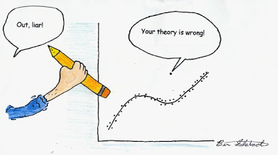

# Diagnóstico do Modelo

## George Box

<center>
"All models are wrong but some are useful."
</center>

<center></center>

<center> [By DavidMCEddy at en.wikipedia, CC BY-SA 3.0](https://commons.wikimedia.org/w/index.php?curid=14941622) </center>


## Introdução {.build}

Como saber se a função de regressão é adequada para explicar a relação entre as variáveis observadas?

> * Gráficos

> * Testes

> Caso a função de regressão não seja adequada, o que fazer?

> * Transformação de variáveis.

> * Outro tipo de modelo.

## Diagnósticos para a variável preditora

```{r,echo=FALSE,fig.height=4,fig.align='center'}
dados <- read.table("./dados/CH01TA01.txt")

stripchart(dados$V1,xlab="Tamanho do lote",method="stack",pch=19,at=.15)
```

* Quantas observações em cada valor diferente de $X$?

* Amplitude dos valores de $X$.

## Diagnósticos para a variável preditora

```{r,echo=FALSE,fig.hegiht=3,fig.align='center'}
plot(dados$V1,ylab="Tamanho do lote",pch=19,type="l",xlab="Ordem de produção")
```

Se as observações são feitas ao longo do tempo, há correlação entre seus valores e o tempo de observação?

## Diagnósticos para a variável preditora

```{r,echo=FALSE,fig.align='center'}
boxplot(dados$V1,ylab="Tamanho do lote",col="lightblue")
```

## Resíduos {.build}

Gráficos de diagnósticos para $Y$ não são úteis em análise de regressão, pois a variável resposta é uma função da preditora.

> Os gráficos de diagnósticos são feitos para os resíduos.

* Resíduos:

$$e_i=Y_i-\hat{Y}_i$$

* Erros:

$$\varepsilon_i=Y_i-E(Y_i)$$

Se assumimos $\varepsilon_i\underset{iid}{\sim}\mathcal{N}(0,\sigma^2)$, esperamos que $e_i$'s, os resíduos observados, reflitam as propriedades assumidas para $\varepsilon_i$'s.


## Propriedades dos resíduos {.build}

* Média dos resíduos:

$$\bar{e}=\frac{\sum_{i=1}^ne_i}{n}=0$$

> Como $\bar{e}$ é sempre nula, não fornece informação sobre $E(\varepsilon_i)$.

> * Variância dos resíduos:

$$s^2=\frac{\sum_{i=1}^n(e_i-\bar{e})^2}{n-2}=\frac{SQErro}{n-2}=QMErro$$

> Se o modelo é apropriado, $s^2$ é um estimador não viesado para $\sigma^2$.

## Propriedades dos resíduos {.build}

* Independência: $e_i$'s **não são variáveis aleatórias independentes**, pois dependem de $\hat{Y}_i$, que por sua vez dependem das mesmas estimativas para os parâmetros $\beta_0$ e $\beta_1$.

> Quanto maior o número de observações com relação ao número de parâmetros estimados, menor é a dependência dos resíduos (pode ser ignorada).

## Resíduos semi-studentizados {.build}

Para detectar outliers, muitas vezes é mais útil observar resíduos padronizados.

> Resíduo semi-studentizado:

$$e_i^*=\frac{e_i}{\sqrt{QME}}$$

## Suposições do modelo estudadas através da análise de resíduos {.build}

Podemos utilizar análise de resíduos para verificar se:

1. a função de regressão não é linear

2. erros não possuem variância constante (heterocedasticidade)

3. erros não são independentes

4. o modelo ajustado é adequado, com exceção de algumas observações outliers

5. erros não seguem distribuição normal

6. uma ou mais variáveis preditoras foram omitidas no modelo

## Análise de Resíduos: gráficos {.build}

* Resíduos x Variável preditora

> * Resíduos absolutos x Variável preditora

> * Resíduos x Valores ajustados ($\hat{Y}$)

> * Resíduos ao longo do tempo/em sequência

> * Resíduos X Variável preditora não incluída no modelo

> * Boxplot dos resíduos

> * Gráfico de probabilidade normal dos resíduos


## Exemplo: Preço do diamante

Preços de diamantes (dólares de Singapura) e peso em quilates (1 quilate = 0.2g).

```{r, echo = FALSE, fig.height=5,fig.width=6, message=FALSE, warning=FALSE,fig.align='center'}
library(UsingR)
data(diamond)
library(ggplot2)
g = ggplot(diamond, aes(x = carat, y = price))
g = g + xlab("Mass (carats)")
g = g + ylab("Price (SIN $)")
g = g + geom_smooth(method = "lm", colour = "black")
g = g + geom_point(size = 7, colour = "black", alpha=0.5)
g = g + geom_point(size = 5, colour = "blue", alpha=0.2)
g
```

## Exemplo: Preço do diamante

Resíduos: comprimento das linhas vermelhas, mantendo o sinal.

```{r, echo = FALSE, fig.height=5, fig.width=5,fig.align='center'}
data(diamond)
y <- diamond$price; x <- diamond$carat; n <- length(y)
fit <- lm(y ~ x)
e <- resid(fit)
yhat <- predict(fit)

plot(diamond$carat, diamond$price,  
     xlab = "Mass (carats)", 
     ylab = "Price (SIN $)", 
     bg = "lightblue", 
     col = "black", cex = 2, pch = 21,frame = FALSE)
abline(fit, lwd = 2)
for (i in 1 : n) 
  lines(c(x[i], x[i]), c(y[i], yhat[i]), col = "red" , lwd = 2)
```

## Exemplo: Preço do diamante

Resíduos X Variável preditora

```{r, echo = FALSE, fig.height=5, fig.width=5,fig.align='center'}
plot(x, e,  
     xlab = "Mass (carats)", 
     ylab = "Residuals (SIN $)", 
     bg = "lightblue", 
     col = "black", cex = 2, pch = 21,frame = FALSE)
abline(h = 0, lwd = 2)
for (i in 1 : n) 
  lines(c(x[i], x[i]), c(e[i], 0), col = "red" , lwd = 2)
```

## Exemplo: Preço do diamante

Resíduos X ordem

```{r, echo = FALSE, fig.height=5, fig.width=5,fig.align='center'}
plot(x=1:length(e), y=e,  
     xlab = "order", 
     ylab = "Residuals (SIN $)", 
     col = "black", cex = 2,type="l")
```


## Exemplo: Preço do diamante

Boxplot dos resíduos

```{r, echo = FALSE, fig.height=5, fig.width=5,fig.align='center'}
boxplot(e,col="lightblue",ylab="Residuals (SIN $)")
```

## Exemplo: Preço do diamante

Gráfico de normalidade dos resíduos

```{r, echo = FALSE, fig.height=4, fig.width=5,fig.align='center'}
qqnorm(e)
```

(ver Kutner pag 110)


## Exemplo: não-linearidade

```{r, echo = FALSE, fig.height=5, fig.width=5,fig.align='center'}
x = runif(100, -3, 3); y = x + sin(x) + rnorm(100, sd = .2); 
library(ggplot2)
g = ggplot(data.frame(x = x, y = y), aes(x = x, y = y))
g = g + geom_smooth(method = "lm", colour = "black")
g = g + geom_point(size = 7, colour = "black", alpha = 0.4)
g = g + geom_point(size = 5, colour = "red", alpha = 0.4)
g
```

## Exemplo: não-linearidade

Resíduos X Variável preditora


```{r, echo = FALSE, fig.height=5, fig.width=5,fig.align='center'}
g = ggplot(data.frame(x = x, y = resid(lm(y ~ x))), 
           aes(x = x, y = y))
g = g + geom_hline(yintercept = 0, size = 2); 
g = g + geom_point(size = 7, colour = "black", alpha = 0.4)
g = g + geom_point(size = 5, colour = "red", alpha = 0.4)
g = g + xlab("X") + ylab("Residual")
g
```

## Exemplo: heterocedasticidade

```{r, echo = FALSE, fig.height=4.5, fig.width=4.5,fig.align='center'}
x <- runif(100, 0, 6); y <- x + rnorm(100,  mean = 0, sd = .001 * x); 
g = ggplot(data.frame(x = x, y = y), aes(x = x, y = y))
g = g + geom_smooth(method = "lm", colour = "black")
g = g + geom_point(size = 7, colour = "black", alpha = 0.4)
g = g + geom_point(size = 5, colour = "red", alpha = 0.4)
g
```

## Exemplo: heterocedasticidade

```{r, echo = FALSE, fig.height=4.5, fig.width=4.5,fig.align='center'}

g = ggplot(data.frame(x = x, y = resid(lm(y ~ x))), 
           aes(x = x, y = y))
g = g + geom_hline(yintercept = 0, size = 2); 
g = g + geom_point(size = 7, colour = "black", alpha = 0.4)
g = g + geom_point(size = 5, colour = "red", alpha = 0.4)
g = g + xlab("X") + ylab("Residual")
g
```


## Análise de Resíduos: testes de hipóteses

Além de gráficos, podemos também utilizar testes de hipóteses estatísticos para avaliar algumas suposições do modelo.

## Teste de correlação para normalidade {.build}

Calcular coeficiente de correlação entre $e_i$ e seus valores esperados, segundo a distribuição normal

> Quanto maior a correlação, maior o indício de normalidade dos resíduos.

> Detalhes sobre o teste: [Looney & Gulledge (1985) - Use of the Correlation Coefficient with Normal Probability Plots](http://www.jstor.org/stable/2683917)

## Teste de correlação para normalidade {.build}

Calcular a correlação entre os resíduos ordenados e 

$$r=\{r_1,r_2,\ldots,r_k\ldots,r_n\}$$

em que $r_k$ é o valor esperado do $k$-ésimo resíduos, segundo a suposição de normalidades.

$$r_k\approx \sqrt{QME}\left[z\left(\frac{k-0.375}{n+0.25} \right) \right]$$

$z(A)$ é o $A\times 100$ percentil da distribuição normal padrão.


> Obs: Outro teste conhecido: [Teste de Shapiro-Wilks](http://www.portalaction.com.br/inferencia/64-teste-de-shapiro-wilk).

## Teste de homocedasticidade: Brown-Forsythe {.build}

* Não depende da suposição de normalidade

> * Aplicável no caso de regressão linear simples quando a variância do erro aumenta ou decresce com a variável preditora $X$.

> * Tamanho amostral grande o suficiente para que possamos assumir que os resíduos são independentes.


> * Idéia parecida com um teste-t para duas amostras.

## Teste de homocedasticidade: Brown-Forsythe {.build}

* $X$ é dividida em $X_1$ (valores mais baixos de $X$) e $X_2$ (valores mais altos de $X$). Isto é, temos dois grupos.

> * $e_{i1}$ é o $i$-ésimo resíduo para o grupo 1 e $e_{i2}$ é o $i$-ésimo resíduo para o grupo 2.

> * $n_j$ é o número de observações no grupo $j$

> * $n=n_1+n_2$.

> * $\tilde{e}_j$  é a mediana dos resíduos do grupo $j$.

> * $d_{i1}=| e_{i1}-\tilde{e}_1|\quad\quad d_{i2}=| e_{i2}-\tilde{e}_2|$

## Teste de homocedasticidade: Brown-Forsythe {.build}

Estatística do teste:

$$t^*_{BF}=\frac{\bar{d}_1-\bar{d}_2}{s\sqrt{\frac{1}{n_1}+\frac{1}{n_2}}}$$

$$s^2=\frac{\sum(d_{i1}-\bar{d}_1)^2+\sum(d_{i2}-\bar{d}_2)^2}{n-2}$$

> Se a variância é constante e $n_1$ e $n_2$ grandes o suficiente, então $t^*_{BF}$ segue distribuição $t$ com $n-2$ graus de liberdade.

> Valores altos de $t^*_{BF}$ indicam heterocedasticidade.


## Exemplo: Toluca

```{r,echo=TRUE,eval=FALSE}
data <- read.table("./dados/CH01TA01.txt")
x = data[,1]
y = data[,2]
ind1 = which(x<80)
ind2 = which(x>=80)
fit = lm(y~x)
resi = fit$resi
resi1 = resi[ind1]
resi2 = resi[ind2]
d1 = abs(resi1-median(resi1))
d2 = abs(resi2-median(resi2))
t.test(d1,d2)
```

## Exemplo: Toluca

```{r,echo=FALSE,eval=TRUE}
data <- read.table("./dados/CH01TA01.txt")
x = data[,1]
y = data[,2]
ind1 = which(x<80)
ind2 = which(x>=80)
fit = lm(y~x)
resi = fit$resi
resi1 = resi[ind1]
resi2 = resi[ind2]
d1 = abs(resi1-median(resi1))
d2 = abs(resi2-median(resi2))
t.test(d1,d2)
```

Não rejeitamos $H_0$, isto é, não obtemos evidências para rejeitar a hipótese de homocedasticidade dos erros.


## Teste de homocedasticidade: Breusch-Pagan {.build}

> Assume que $\varepsilon_i\sim\mathcal{N}(0,\sigma_i^2)$.

> O seguinte modelo é assumido:

$$\log_e\sigma_i^2=\gamma_0+\gamma_1X_i$$

> Se $\gamma_1=0$ temos homocedasticidade.

> $H_0$: $\gamma_1=0$ vs $H_1$: $\gamma_1\neq0$.

## Teste de homocedasticidade: Breusch-Pagan {.build}

Estatística do teste:

$$X^2_{BP}=\frac{\frac{SQRq}{2}}{\left(\frac{SQE}{n}\right)^2}$$

em que $SQRq$ é a soma de quadrados da regressão de $e_i^2$ em $X$ e $SQE$ é a soma de quadrados do erro da regressão de $Y$ em $X$.

Sob $H_0$, $X^2_{BP}\sim\chi^2_1$.

## Exemplo: Toluca


```{r,echo=TRUE}
fit = lm(y~x)
resi = fit$resi
fit2 = lm(resi^2~x)
a1 <- anova(fit)
a2 <- anova(fit2)
estatistica <- (a2$`Sum Sq`[1]/2)/((a1$`Sum Sq`[2]/length(y))^2)
```

## Exemplo: Toluca


```{r,echo=FALSE}
a1
a2
estatistica
```

## Teste de homocedasticidade: Breusch-Pagan {.build}

Diretamente pelo R:

```{r,echo=TRUE}
library('car')
ncvTest(fit)
```

## Teste F para falta de ajuste {.build}


Queremos testar se a função de regressão proposta é adequada para os dados.

Suposições: as observações de $Y|X$ são

* independentes
* seguem distribuição normal
* variância constante $\sigma^2$

É preciso que tenhamos mais de uma observação para cada nível de $X$ (replicações).


## Teste F para falta de ajuste {.build}

Suponha que tenhamos $m$ valores distintos para $X$

Para cada valor diferente de $X$, $x_j$, temos $n_j$ observações.

* $Y_{11},Y_{12},\ldots, Y_{1n_1}$ são $n_1$ repetições para $X=x_1$.
* $Y_{21},Y_{22},\ldots, Y_{2n_2}$ são $n_2$ repetições para $X=x_2$.
* $Y_{m1},Y_{m2},\ldots, Y_{mn_m}$ são $n_m$ repetições para $X=x_m$.

$$n=\sum_{j=1}^m\sum_{u=1}^{n_j}1=\sum_{j=1}^mn_j$$

## Teste F para falta de ajuste {.build}


Com replicações para cada $X=x_k$, temos um estimador para $Var(Y|X=x_k)=\sigma^2$ para todo $k$.

Por exemplo, quando $X=x_1$, podemos usar $Y_{11},Y_{12},\ldots, Y_{1n_1}$ e o seguinte estimador para $Var(Y|X=x_1)$:

$$\frac{1}{n_1-1}\sum_{j=1}^{n_1}(Y_{1j}-\bar{Y}_1)^2$$

Combinando todas as observações (não apenas as replicações para um dado nível de $X$), temos o seguinte estimador para $\sigma^2$:

$$s_p^2=\frac{\sum_{j=1}^m\sum_{u=1}^{n_j}(Y_{ju}-\bar{Y}_j)^2}{\sum_{j=1}^m(n_j-1)}$$

## Teste F para falta de ajuste {.build}

$$SQE_p=\sum_{j=1}^m\sum_{u=1}^{n_j}=(Y_{ju}-\bar{Y}_j)^2$$

com graus de liberdade $n_p=\sum_{j=1}^m(n_j-1)=\sum_{j=1}^mn_j-m$.

$$QME_{puro}=s_p^2=\frac{\sum_{j=1}^m\sum_{u=1}^{n_j}(Y_{ju}-\bar{Y}_j)^2}{\sum_{j=1}^mn_j-m}$$

## Teste F para falta de ajuste {.build}

Relembrando:

$$SQE=\sum_{j=1}^m\sum_{u=1}^{n_j}(Y_{ju}-\hat{Y}_j)^2$$

**Mostre$^1$** que a $SQE$ pode ser particionada da seguinte forma:

$$\sum_{j=1}^m\sum_{u=1}^{n_j}(Y_{ju}-\hat{Y}_j)^2 = \sum_{j=1}^m\sum_{u=1}^{n_j}(Y_{ju}-\bar{Y}_j)^2 + \sum_{j=1}^mn_j(\hat{Y}_j-\bar{Y}_j)^2$$

## Teste F para falta de ajuste {.build}

$$\underbrace{\sum_{j=1}^m\sum_{u=1}^{n_j}(Y_{ju}-\hat{Y}_j)^2}_{SQE} = \underbrace{\sum_{j=1}^m\sum_{u=1}^{n_j}(Y_{ju}-\bar{Y}_j)^2}_{SQE_p} + \underbrace{\sum_{j=1}^mn_j(\hat{Y}_j-\bar{Y}_j)^2}_{SQF_a}$$

$SQE$ é a soma de quadrados dos resíduos, representando a variação em torno da reta.

$SQE_p$ é a soma de quadrados do erro puro, representando a variação de $Y$, para $X$ fixo, independente do modelo (pois utilizamos as replicações).

$SQF_a$ é a soma de quadrados da falta de ajuste, representando a falta de ajuste do modelo.

## Teste F para falta de ajuste {.build}

$SQE$ é o numerador de $s^2$ e $SQE_p$ é o numerador de $s^2_p$.

Valores relativamente altos de $SQF_a$ indicam discrepância entre esses dois estimadores e, consequentemente, indicam evidência contra a adequação do modelo de regressão linear simples.

Quanto mais alto o valor de $SQF_a$, pior é o ajuste do modelo, pois, se o modelo fosse perfeito, teríamos que $SQF_a=0$.

## Teste F para falta de ajuste {.build}


$H_0$: o MRLS é adequado

$H_1$: o MRLS não é adequado

Estatística do teste:

$$F^*=\frac{SQF_a/(m-2)}{SQE_p/(n-m)}\overset{\mbox{sob }H_0}{\sim} F_{m-2,n-m}$$

## Teste F para falta de ajuste {.build}

Fonte de Variação  | gl        | SQ                                         
------------------ | ----------|--------------------------------------------
Regressão          |  $1$      | $SQReg=\sum_{i=1}^n(\hat{Y}_i-\bar{Y})^2$  
Erro               |  $n-2$    | $SQE=\sum_{i=1}^n(Y_i-\hat{Y})^2$    
(Falta de ajuste)  |  $m-2$    | $SQF_a=\sum_{j=1}^mn_j(\hat{Y}_j-\bar{Y}_j)^2$  
(Erro puro)        |  $n-m$    | $SQE_p=\sum_{j=1}^m\sum_{u=1}^{n_j}(Y_{ju}-\bar{Y}_j)^2$  
Total (ajustada)   |  $n-1$    | $SQT=\sum_{i=1}^n(Y_i-\bar{Y})^2$          


## Exemplo: Agências bancárias {.build}

11 agências de um certo banco ofereceram brindes para novos clientes.

Um depósito inicial mínimo era necessário para qualificar para o brinde.

Cada agência especificou o valor do depósito mínimo.

Interesse: valor do depósito mínimo inicial e número de contas que foram abertas na agência.


## Exemplo: Agências bancárias {.build}

```{r,echo=FALSE,message=FALSE,warning=FALSE,fig.align='center',fig.height=4.5}
data = read.table('./dados/CH03TA04.txt',header=F)
y = data[,2]
x = data[,1]
colnames(data) <- c("x","y")

ggplot(data,aes(x=x,y=y))+geom_point(shape=1) + geom_smooth(method=lm,se=FALSE) + ylab("Contas abertas")+xlab("Depósito mínimo")

```


## Exemplo: Agências bancárias {.build}

Modelo completo:

$$Y_{ij}=\mu_{j}+\varepsilon_{ij}$$

Temos que $E(Y_{ij})=\mu_j$, isto é, temos esperança diferente para cada $X_j$.

## Exemplo: Agências bancárias {.build .smaller}

```{r,echo=TRUE,message=FALSE,warning=FALSE}
Full=lm(y~as.factor(x)-1)
summary(Full)
```


## Exemplo: Agências bancárias {.build .smaller}

Modelo reduzido: reta de regressão.

```{r,echo=TRUE,message=FALSE,warning=FALSE}
Reduced=lm(y~x)
summary(Reduced)
```


```{r,echo=FALSE,message=FALSE,warning=FALSE}
library(lmf)
extract2a <- lm.extract(y ~ -1 + factor(x))
extract1a <- lm.extract(y ~ x)
```
$s=`r round(extract1a$sigma.djt,2)`$ enquanto que, usando o modelo anterior, temos que $s_e=`r round(extract2a$sigma.djt,2)`$.


## Exemplo: Agências bancárias {.smaller}

```{r,echo=TRUE,message=FALSE,warning=FALSE}
Reduced=lm(y~x)
Full=lm(y~as.factor(x)-1)
anova(Reduced, Full)
```

Estatística do teste:

$$F^*=\frac{SQF_a/(m-2)}{SQE_p/(n-m)}\overset{\mbox{sob }H_0}{\sim} F_{m-2,n-m}=F_{`r anova(Reduced,Full)[2,3]`,`r anova(Reduced,Full)[2,1]`}$$

## Exemplo: Agências bancárias

$$F^*_{obs}=\frac{[SQE(Reduced)-SQE(Full)]/`r (anova(Reduced)[2,1]-anova(Full)[2,1])`}{SQE(Full)/`r anova(Full)[2,1]`}=\frac{`r (anova(Reduced)[2,2]-anova(Full)[2,2])`/`r (anova(Reduced)[2,1]-anova(Full)[2,1])`}{`r anova(Full)[2,2]`/`r anova(Full)[2,1]`}=`r round(anova(Reduced,Full)[2,5],2)`$$

valor de p: `r anova(Reduced,Full)[2,6]`.

Valor crítico para $\alpha=0.05$: `r round(qf(.95, df1=anova(Reduced,Full)[2,3], df2=anova(Reduced,Full)[2,1]),2)`


## Exemplo: Ligas de cobre e níquel {.build}

13 ligas de cobre e níquel, mas quantidades diferentes de ferro.

As ligas foram submersas em água do mar por 60 dias e a perda de peso devido à corrosão foi anotada em miligramas por decímetro quadrado por dia.

```{r,echo=FALSE,message=FALSE,warning=FALSE,fig.align='center',fig.height=3.5}
library(faraway)
data(corrosion)
library(ggplot2)
ggplot(corrosion,aes(x=Fe,y=loss))+geom_point(shape=1) + geom_smooth(method=lm,se=FALSE) + ylab("Peso perdido")+xlab("Quantidade de ferro")
```


## Exemplo: Ligas de cobre e níquel {.build}

```{r,echo=FALSE,message=FALSE,warning=FALSE}
library(faraway)
data(corrosion)
modeloreduzido <- lm(loss ~ Fe,data=corrosion)
summary(modeloreduzido)
library(lmf)
extract <- lm.extract(loss ~ Fe, data=corrosion)
```

## Exemplo: Ligas de cobre e níquel {.build .smaller}

```{r,echo=FALSE,message=FALSE,warning=FALSE}
modelocompleto <- lm(loss ~ factor(Fe) -1,data=corrosion)
extract2 <- lm.extract(loss ~ -1 + factor(Fe), data=corrosion)
summary(modelocompleto)
```


$s_{e}=`r round(extract2$sigma.djt,2)`$ enquanto que, usando o modelo anterior, temos que $s=`r round(extract$sigma.djt,2)`$.


## Exemplo: Ligas de cobre e níquel {.build}

```{r}
anova(modeloreduzido,modelocompleto)
```


Estatística do teste:

$$F^*=\frac{SQF_a/(m-2)}{SQE_p/(n-m)}=\frac{91.069/5}{11.782/6}=9.28$$

## Exemplo: Ligas de cobre e níquel

```{r,echo=TRUE,warning=FALSE,message=FALSE}
library(alr3)
pureErrorAnova(modeloreduzido)
```

## Como melhorar o modelo {.build}

Se nos testes e/ou gráficos de diagnóstico do modelo determinarmos que o mesmo não é adequado, o que fazer?

> * Abandonar o modelo e procurar outro mais adequado: regressão logística, regressão não-paramétrica, regressão robusta...

> * Aplicar alguma transformação nos dados, de maneira que a regressão linear simples fique adequada.


## Leitura

* Applied Linear Statistical Models: 3.1-3.7.

* Caffo - [Regression Models for Data Science in R](https://leanpub.com/regmods): Residuals.

* Draper & Smith - [Applied Regression Analysis](http://onlinelibrary.wiley.com/book/10.1002/9781118625590): Capítulo 2.

* Weisberg - [Applied Linear Regression](http://unicampbr.summon.serialssolutions.com/2.0.0/link/0/eLvHCXMwrV1NSwMxEB1EDyoFv22tSs5Ca5JdN9mTWLX0oljwXqZJCh5cy3YF_fdmku0KhXryGCZfhCQzTN57AUhkn_dW7oQURSaFUUamqDBVM41CckyN0M5wNOFP23w8Vs8jUs0Z_PWASqSJ9_m1_TAPAWXZjwyAW1sHtaTYJolf7l0ZHdW7QfKbdeH0DMjDl0F-M-vM166Fn5Zl3VCOIiIyOJrh3n_MaR-2HFEYDmDDFYew-9Qosy6O4CpcA4ySYm7B3gr2UvoTHRCy3wwLyyj6jOLNx3A5fHy9H_XiNCbzKEwxWY6TnEALCSBfVIFIZ9vAfCiHWjlhUU0pm6YxkQptluezG8wV78Dpmt460F2xVF9VYz1b264LOz66qGEu57BZlZ_uArbrtZqWP8hqnhA
): Capítulo 2.

* Faraway - [Linear Models with R](http://www.maths.bath.ac.uk/~jjf23/LMR/): 8.3.

<center></center>

