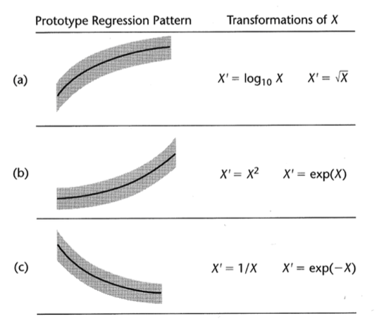
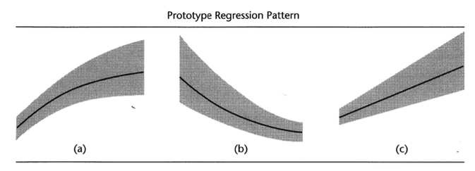

# Transformações

## Transformações: relações não lineares

<center></center>

## Transformações: relações não lineares {.build}

* Linearizar uma relação linear, em casos que a suposição de normalidade dos erros com variância constante é adequada .

* Tentar encontrar transformação em $X$.

* Avaliar os gráficos de resíduo para decidir qual a melhor transformação.

## Exemplo: Treinamento e Performance {.build}

$X$: número de dias de treinamento recebido.

$Y$: performance nas vendas.

```{r,echo=FALSE}
dados <- read.table("./dados/CH03TA07.txt")
colnames(dados) <- c("Days","Performance")
dados
```

## Exemplo: Treinamento e Performance

```{r,echo=FALSE,warning=FALSE,message=FALSE,fig.align='center'}
modelo <- lm(Performance ~ Days,data=dados)
library(ggplot2)
g = ggplot(dados, aes(x = Days, y = Performance))
g = g + geom_point()
g = g + xlab("Days")
g = g + ylab("Performance")
g = g + geom_smooth(method = "lm",se=FALSE)
g
```

$$\hat{Y}=`r coef(modelo)[1]` + `r coef(modelo)[2]`X$$

## Exemplo: Treinamento e Performance

Gráfico de resíduos: $e_i$ versus $\hat{Y}_i$.

```{r,echo=FALSE,fig.align='center'}
dados$fit <- fitted(modelo)
dados$res <- resid(modelo)

g = ggplot(dados, aes(x = fit, y = res))
g = g + geom_point()
g = g + xlab("Fitted")
g = g + ylab("Residuals")+ geom_smooth(method = "loess",se=FALSE)
g
```

## Exemplo: Treinamento e Performance

$X'=\sqrt{X}$

```{r,echo=FALSE,warning=FALSE,message=FALSE,fig.align='center',fig.height=4}
modelo2 <- lm(Performance ~ sqrt(Days),data=dados)
dados$fit2 <- fitted(modelo2)
dados$res2 <- resid(modelo2)

g = ggplot(dados, aes(x = sqrt(Days), y = Performance))
g = g + geom_point()
g = g + xlab("X'")
g = g + ylab("Performance")
g = g + geom_smooth(method = "lm",se=FALSE)
g

```

$$\hat{Y}=`r round(coef(modelo2)[1],2)` + `r round(coef(modelo2)[2],2)`\sqrt{X}$$


## Exemplo: Treinamento e Performance

Gráfico de resíduos: $e_i$ versus $\hat{Y}_i$ usando $X'$ no modelo.

```{r,echo=FALSE,fig.align='center'}
g = ggplot(dados, aes(x = fit2, y = res2))
g = g + geom_point()
g = g + xlab("Fitted")
g = g + ylab("Residuals")+ geom_smooth(method = "loess",se=FALSE)
g
```


## Transformações: não normalidade e variância não constante

<center></center>

## Transformações: não normalidade e variância não constante

* Tentar encontrar transformação em $Y$.

* Pode ser combinada com uma transformação também em $X$.

## Exemplo: Idade e nível de poliamina

$X$: Idade

$Y$: nível de poliamina no plasma


```{r,echo=FALSE}
dados <- read.table("./dados/CH03TA08.txt")
colnames(dados) <- c("Idade","Poliamina")
dados[,1:2]
```

## Exemplo: Idade e nível de poliamina

```{r,echo=FALSE,warning=FALSE,message=FALSE,fig.align='center'}
modelo <- lm(Poliamina ~ Idade,data=dados)
library(ggplot2)
g = ggplot(dados, aes(x = Idade, y = Poliamina))
g = g + geom_point()
g = g + xlab("Idade")
g = g + ylab("Poliamina")
g = g + geom_smooth(method = "lm",se=FALSE)
g
```

$$\hat{Y}=`r coef(modelo)[1]` + `r coef(modelo)[2]`X$$

## Exemplo: Idade e nível de poliamina

Gráfico de resíduos: $e_i$ versus $\hat{Y}_i$.

```{r,echo=FALSE,fig.align='center'}
dados$fit <- fitted(modelo)
dados$res <- resid(modelo)

g = ggplot(dados, aes(x = fit, y = res))
g = g + geom_point()
g = g + xlab("Fitted")
g = g + ylab("Residuals")+ geom_smooth(method = "loess",se=FALSE)
g
```


## Exemplo: Idade e nível de poliamina

Gráfico de resíduos: $e_i$ versus $X_i$.

```{r,echo=FALSE,fig.align='center'}
dados$fit <- fitted(modelo)
dados$res <- resid(modelo)

g = ggplot(dados, aes(x = Idade, y = res))
g = g + geom_point()
g = g + xlab("Idade")
g = g + ylab("Residuals")+ geom_smooth(method = "loess",se=FALSE)
g
```


## Exemplo: Idade e nível de poliamina

$Y'=\log_{10}Y$

```{r,echo=FALSE,warning=FALSE,message=FALSE,fig.align='center',fig.height=4}
modelo2 <- lm(log10(Poliamina) ~ Idade,data=dados)
dados$fit2 <- fitted(modelo2)
dados$res2 <- resid(modelo2)

g = ggplot(dados, aes(x = Idade, y = log10(Poliamina)))
g = g + geom_point()
g = g + xlab("Idade")
g = g + ylab("Y")
g = g + geom_smooth(method = "lm",se=FALSE)
g

```

$$\hat{Y'}=`r round(coef(modelo2)[1],2)` + `r round(coef(modelo2)[2],2)`X$$


## Exemplo: Idade e nível de poliamina

Gráfico de resíduos: $e_i$ versus $\hat{Y'}_i$ usando $Y'$ no modelo.

```{r,echo=FALSE,fig.align='center'}
g = ggplot(dados, aes(x = fit2, y = res2))
g = g + geom_point()
g = g + xlab("Fitted")
g = g + ylab("Residuals")+ geom_smooth(method = "loess",se=FALSE)
g
```

## Exemplo: Idade e nível de poliamina

Gráfico de resíduos: $e_i$ versus $X_i$.

```{r,echo=FALSE,fig.align='center'}

g = ggplot(dados, aes(x = Idade, y = res2))
g = g + geom_point()
g = g + xlab("Idade")
g = g + ylab("Residuals")+ geom_smooth(method = "loess",se=FALSE)
g
```

## Algumas transformações em $Y$ {.build}

* $\log_e(Y)$: para estabilizar a variância quando esta tende a crescer à medida que $Y$ cresce.

* $\sqrt{Y}$: estabilizar a variância quando esta é proporcional à média dos $Y$'s.

* $\frac{1}{Y}$: estabilizar a variância, minimizando o efeito de valores muito altos de $Y$.

* $Y^2$: estabilizar a variância quando esta tende a decrescer com a média de $Y$'s.

* $\arcsin{\sqrt{Y}}$: estabilizar a variância quando os dados são proporções.

* etc...

## Transformações de Box-Cox {.build}

* Muitas vezes é difícil determinar, através de gráficos, qual a melhor transformação a ser feita.

* O procedimento de [Box-Cox](http://www.jstor.org/stable/2984418) identifica automaticamente uma transformação:

$$Y'=Y^{\lambda}$$

em que $\lambda$ é um parâmetro a ser determinado a partir dos dados.

* Modelo com dados transformados:

$$Y_i^{\lambda}=\beta_0+\beta_1X_i+\varepsilon_i$$

* O procedimento de Box-Cox utiliza o método de máxima verossimilhança para estimar $\lambda$.


## Leitura

* Applied Linear Statistical Models: 3.8-3.11.

* Weisberg - [Applied Linear Regression](http://unicampbr.summon.serialssolutions.com/2.0.0/link/0/eLvHCXMwrV1NSwMxEB1EDyoFv22tSs5Ca5JdN9mTWLX0oljwXqZJCh5cy3YF_fdmku0KhXryGCZfhCQzTN57AUhkn_dW7oQURSaFUUamqDBVM41CckyN0M5wNOFP23w8Vs8jUs0Z_PWASqSJ9_m1_TAPAWXZjwyAW1sHtaTYJolf7l0ZHdW7QfKbdeH0DMjDl0F-M-vM166Fn5Zl3VCOIiIyOJrh3n_MaR-2HFEYDmDDFYew-9Qosy6O4CpcA4ySYm7B3gr2UvoTHRCy3wwLyyj6jOLNx3A5fHy9H_XiNCbzKEwxWY6TnEALCSBfVIFIZ9vAfCiHWjlhUU0pm6YxkQptluezG8wV78Dpmt460F2xVF9VYz1b264LOz66qGEu57BZlZ_uArbrtZqWP8hqnhA
): Capítulo 8.

* Faraway - [Linear Models with R](http://www.maths.bath.ac.uk/~jjf23/LMR/): Capítulo 9.

<center></center>

