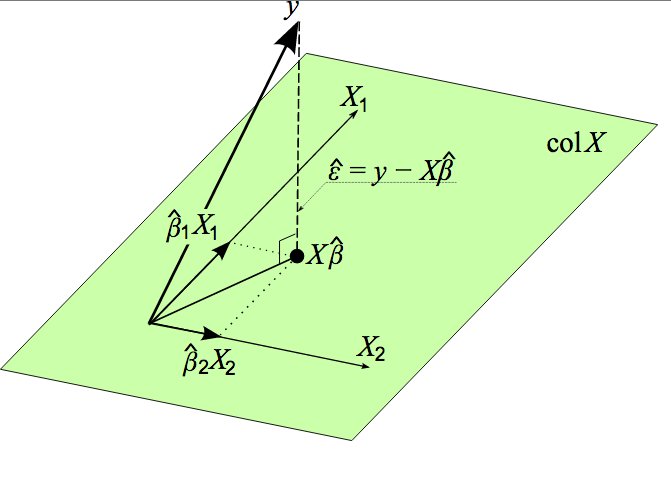

# Intervalo de confiança simultâneo

## Inferência simultânea {.build}

Suponha que tenhamos interesse tanto em fazer inferência sobre $\beta_0$ quanto para $\beta_1$.

Vimos como construir um intervalo de, por exemplo, $95\%$ de confiança para $\hat{\beta}_0$ e um intervalo de $95\%$ de confiança para $\hat{\beta}_1$.

Mas, se utilizarmos esses intervalos de confiança individuais, não temos $95\%$ de confiança para $\beta_0$ e $\beta_1$ conjuntamente. 

Por exemplo, se essas inferências fossem independentes, teríamos $0.95^2=0.9025$ de confiança. 

No caso, já vimos que $\hat{\beta}_0$ e $\hat{\beta}_1$ não são independentes, o que dificulta a determinação do verdadeiro nível de confiança.

## Intervalo de confiança conjunto de Bonferroni {.build}

Relembrando:

1. Intervalo de confiança $100\times(1-\alpha)\%$ para $\beta_0$: $$\hat{\beta}_0\pm t_{n-2,\alpha/2}\sqrt{\widehat{Var}(\hat{\beta}_0)}$$

2. Intervalo de confiança $100\times(1-\alpha)\%$ para $\beta_1$: $$\hat{\beta}_1\pm t_{n-2,\alpha/2}\sqrt{\widehat{Var}(\hat{\beta}_1)}$$


## Intervalo de confiança conjunto de Bonferroni {.build}


Seja $A_1$ o evento de que o intervalo 1 não contenha $\beta_0$. $P(A_1)=\alpha$.

Seja $A_2$ o evento de que o intervalo 2 não contenha $\beta_1$. $P(A_2)=\alpha$.

Qual a probabilidade de que ambos intervalos estejam corretos, isto é, $P(A_1^c\cap A_2^c)$?

$$P(A_1^c\cap A_2^c)=1-P(A_1\cup A_2)=1-P(A_1)-P(A_2)+P(A_1\cap A_2)$$

Desigualdade de Bonferroni:

$$\begin{eqnarray} 
P(A_1^c\cap A_2^c)&\geq& 1-P(A_1)-P(A_2)\\
&\geq& 1-2\alpha
\end{eqnarray}$$


## Intervalo de confiança conjunto de Bonferroni {.build}

Para obter $100\times(1-\alpha)\%$ de confiança para $\beta_0$ e $\beta_1$ conjuntamente, segundo o procedimento de Bonferroni:

1. $$\hat{\beta}_0\pm t_{n-2,\alpha/4}\sqrt{\widehat{Var}(\hat{\beta}_0)}$$

2. $$\hat{\beta}_1\pm t_{n-2,\alpha/4}\sqrt{\widehat{Var}(\hat{\beta}_1)}$$

De maneira que:

$$\begin{eqnarray} 
P(A_1^c\cap A_2^c)&\geq& 1-P(A_1)-P(A_2)\\
&\geq& 1-\alpha/2-\alpha/2\\
&\geq& 1-\alpha
\end{eqnarray}$$

# Notação Matricial para Regressão

## Vetores e Matrizes Aleatórios

Suponha que tenhamos um vetor aleatório $\mathbf{Y}$ em que $n=3$:

$$\mathbf{Y}_{3\times1}=\left(
\begin{array}{c}
Y_1\\
Y_2\\
Y_3
\end{array}
\right)
$$

$E(\mathbf{Y})$ é definida como:

$$E(\mathbf{Y})_{3\times1}=\left(
\begin{array}{c}
E(Y_1)\\
E(Y_2)\\
E(Y_3)
\end{array}
\right)
$$

Se $\mathbf{Y}$ é uma matriz aleatória de dimensão $n\times p$:

$$E(\mathbf{Y})_{n\times p}=[E(Y_{ij})]\quad i=1,\ldots,n\,; j=1\ldots, p$$


## Matriz de Variância-Covariância de um Vetor Aleatório

Suponha que tenhamos um vetor aleatório $\mathbf{Y}$ em que $n=3$:

$$\mathbf{Y}_{3\times1}=\left(
\begin{array}{c}
Y_1\\
Y_2\\
Y_3
\end{array}
\right)
$$

A matriz de variância-covariância de $\mathbf{Y}$ é definida como:


$$Var(\mathbf{Y})_{3\times3}=\left(
\begin{array}{ccc}
Var(Y_1) & Cov(Y_1,Y_2) & Cov(Y_1,Y_3)\\
Cov(Y_2,Y_1) & Var(Y_2) & Cov(Y_2,Y_3)\\
Cov(Y_3,Y_1) & Cov(Y_3,Y_2) & Var(Y_3)
\end{array}
\right)
$$

## Matriz de variância-vovariância de um vetor aleatório


Em geral:

$$Var(\mathbf{Y})=E[(\mathbf{Y}-E(\mathbf{Y}))(\mathbf{Y}-E(\mathbf{Y}))^T]$$

$$Var(\mathbf{Y})_{n\times n}=\left(
\begin{array}{cccc}
Var(Y_1) & Cov(Y_1,Y_2) & \ldots & Cov(Y_1,Y_n)\\
Cov(Y_2,Y_1) & Var(Y_2) & \ldots & Cov(Y_2,Y_n)\\
\vdots & \vdots &   & \vdots\\
Cov(Y_n,Y_1) & Cov(Y_n,Y_2) & \ldots & Var(Y_n)
\end{array}
\right)
$$


## Propriedades básicas


Seja $\mathbf{W}$ um vetor aleatório obtido pela multiplicação do vetor aleatório $\mathbf{Y}$ e da matriz de constantes $\mathbf{A}$:

$$\mathbf{W}=\mathbf{A}\mathbf{Y}\,.$$

Temos as seguintes propriedades:

$$E(\mathbf{A})=\mathbf{A}$$

$$E(\mathbf{W})=E(\mathbf{A}\mathbf{Y})=\mathbf{A}E(\mathbf{Y})$$

$$Var(\mathbf{Y})=Var(\mathbf{A}\mathbf{Y})=\mathbf{A}Var(\mathbf{Y})\mathbf{A}^T$$


## Distribuição Normal Multivariada

$$\mathbf{Y}_{p\times1}=\left(
\begin{array}{c}
Y_1\\
Y_2\\
\vdots\\
Y_p
\end{array}
\right)
$$

$$\boldsymbol\mu_{p\times 1}=E(\mathbf{Y})_{p\times 1}=\left(
\begin{array}{c}
\mu_1\\
\mu_2\\
\vdots\\
\mu_p
\end{array}
\right)=\left(
\begin{array}{c}
E(Y_1)\\
E(Y_2)\\
\vdots\\
E(Y_p)
\end{array}
\right)
$$


## Distribuição Normal Multivariada

$$\boldsymbol\Sigma_{p\times p}=\left(
\begin{array}{cccc}
Var(Y_1) & Cov(Y_1,Y_2) & \ldots & Cov(Y_1,Y_p)\\
Cov(Y_2,Y_1) & Var(Y_2) & \ldots & Cov(Y_2,Y_p)\\
\vdots & \vdots &   & \vdots\\
Cov(Y_p,Y_1) & Cov(Y_n,Y_2) & \ldots & Var(Y_p)
\end{array}
\right)$$

Função de densidade da normal $p$-variada:

$$f(\mathbf{Y})=\frac{1}{(2\pi)^{p/2}|\boldsymbol\Sigma|^{1/2}}\exp\left[-\frac{1}{2}(\mathbf{Y}-\boldsymbol\mu)^T \boldsymbol\Sigma^{-1} (\mathbf{Y}-\boldsymbol\mu)\right]$$


## Regressão Linear Simples com notação matricial

$$Y_i=\beta_0+\beta_1X_i\,,\quad\varepsilon_i\sim\mathbf{N}(0,\sigma^2)\,,\quad i=1,2,\ldots,n$$


$$\mathbf{Y}_{n\times1}=\mathbf{X}_{n\times2}\boldsymbol\beta_{2\times1}+\boldsymbol\varepsilon_{n\times1}\,,\quad \boldsymbol\varepsilon\sim\mathcal{N}(\mathbf{0},\sigma^2\mathbf{I})$$

$$\mathbf{Y}_{n\times1}=\left(
\begin{array}{c}
Y_1\\
Y_2\\
\vdots\\
Y_n
\end{array}
\right)
$$


$$\mathbf{X}_{n\times1}=\left(
\begin{array}{c}
1 & X_1\\
1 & X_2\\
\vdots\\
1 & X_n
\end{array}
\right)\quad \boldsymbol\beta_{2\times1}=\binom{\beta_0}{\beta_1}\quad \boldsymbol\varepsilon_{n\times1}=\left(
\begin{array}{c}
\varepsilon_1\\
\varepsilon_2\\
\vdots\\
\varepsilon_n
\end{array}
\right)
$$


## Regressão Linear Simples com notação matricial

$$E(\boldsymbol\varepsilon)_{n\times1}=\mathbf{0}_{n\times1}$$


$$Var(\boldsymbol\varepsilon)_{n\times n}=\sigma^2\mathbf{I}_{n\times n}$$


$$E(\mathbf{Y})=E(\mathbf{X}\boldsymbol\beta+\boldsymbol\varepsilon)=\mathbf{X}\boldsymbol\beta$$

$$Var(\mathbf{Y})=\sigma^2\mathbf{I}$$


## Mínimos Quadrados {.build}

Queremos encontrar $\hat{\boldsymbol\beta}$ que minimiza:

$$\begin{eqnarray}
S(\boldsymbol\beta)&=&\sum_{i=1}^n\varepsilon_i^2=\boldsymbol\varepsilon^T\boldsymbol\varepsilon=(\mathbf{Y}-\mathbf{X}\boldsymbol\beta)^T(\mathbf{Y}-\mathbf{X}\boldsymbol\beta)\\
&=& \mathbf{Y}^T\mathbf{Y}-\mathbf{Y}^T\mathbf{X}\boldsymbol\beta-\boldsymbol\beta^T\mathbf{X}^T\mathbf{Y}+\boldsymbol\beta^T\mathbf{X}^T\mathbf{X}\boldsymbol\beta\\
&=& \mathbf{Y}^T\mathbf{Y}-2\boldsymbol\beta^T\mathbf{X}^T\mathbf{Y}+\boldsymbol\beta^T\mathbf{X}^T\mathbf{X}\boldsymbol\beta
\end{eqnarray}$$

$$\begin{eqnarray}
\frac{\partial S(\boldsymbol\beta)}{\partial\boldsymbol\beta} = -2\mathbf{X}^T\mathbf{Y}+2\mathbf{X}^T\mathbf{X}\boldsymbol\beta
\end{eqnarray}$$

Equação normal: $\mathbf{X}^T\mathbf{X}\hat{\boldsymbol\beta}=\mathbf{X}^T\mathbf{Y}$

$$\hat{\boldsymbol\beta}=(\mathbf{X}^T\mathbf{X})^{-1}\mathbf{X}^T\mathbf{Y}$$

## Mínimos Quadrados {.build}

$$\begin{eqnarray}
Var(\hat{\boldsymbol\beta})&=&Var\left[(\mathbf{X}^T\mathbf{X})^{-1}\mathbf{X}^T\mathbf{Y}\right]\\
&=&(\mathbf{X}^T\mathbf{X})^{-1}\mathbf{X}^TVar(\mathbf{Y})\mathbf{X}(\mathbf{X}^T\mathbf{X})^{-1}\\
&=&(\mathbf{X}^T\mathbf{X})^{-1}\mathbf{X}^T\sigma^2\mathbf{I}\mathbf{X}(\mathbf{X}^T\mathbf{X})^{-1}\\
&=&\sigma^2(\mathbf{X}^T\mathbf{X})^{-1}
\end{eqnarray}$$

$\mathbf{H}$ é a matriz de projeção ortogonal no espaço coluna de $\mathbf{X}$.

$$\hat{\mathbf{Y}}=\mathbf{X}\hat{\boldsymbol\beta}=\underbrace{\mathbf{X}(\mathbf{X}^T\mathbf{X})^{-1}\mathbf{X}^T}_{\mathbf{H}}\mathbf{Y}$$

$$\mathbf{e}=\mathbf{Y}-\hat{\mathbf{Y}}=\mathbf{Y}-\mathbf{H}\mathbf{Y}=(\mathbf{I}-\mathbf{H})\mathbf{Y}$$

## Interpretação geométrica 

<center>

</center>


## Interpretação geométrica


<center>

</center>

## Interpretação geométrica

$$\sum_{i=1}^n(Y_i-\bar{Y})^2=\sum_{i=1}^n(\hat{Y}_i-\bar{Y})^2+\sum_{i=1}^n(Y_i-\hat{Y}_i)^2$$

Pitágoras:

$$ ||\mathbf{Y}-\bar{Y}\mathbf{1}_n||^2 = ||\mathbf{Y}-\hat{\mathbf{Y}}||^2+||\hat{\mathbf{Y}}-\bar{Y}\mathbf{1}_n||^2$$


$$R^2=1-
\frac{SQE}{SQT}=1-\frac{||\mathbf{Y}-\hat{\mathbf{Y}}||^2}{||\mathbf{Y}-\bar{Y}\mathbf{1}_n||^2}=\frac{SQReg}{SQT}=\frac{||\hat{\mathbf{Y}}-\bar{Y}\mathbf{1}_n||^2}{||\mathbf{Y}-\bar{Y}\mathbf{1}_n||^2}$$


$$R=\cos(\theta)=\frac{||\hat{\mathbf{Y}}-\bar{Y}\mathbf{1}_n||}{||\mathbf{Y}-\bar{Y}\mathbf{1}_n||}$$


## Exercício {.smaller}

$X$: temperatura ($^{\circ} F$).

$Y$: semanas até a deterioração do sabor.


```{r,echo=FALSE}
x <- c(8,4,0,-4,-8)
y <- c(7.8,9,10.2,11,11.7)
dados <- data.frame(x=x,y=y)
dados
```

Utilizando a notação matricial para o modelo de regressão, obtenha:
 
 * $\mathbf{Y}^T\mathbf{Y}$, $\mathbf{X}^T\mathbf{X}$ e $\mathbf{X}^T\mathbf{Y}$, $(\mathbf{X}^T\mathbf{X})^{-1}$.
 * $\hat{\boldsymbol\beta}$
 * vetor de resíduos
 * matriz de variância-covariância estimada para $\hat{\boldsymbol\beta}$.


## Leitura

* Applied Linear Statistical Models: 4.1-4.3, Capítulo 5.

* Draper & Smith - [Applied Regression Analysis](http://onlinelibrary.wiley.com/book/10.1002/9781118625590): Capítulos 4 e 20.


* Faraway - [Linear Models with R](http://www.maths.bath.ac.uk/~jjf23/LMR/): Capítulo 2.

* [The Matrix Cookbook](https://www.math.uwaterloo.ca/~hwolkowi/matrixcookbook.pdf)

<center>


[https://xkcd.com/882/](https://xkcd.com/882/)
</center>

