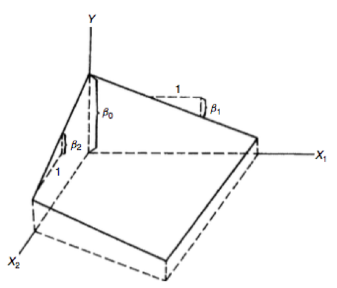

# Regressão Linear Múltipla

## Regressão Linear Múltipla {.build}

Imagine que algum pesquisador apresente o seguinte resultado: há relação entre uso de balinhas de menta ($X$, total por dia) e função pulmonar ($Y$, FEV).

O que você diria?

Você poderia argumentar, por exemplo, que fumantes consomem mais balinhas de menta e que o fato de ser fumante influencia na função pulmonar, não as balinhas.

O pesquisador então perguntaria: como eu poderia convencer você do efeito das balinhas?

Você poderia dizer que estaria convencido se, por exemplo: não-fumantes consumidores de balinhas de menta apresentam função pulmonar menor do que fumantes não consumidores de balinhas de menta; ou se fumantes consumidores de balinhas de menta apresentam função pulmonar melhor do que os fumantes não consumidores de balinhas de menta.

## Regressão Linear Múltipla {.build}

Ou seja, para verificar o efeito do consumo de balinhas de menta, você gostaria de manter o efeito do cigarro (fumantes e não fumante) fixo.

A técnica de regressão linear múltipla pode ser usada neste caso: ela avaliará a relação entre um preditor e a resposta, enquanto "controla" pelas demais variáveis no modelo.


## Modelo com duas variáveis preditoras

$$Y_i=\beta_0+\beta_1X_{i1}+\beta_2 X_{i2}+\varepsilon_i$$


$X_{i1}$ e $X_{i2}$ são valores de duas variáveis preditoras para a observação $i$.

Assumindo que $E(\varepsilon_i)=0\,,\forall i$:

$$E(Y)=\beta_0+\beta_1X_{1}+\beta_2 X_{2}$$

## Exemplo

Na situação com duas variáveis preditoras, a função de regressão representa um plano:

<center>

</center>

## Exemplo {.build}

Interpretação dos coeficientes:

* $\beta_0$ (intercepto): valor esperado de $Y$ quando $X_1=0$ e $X_2=0$.

* $\beta_1$: indica a mudança no valor esperado de $Y$ para cada unidade de aumento de $X_1$, quando $X_2$ é mantida constante.


* $\beta_2$: indica a mudança no valor esperado de $Y$ para cada unidade de aumento de $X_2$, quando $X_1$ é mantida constante.

Exemplo, se fixamos $X_2=2$:

$$E(Y)=10+2X_1+5\times 2=20+2X_1$$

## Exemplo {.build}

* Se $\beta_1=2$: o valor esperado de $Y$ aumenta 2 unidades a cada aumento de 1 unidade de $X_1$ e $X_2$ mantida constante.

* Se $\beta_2=5$: o valor esperado de $Y$ aumenta 5 unidades a cada aumento de 1 unidade de $X_2$ e $X_1$ mantida constante.


## Exemplo

Na situação com duas variáveis preditoras, a função de regressão representa um plano:

<center>

</center>


## Modelo de regressão linear múltipla geral {.build}

$$Y_i=\beta_0+\beta_1X_{i1}+\beta_2X_{i2}+\ldots + \beta_{p-1} X_{i,p-1}+\varepsilon_i$$

* $\beta_0,\beta_1,\ldots,\beta_{p-1}$ são parâmetros.

* $X_{i1},\ldots,X_{i,p-1}$ são constantes conhecidas.

* $\varepsilon_i\overset{iid}{\sim}\mathcal{N}(0,\sigma^2)$.

* $i=1,2,\ldots,n$.

Se $X_{i0}=1$, podemos escrever:

$$Y_i=\sum_{k=0}^{p-1}\beta_kX_{ik}+\varepsilon_i$$


## Modelo de regressão linear múltipla geral

Função de regressão (hiperplano):

$$E(Y)=\beta_0+\beta_1X_1+\ldots+\beta_{p-1}X_{p-1}$$


## Regressão Linear Múltipla com notação matricial {.smaller}

$$Y_i=\sum_{k=0}^{p-1}\beta_kX_{ik}+\varepsilon_i\,,\quad\varepsilon_i\overset{iid}{\sim}\mathbf{N}(0,\sigma^2)\,,\quad i=1,2,\ldots,n$$


$$\mathbf{Y}_{n\times1}=\mathbf{X}_{n\times p}\boldsymbol\beta_{p\times1}+\boldsymbol\varepsilon_{n\times1}\,,\quad \boldsymbol\varepsilon\sim\mathcal{N}(\mathbf{0},\sigma^2\mathbf{I})$$

$$\mathbf{Y}_{n\times1}=\left(
\begin{array}{c}
Y_1\\
Y_2\\
\vdots\\
Y_n
\end{array}
\right)
$$


$$\mathbf{X}_{n\times p}=\left(
\begin{array}{ccccc}
1 & X_{11} & X_{12} & \ldots & X_{1,p-1} \\
1 & X_{21} & X_{22} & \ldots & X_{2,p-1}  \\
\vdots & \vdots & \vdots & \vdots\\
1 & X_{n1} & X_{n2} & \ldots & X_{n,p-1}
\end{array}
\right)\quad \boldsymbol\beta_{p\times1}=\left(
\begin{array}{c}
\beta_0\\
\beta_1\\
\vdots\\
\beta_{p-1}
\end{array}
\right)
\quad \boldsymbol\varepsilon_{n\times1}=\left(
\begin{array}{c}
\varepsilon_1\\
\varepsilon_2\\
\vdots\\
\varepsilon_n
\end{array}
\right)
$$


## Regressão Linear Múltipla com notação matricial {.smaller}

$$E(\boldsymbol\varepsilon)_{n\times1}=\mathbf{0}_{n\times1}$$


$$Var(\boldsymbol\varepsilon)_{n\times n}=\sigma^2\mathbf{I}_{n\times n}$$


$$E(\mathbf{Y})=E(\mathbf{X}\boldsymbol\beta+\boldsymbol\varepsilon)=\mathbf{X}\boldsymbol\beta$$

$$Var(\mathbf{Y})=\sigma^2\mathbf{I}$$


## Mínimos Quadrados {.build}

Queremos encontrar $\hat{\boldsymbol\beta}$ que minimiza:

$$\begin{eqnarray}
S(\boldsymbol\beta)&=&\sum_{i=1}^n\varepsilon_i^2=\boldsymbol\varepsilon^T\boldsymbol\varepsilon=(\mathbf{Y}-\mathbf{X}\boldsymbol\beta)^T(\mathbf{Y}-\mathbf{X}\boldsymbol\beta)\\
&=& \mathbf{Y}^T\mathbf{Y}-\mathbf{Y}^T\mathbf{X}\boldsymbol\beta-\boldsymbol\beta^T\mathbf{X}^T\mathbf{Y}+\boldsymbol\beta^T\mathbf{X}^T\mathbf{X}\boldsymbol\beta\\
&=& \mathbf{Y}^T\mathbf{Y}-2\boldsymbol\beta^T\mathbf{X}^T\mathbf{Y}+\boldsymbol\beta^T\mathbf{X}^T\mathbf{X}\boldsymbol\beta
\end{eqnarray}$$

$$\begin{eqnarray}
\frac{\partial S(\boldsymbol\beta)}{\partial\boldsymbol\beta} = -2\mathbf{X}^T\mathbf{Y}+2\mathbf{X}^T\mathbf{X}\boldsymbol\beta
\end{eqnarray}$$

Equação normal: $\mathbf{X}^T\mathbf{X}\hat{\boldsymbol\beta}=\mathbf{X}^T\mathbf{Y}$

$$\hat{\boldsymbol\beta}=(\mathbf{X}^T\mathbf{X})^{-1}\mathbf{X}^T\mathbf{Y}$$

## Mínimos Quadrados {.build}

$$\begin{eqnarray}
Var(\hat{\boldsymbol\beta})&=&Var\left[(\mathbf{X}^T\mathbf{X})^{-1}\mathbf{X}^T\mathbf{Y}\right]\\
&=&(\mathbf{X}^T\mathbf{X})^{-1}\mathbf{X}^TVar(\mathbf{Y})\mathbf{X}(\mathbf{X}^T\mathbf{X})^{-1}\\
&=&(\mathbf{X}^T\mathbf{X})^{-1}\mathbf{X}^T\sigma^2\mathbf{I}\mathbf{X}(\mathbf{X}^T\mathbf{X})^{-1}\\
&=&\sigma^2(\mathbf{X}^T\mathbf{X})^{-1}
\end{eqnarray}$$

$\mathbf{H}$ é a matriz de projeção ortogonal no espaço coluna de $\mathbf{X}$.

$$\hat{\mathbf{Y}}=\mathbf{X}\hat{\boldsymbol\beta}=\underbrace{\mathbf{X}(\mathbf{X}^T\mathbf{X})^{-1}\mathbf{X}^T}_{\mathbf{H}}\mathbf{Y}$$

$$\mathbf{e}=\mathbf{Y}-\hat{\mathbf{Y}}=\mathbf{Y}-\mathbf{H}\mathbf{Y}=(\mathbf{I}-\mathbf{H})\mathbf{Y}$$


## Preditores qualitativos

Muitas vezes as variáveis preditoras podem ser do tipo qualitativo:

* Sexo: feminino/masculino

* Tem ensino superior? sim/não

* etc


## Exemplo {.build}

Modelo de regressão para tempo de permanência no hospital ($Y$) considerando a idade ($X_1$) e o sexo ($X_2$) do paciente.

$$\begin{eqnarray}
X_2 = \begin{cases} 1 & \mbox{se feminino} \\ 0 & \mbox{se masculino} \end{cases}
\end{eqnarray}$$

$$Y_i=\beta_0+\beta_1X_{i1}+\beta_2X_{i2}+\varepsilon_i$$

* $X_{i1}$ é a idade do paciente $i$.

* $X_{i2}$ é o sexo do paciente $i$.

Se $X_2=0$ (paciente masculino): $E(Y)=\beta_0+\beta_1X_1$.

Se $X_2=1$ (paciente feminino): $E(Y)=(\beta_0+\beta_2)+\beta_1X_1$.


## Preditores qualitativos


Em geral, representamos uma variável qualitativa com $c$ classes através de $c-1$ variáveis indicadoras.

Por exemplo, se temos uma variável qualitativa do estado de incapacidade do paciente com as seguintes classes: incapaz, parcialmente incapaz, não incapaz. Utilizamos as seguinte vairáveis indicadoras:

$$\begin{eqnarray}
X_3 = \begin{cases} 1 & \mbox{se não incapaz} \\ 0 & \mbox{caso contrário} \end{cases}
\end{eqnarray}$$

$$\begin{eqnarray}
X_4 = \begin{cases} 1 & \mbox{se parcialmente incapaz} \\ 0 & \mbox{caso contrário} \end{cases}
\end{eqnarray}$$

$$Y_i=\beta_0+\beta_1X_{i1}+\beta_2X_{i2}+\beta_3X_{i3}+\beta_4X_{i4}+\varepsilon_i$$

## Exemplo: conjunto de dados `swiss`

`require(datasets); data(swiss); ?swiss`

A data frame with 47 observations on 6 variables, each of which is in percent, i.e., in [0, 100].

[,1]	Fertility	Ig, ‘common standardized fertility measure’

[,2]	Agriculture	% of males involved in agriculture as occupation

[,3]	Examination	% draftees receiving highest mark on army examination

[,4]	Education	% education beyond primary school for draftees.

[,5]	Catholic	% ‘catholic’ (as opposed to ‘protestant’).

[,6]	Infant.Mortality	live births who live less than 1 year.

All variables but ‘Fertility’ give proportions of the population.

## Exemplo: conjunto de dados `swiss`

```{r, fig.height=5, fig.width=10, echo = FALSE,warning=FALSE,message=FALSE}
require(datasets); data(swiss); require(GGally); require(ggplot2)
my_fn <- function(data, mapping, method="loess", ...){
      p <- ggplot(data = data, mapping = mapping) + 
      geom_point() + 
      geom_smooth(method=method, ...)
      p
    }

# Default loess curve    
ggpairs(swiss, lower = list(continuous = my_fn))
```

## Exemplo: conjunto de dados `swiss`

```{r, echo = TRUE}
modelo <- lm(Fertility ~ . , data = swiss)
summary(modelo)$coefficients
```

## Exemplo: conjunto de dados `swiss` {.build}


* `Agriculture`: expressa em porcentagem (0 - 100)

* Estimativa é `r coef(modelo)[2]`.

* Segundo o modelo, espera-se um decréscimo de 0.17 na fertilidade para cada 1% de aumento de pessoas do sexo masculino envolvidas na agricultura, mantendo as demais variáveis fixas.


* O teste-t para $H_0: \beta_{Agri} = 0$ versus $H_a: \beta_{Agri} \neq 0$ é significante.

* A título de curiosidade, a estimativa do efeito de agricultura, sem ajustar pelas demais variáveis é:
```{r,echo=FALSE}
summary(lm(Fertility ~ Agriculture, data = swiss))$coefficients
```

([Paradoxo de Simpson](https://en.wikipedia.org/wiki/Simpson%27s_paradox))

## Simulação {.build}

Ao considerarmos outras variáveis no modelo, o sinal do efeito de uma dada variável pode inverter. Vamos simular um caso para exemplificar.

* Simulamos 100 v.a. com relação linear: $Y$, $X_1$ e $X_2$.

* $X_1$ tem relação linear com $X_2$.

* $X_1$ tem um efeito ajustado negativo sobre $Y$.

* $X_2$ tem um efeito ajustado positivo sobre $Y$.


## Simulação

```{r, echo = TRUE}
n <- 100
x2 <- 1 : n
x1 <- .01 * x2 + runif(n, -.1, .1)
y = -x1 + x2 + rnorm(n, sd = .01)
summary(lm(y ~ x1))$coef
summary(lm(y ~ x1 + x2))$coef
```


## Simulação

```{r, echo = FALSE, fig.height=4.5, fig.width=10, results = 'show'}
dat = data.frame(y = y, x1 = x1, x2 = x2, ey = resid(lm(y ~ x2)), ex1 = resid(lm(x1 ~ x2)))
library(ggplot2)
g = ggplot(dat, aes(y = y, x = x1, colour = x2))
g = g + geom_point(colour="grey50", size = 5) + geom_smooth(method = lm, se = FALSE, colour = "black") 
g = g + geom_point(size = 4) 
g
```

$Y$ e $X_1$ têm relação positiva (não ajustada). Note que $X_2$ também aumenta com $Y$.

## Simulação

```{r, echo = FALSE, fig.height=4.5, fig.width=10, results = 'show'}
g2 = ggplot(dat, aes(y = ey, x = ex1, colour = x2))  
g2 = g2 + geom_point(colour="grey50", size = 5) + geom_smooth(method = lm, se = FALSE, colour = "black") + geom_point(size = 4) +ylab("resid(lm(y ~ x2))")+xlab("resid(lm(x1 ~ x2))")
g2
```

Ajustando $X_1$ e $Y$ através do resíduo da regressão de cada uma em $X_2$ temos a relação correta entre $X_1$ e $Y$.


## Exemplo: conjunto de dados `swiss`

Vamos considerar a seguinte variável qualitativa:

```{r,message=FALSE,warning=FALSE}
library(dplyr); 
swiss = mutate(swiss, CatholicBin = 1 * (Catholic > 50))
```

## Exemplo: conjunto de dados `swiss`

```{r, fig.height=5, fig.width=8, echo = FALSE,fig.align='center'}
g = ggplot(swiss, aes(x = Agriculture, y = Fertility, colour = factor(CatholicBin)))
g = g + geom_point(size = 6, colour = "black") + geom_point(size = 4)
g = g + xlab("% in Agriculture") + ylab("Fertility")
g
```

## Exemplo: conjunto de dados `swiss`

$$Y_i=\beta_0+\beta_1X_{i1}+\beta_2X_{i2}+\varepsilon_i$$

* $Y_i$: `Fertility`

* $X_{i1}$: `Agriculture`

* $X_{i2}$: `CatholicBin`

## Exemplo: conjunto de dados `swiss`

Sem considerar $X_{i2}$:

```{r, echo = TRUE}
summary(lm(Fertility ~ Agriculture, data = swiss))$coef
```

Este modelo assume que ajustamos apenas uma reta.

## Exemplo: conjunto de dados `swiss`

```{r, echo = FALSE, fig.width=8, fig.height=5,fig.align='center'}
fit = lm(Fertility ~ Agriculture, data = swiss)
g1 = g
g1 = g1 + geom_abline(intercept = coef(fit)[1], slope = coef(fit)[2], size = 2)
g1
```

## Exemplo: conjunto de dados `swiss`

No modelo:

$$Y_i=\beta_0+\beta_1X_{i1}+\beta_2X_{i2}+\varepsilon_i$$


Temos que, se $X_{i2}=0$:

$$Y_i=\beta_0+\beta_1X){i1}+\varepsilon_i$$

e se $X_{i2}=1$:

$$Y_i=(\beta_0+\beta_2)+\beta_1X_{i1}+\varepsilon_i$$


Ou seja, temos duas retas paralelas ajustadas (uma para cada categoria de `CatholicBin`).

## Exemplo: conjunto de dados `swiss`


```{r, echo = TRUE}
summary(lm(Fertility ~ Agriculture + factor(CatholicBin), data = swiss))$coef
```

Segundo o modelo, `r round(coef(lm(Fertility ~ Agriculture + factor(CatholicBin), data = swiss))[3],2)`é a mudança esperada no intercepto da relação linear entre agricultura e fertilidade quando comparamos não-católicos a católicos.

## Exemplo: conjunto de dados `swiss`

```{r, echo = FALSE, fig.width=5, fig.height=4,fig.align='center'}
fit = lm(Fertility ~ Agriculture + factor(CatholicBin), data = swiss)
g1 = g
g1 = g1 + geom_abline(intercept = coef(fit)[1], slope = coef(fit)[2], size = 2)
g1 = g1 + geom_abline(intercept = coef(fit)[1] + coef(fit)[3], slope = coef(fit)[2], size = 2)
g1
```

## Exemplo: conjunto de dados `swiss` {.build}

Podemos também considerar um modelo que permite diferentes interceptos e diferentes coeficientes angulares (retas não paralelas). Isto é obtido considerando termo de **interação**.


$$Y_i=\beta_0+\beta_1X_{i1}+\beta_2X_{i2}+\beta_3X_{i1}X_{i2}+\varepsilon_i$$

Agora, quando $X_{i2}=0$:

$$Y_i=\beta_0+\beta_1X){i1}+\varepsilon_i$$

e quando $X_{i2}=1$:

$$Y_i=(\beta_0+\beta_2)+(\beta_1+\beta_3)X_{i1}+\varepsilon_i$$

## Exemplo: conjunto de dados `swiss`

```{r, echo = TRUE}
summary(lm(Fertility ~ Agriculture * factor(CatholicBin), data = swiss))$coef
```

## Exemplo: conjunto de dados `swiss`

```{r, echo = FALSE, fig.width=5, fig.height=4,fig.align='center'}
fit = lm(Fertility ~ Agriculture * factor(CatholicBin), data = swiss)
g1 = g
g1 = g1 + geom_abline(intercept = coef(fit)[1], slope = coef(fit)[2], size = 2)
g1 = g1 + geom_abline(intercept = coef(fit)[1] + coef(fit)[3], 
                          slope = coef(fit)[2] + coef(fit)[4], size = 2)
g1
```


## Exemplo: conjunto de dados `swiss` {.build}

Segundo o modelo ajustado, 2.8577 é a mudança esperada estimada no intercepto da reta de relação entre `Agriculture` e `Fertility` quando comparamos não católicos a católicos. 

O termo de interação 0.9891 é a mudança esperada estimada no coeficiente angular.

O intercepto estimado entre os não-católicos é 62.04993 e o intercepto estimado entre os católicos é 62.04993 + 2.85770. 

O coeficiente angular da relação entre `Agriculture` e `Fertility` para não-católicos
é 0.09612 + 0.08914.

O coeficiente angular da relação entre `Agriculture` e `Fertility` para católicos
é 0.09612.


## Leitura

* Applied Linear Statistical Models: 6.1-6.5.

* Weisberg - [Applied Linear Regression](http://unicampbr.summon.serialssolutions.com/2.0.0/link/0/eLvHCXMwrV1NSwMxEB1EDyoFv22tSs5Ca5JdN9mTWLX0oljwXqZJCh5cy3YF_fdmku0KhXryGCZfhCQzTN57AUhkn_dW7oQURSaFUUamqDBVM41CckyN0M5wNOFP23w8Vs8jUs0Z_PWASqSJ9_m1_TAPAWXZjwyAW1sHtaTYJolf7l0ZHdW7QfKbdeH0DMjDl0F-M-vM166Fn5Zl3VCOIiIyOJrh3n_MaR-2HFEYDmDDFYew-9Qosy6O4CpcA4ySYm7B3gr2UvoTHRCy3wwLyyj6jOLNx3A5fHy9H_XiNCbzKEwxWY6TnEALCSBfVIFIZ9vAfCiHWjlhUU0pm6YxkQptluezG8wV78Dpmt460F2xVF9VYz1b264LOz66qGEu57BZlZ_uArbrtZqWP8hqnhA
): Capítulos 3, 4 e seção 5.1.

* Faraway - [Linear Models with R](http://www.maths.bath.ac.uk/~jjf23/LMR/): Capítulo 5.

* Caffo - [Regression Models for Data Science in R](https://leanpub.com/regmods): Multivariable regression analysis, Multivariable examples and tricks.


