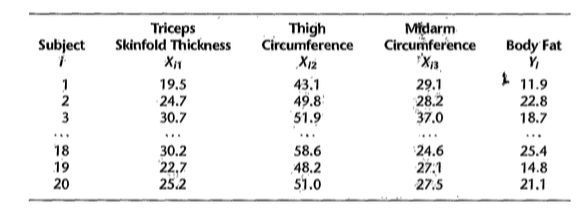
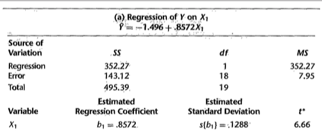
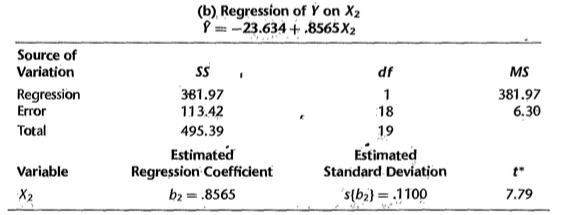
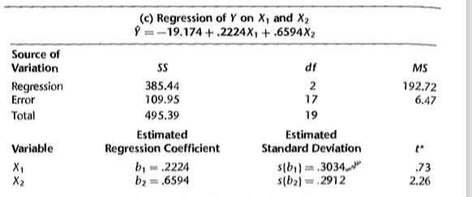
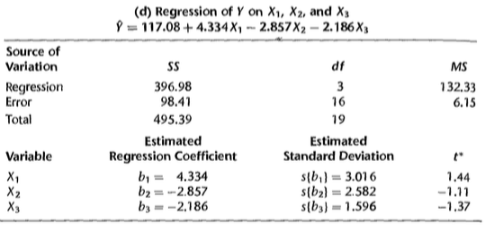
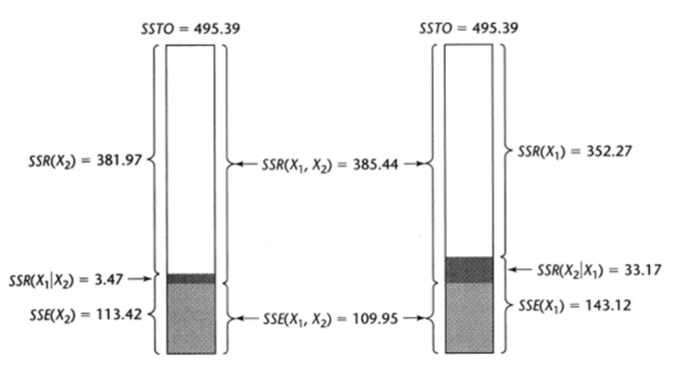

# Soma extra de quadrados

## Motivação {.build}

* Verificar a redução na soma de quadrados do erro quando uma ou mais variáveis preditoras são adicionadas no modelo de regressão, dado que outras variáveis preditoras já estão incluídas no modelo. 


* Equivalentemente, podemos utilizar a soma extra de quadrados para medir o aumento na soma de quadrados da regressão ao adicionarmos uma ou mais preditoras no modelo.

* Em resumo, a soma extra de quadrados pode nos auxiliar na decisão de inclusão ou retirada de variáveis no modelo.

## Exemplo

Relação entre gordura corporal e 3 medidas corporais.

<center>

</center>


## Exemplo: Regressão de $Y$ em $X_1$

<center>

</center>

$$SQReg(X_1)=352.27$$

$$SQE(X_1)=143.12$$


## Exemplo: Regressão de $Y$ em $X_1$


```{r,echo=TRUE}
dat = read.table('./dados/fat.txt')
X1 = dat[,1]
X2 = dat[,2]
X3 = dat[,3]
Y = dat[,4]

modelo1 <- lm(Y ~X1)
summary(modelo1)$coefficients
```


## Exemplo: Regressão de $Y$ em $X_1$

```{r,echo=TRUE}
anova(modelo1)
```


## Exemplo: Regressão de $Y$ em $X_2$

<center>

</center>

$$SQReg(X_2)=381.97$$

$$SQE(X_2)=113.42$$


## Exemplo: Regressão de $Y$ em $X_2$

```{r,echo=TRUE}
modelo2 <- lm(Y ~X2)
summary(modelo2)$coefficients
anova(modelo2)
```


## Exemplo: Regressão de $Y$ em $X_1$ e $X_2$

<center>

</center>

$$SQReg(X_1,X_2)=385.44$$

$$SQE(X_1,X_2)=109.95$$


## Exemplo: Regressão de $Y$ em $X_1$ e $X_2$ {.smaller}

```{r,echo=TRUE}
modelo3 <- lm(Y ~ X1 + X2)
summary(modelo3)$coefficients
anova(modelo3)
```

## Exemplo: Regressão de $Y$ em $X_1$ e $X_2$ {.smaller}

```{r,echo=TRUE}
SQReg <- sum(anova(modelo3)[1:2,2])
SQReg
```


## Exemplo: Soma extra de quadrados

Quando ambos $X_1$ e $X_2$ estão no modelo, temos que $SQE(X_1,X_2)=109.95$, que é menor do que com apenas $X_1$ no modelo, $SQE(X_1)=143.12$.

Esta diferença é denominada **soma extra de quadrados**:

$$SQReg(X_2\mid X_1) = SQE(X_1)-SQE(X_1,X_2)=143.12-109.95=33.17$$

Equivalentemente:

$$SQReg(X_2\mid X_1) = SQReg(X_1,X_2)-SQReg(X_1)=385.44-352.27=33.17$$


## Exemplo: Soma extra de quadrados

```{r,echo=TRUE}
modelo3 <- lm(Y ~ X1 + X2)
anova(modelo3)
```

Na tabela, a linha $X_2$ contém $SQReg(X_2\mid X_1)$.


## Exemplo: Regressão de $Y$ em $X_1$, $X_2$ e $X_3$

<center>

</center>

$$SQReg(X_1,X_2,X_3)=396.98$$

$$SQE(X_1,X_2,X_3)=98.41$$


## Exemplo: Regressão de $Y$ em $X_1$, $X_2$ e $X_3$ {.smaller}

```{r,echo=TRUE}
modelo4 <- lm(Y ~ X1 + X2 + X3)
summary(modelo4)$coefficients
anova(modelo4)
```

## Exemplo: Soma extra de quadrados

Quando $X_1$, $X_2$ e $X_3$ estão no modelo, temos que $SQE(X_1,X_2,X_3)=98.41$, que é menor do que com apenas $X_1$ e $X_2$ no modelo, $SQE(X_1,X_2)=109.95$.

Esta diferença é denominada **soma extra de quadrados**:

$$\begin{eqnarray}
SQReg(X_3\mid X_1, X_2) &=& SQE(X_1,X_2)-SQE(X_1,X_2,X_3)\\
                        &=&109.95-98.41=11.54
\end{eqnarray}$$

Equivalentemente:

$$\begin{eqnarray}
SQReg(X_3\mid X_1,X_2) &=& SQReg(X_1,X_2,X_3)-SQReg(X_1,X_2)\\
                       &=&396.98-385.44=11.54
\end{eqnarray}$$    

## Exemplo: Soma extra de quadrados

```{r,echo=TRUE}
modelo4 <- lm(Y ~ X1 + X2 + X3)
anova(modelo4)
```

Na tabela, a linha $X_2$ contém $SQReg(X_2\mid X_1)$.

Na tabela, a linha $X_3$ contém $SQReg(X_3\mid X_1, X_2)$.


## Exemplo: Soma extra de quadrados

Podemos avaliar, também, a adição de mais de uma variável ao mesmo tempo. Por exemplo, podemos avaliar o efeito de incluir $X_2$ e $X_3$ a um modelo com apenas $X_1$:

$$\begin{eqnarray}
SQReg(X_2, X_3\mid X_1) &=& SQE(X_1)-SQE(X_1,X_2,X_3)\\
                        &=&143.12-98.41=44.71
\end{eqnarray}$$


Equivalentemente:

$$\begin{eqnarray}
SQReg(X_2, X_3\mid X_1) &=& SQReg(X_1,X_2,X_3)-SQReg(X_1)\\
                       &=&396.98-352.27=44.71
\end{eqnarray}$$     


## Exemplo: Soma extra de quadrados

```{r,echo=TRUE}
modelo1 <- lm(Y ~X1)
modelo4 <- lm(Y ~X1 + X2 + X3)

anova(modelo1,modelo4)
```

$$SQReg(X_2, X_3\mid X_1)=44.71$$

## Soma extra de quadrados

Em geral, se temos $X_1$ e $X_2$ no modelo, podemos escrever:

$$SQReg(X_1,X_2)=SQReg(X_1)+SQReg(X_2\mid X_1)$$

ou, dado que a ordem de entrada das variáveis é arbitrária no modelo, temos:

$$SQReg(X_1,X_2)=SQReg(X_2)+SQReg(X_1\mid X_2)$$


## Exemplo

<center>

</center>


## Soma extra de quadrados

Se temos $X_1$, $X_2$ e $X_3$ no modelo, podemos escrever, por exemplo:

$$SQReg(X_1,X_2,X_3)=SQReg(X_1)+SQReg(X_2\mid X_1)+SQReg(X_3\mid X_1,X_2)$$

$$SQReg(X_1,X_2,X_3)=SQReg(X_2)+SQReg(X_3\mid X_2)+SQReg(X_1\mid X_2,X_3)$$

$$SQReg(X_1,X_2,X_3)=SQReg(X_1)+SQReg(X_2,X_3\mid X_1)$$


## Teste para $\beta_k$ usando soma extra de quadrados


* $H_0$: $\beta_k=0$.

* $H_1$: $\beta_k\neq0$.

Vimos que podemos usar a seguinte estatística do teste:

$$t^*=\frac{\hat{\beta}_k}{\sqrt{\widehat{Var(\hat{\beta}_k)}}}\overset{\mbox{sob $H_0$}}{\sim}t_{n-p}$$

## Teste para $\beta_k$ usando soma extra de quadrados

Equivalentemente, podemos utilizar soma extra de quadrados para o mesmo teste de hipóteses.

Estatística do teste:

$$\begin{eqnarray}
F^*&=&\frac{SQReg(X_k\mid X_1,\ldots, X_{k-1},X_{k+1},\ldots,X_{p-1})}{1}\div\frac{SQE(X_1,\ldots,X_{p-1})}{n-p}\\
&\overset{\mbox{sob $H_0$}}{\sim}&F_{1,n-p}
\end{eqnarray}$$

## Exemplo:  Regressão de $Y$ em $X_1$, $X_2$ e $X_3$

Queremos testar se $X_3$ pode ser excluída do modelo.

```{r,echo=TRUE}
modelo3 <- lm(Y ~X1 + X2)
modelo4 <- lm(Y ~X1 + X2 + X3)
anova(modelo3,modelo4)
```

$F^*=`r round(anova(modelo3,modelo4)[2,5],2)`$. Não encontramos evidências para rejeitar $H_0$: $\beta_3=0$.

## Teste para vários $\beta_k$'s usando soma extra de quadrados


* $H_0$: $\beta_q=\beta_{q+1}=\ldots=\beta_{p-1}=0$.

* $H_1$: pelo menos um $\beta_q,\ldots,\beta_{p-1}$ não é zero.

(por conveniência, a notação assume que os últimos $p-q$ coeficientes do modelo serão testados)


Estatística do teste:

$$\begin{eqnarray}
F^*&=&\frac{SQReg(X_q,\ldots, X_{p-1}\mid X_1,\ldots,X_{q-1})}{p-q}\div\frac{SQE(X_1,\ldots,X_{p-1})}{n-p}\\
&\overset{\mbox{sob $H_0$}}{\sim}&F_{p-q,n-p}
\end{eqnarray}$$


## Exemplo:  Regressão de $Y$ em $X_1$, $X_2$ e $X_3$

Queremos testar se $X_2$ e $X_3$ podem ser excluídas do modelo.

```{r,echo=TRUE}
modelo1 <- lm(Y ~X1)
modelo4 <- lm(Y ~X1 + X2 + X3)
anova(modelo1,modelo4)
```

$F^*=`r round(anova(modelo1,modelo4)[2,5],2)`$. 


## Leitura

* Applied Linear Statistical Models: Seções 7.1-7.3.

* Draper & Smith - [Applied Regression Analysis](http://onlinelibrary.wiley.com/book/10.1002/9781118625590): Capítulo 6.

* Weisberg - [Applied Linear Regression](http://unicampbr.summon.serialssolutions.com/2.0.0/link/0/eLvHCXMwrV1NSwMxEB1EDyoFv22tSs5Ca5JdN9mTWLX0oljwXqZJCh5cy3YF_fdmku0KhXryGCZfhCQzTN57AUhkn_dW7oQURSaFUUamqDBVM41CckyN0M5wNOFP23w8Vs8jUs0Z_PWASqSJ9_m1_TAPAWXZjwyAW1sHtaTYJolf7l0ZHdW7QfKbdeH0DMjDl0F-M-vM166Fn5Zl3VCOIiIyOJrh3n_MaR-2HFEYDmDDFYew-9Qosy6O4CpcA4ySYm7B3gr2UvoTHRCy3wwLyyj6jOLNx3A5fHy9H_XiNCbzKEwxWY6TnEALCSBfVIFIZ9vAfCiHWjlhUU0pm6YxkQptluezG8wV78Dpmt460F2xVF9VYz1b264LOz66qGEu57BZlZ_uArbrtZqWP8hqnhA
): Seções 6.1-6.3 

* Faraway - [Linear Models with R](http://www.maths.bath.ac.uk/~jjf23/LMR/): Seções 3.1 e 3.2.


<center>

</center>


