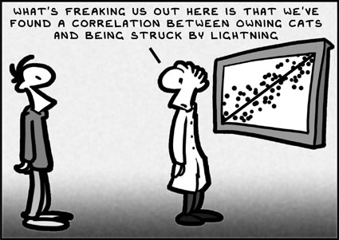

# Multicolinearidade

## Introdução {.build}

**Multicolinearidade**: variáveis preditoras correlacionadas entre si.

* Variáveis preditoras não correlacionadas

* Variáveis preditoras perfeitamente correlacionadas

* Efeitos da multicolinearidade


## Variáveis preditoras não correlacionadas

Considere a seguinte situação:

* Regressão de $Y$ em $X_1$: $\hat{\beta}_1$.

* Regressão de $Y$ em $X_2$: $\hat{\beta}_2$.

* Regressão de $Y$ em $X_1$ e $X_2$: $\hat{\beta}^*_1$ e $\hat{\beta}^*_2$.

Se $X_1$ e $X_2$ não são correlacionados:

* $\hat{\beta}_1=\hat{\beta}^*_1$ e  $\hat{\beta}_2=\hat{\beta}^*_2$.

* $SQReg(X_1\mid X_2)=SQReg(X_1)$ e $SQReg(X_2\mid X_1)=SQReg(X_2)$.

## Exemplo

$X_1$: tamanho da equipe

$X_2$: pagamento (dólares)

$Y$: produtividade

```{r,echo=FALSE}
dados = read.table('./dados/CH07TA06.txt')
colnames(dados) <- c("X1","X2","Y")
dados
```

## Exemplo {.smaller}

Regressão de $Y$ em $X_1$: $\hat{\beta}_1$.

```{r,echo=FALSE}
modelo1 <- lm(Y ~ X1, data=dados)
summary(modelo1)$coef
anova(modelo1)
```


$$\hat{\beta}_1=`r round(summary(modelo1)$coef[2,1],3)`$$

$$SQReg(X_1)=`r round(anova(modelo1)[1,2],2)`$$

## Exemplo {.smaller}

Regressão de $Y$ em $X_2$: $\hat{\beta}_2$.

```{r,echo=FALSE}
modelo2 <- lm(Y ~ X2, data=dados)
summary(modelo2)$coef
anova(modelo2)
```

$$\hat{\beta}_2=`r round(summary(modelo2)$coef[2,1],3)`$$

$$SQReg(X_2)=`r round(anova(modelo2)[1,2],2)`$$


## Exemplo

Regressão de $Y$ em $X_1$ e $X_2$: $\hat{\beta}^*_1$ e $\hat{\beta}^*_2$.

```{r,echo=FALSE}
modelo12a <- lm(Y ~ X1 + X2, data=dados)
summary(modelo12a)$coef
```


$$\hat{\beta}_1^*=`r round(summary(modelo12a)$coef[2,1],3)`$$

$$\hat{\beta}_2^*=`r round(summary(modelo12a)$coef[3,1],3)`$$

## Exemplo {.smaller}

```{r,echo=FALSE}
anova(modelo12a)
```
$$SQReg(X_2|X_1)=SQE(X_2)-SQE(X_1,X_2)=`r round(anova(modelo12a)[2,2],2)`=SQReg(X_2)$$

```{r,echo=FALSE}
modelo12b <- lm(Y ~ X2 + X1, data=dados)
anova(modelo12b)
```


$$SQReg(X_1|X_2)=SQE(X_1)-SQE(X_1,X_2)=`r round(anova(modelo12b)[2,2],2)`=SQReg(X_1)$$


## Variáveis preditoras perfeitamente correlacionadas


Exemplo:

```{r,echo=FALSE}
dados = read.table('./dados/CH07TA08.txt')
colnames(dados) <- c("X1","X2","Y")
dados
```

$$E(Y)=\beta_0+\beta_1X_1+\beta_2X_2$$

## Exemplo


```{r,echo=T}
modelo1 <- lm(Y ~ X1 + X2,data=dados)
summary(modelo1)$coef
```

que produz valores ajustados perfeitos (resíduo nulo):
```{r,echo=FALSE}
fitted(modelo1)
```


## Exemplo {.build}

$$\hat{Y}=-87 + X_1 + 18 X_2$$

$$\hat{Y}=-7+9X_1+2X_2$$

também fornecem os mesmos valores para $\hat{Y}$.

Problema: $X_1$ e $X_2$ são perfeitamente correlacionadas ($X_2=5+0.5X_1$).


Podemos obter bons valores ajustados/preditos, mas não podemos interpretar os parâmetros do modelo (pois temos infinitas possibilidades).

## Efeitos da multicolinearidade

Na prática, dificilmente encontraremos variáveis preditoras que sejam perfeitamente correlacionadas entre si. 

No entanto, quando a correlação é alta, temos problemas similares aos vistos no exemplo anterior.

## Efeito nos coeficientes de regressão

$X_1$: tríceps

$X_2$: coxa

$X_3$: antebraço

$Y$: gordura corporal


```{r,echo=FALSE}
dat = read.table('./dados/fat.txt')
colnames(dat) <- c("X1","X2","X3","Y")
dat
```

## Exemplo

```{r,echo=FALSE,fig.align='center',fig.height=5,fig.width=7}
panel.cor <- function(x, y, digits=2, prefix="", cex.cor, ...)
{
    usr <- par("usr"); on.exit(par(usr))
    par(usr = c(0, 1, 0, 1))
    r <- abs(cor(x, y))
    txt <- format(c(r, 0.123456789), digits=digits)[1]
    txt <- paste(prefix, txt, sep="")
    if(missing(cex.cor)) cex.cor <- 0.8/strwidth(txt)
    text(0.5, 0.5, txt)
}
pairs(dat,upper.panel=panel.cor,lower.panel=panel.smooth)
```

## Exemplo {.build}

Quando as preditoras têm correlação, os efeitos das variáveis são marginais ou parciais.


```{r,echo=FALSE}
modelo1 <- lm(Y ~ X1, data=dat)
beta11 <- round(summary(modelo1)$coef[2,1],3)
sbeta11 <- round(summary(modelo1)$coef[2,2],3)
modelo2 <- lm(Y ~ X2, data=dat)
beta21 <- round(summary(modelo2)$coef[2,1],3)
sbeta21 <- round(summary(modelo2)$coef[2,2],3)
modelo12 <- lm(Y ~ X1+ X2, data=dat)
beta12 <- round(summary(modelo12)$coef[2,1],3)
beta22 <- round(summary(modelo12)$coef[3,1],3)
sbeta12 <- round(summary(modelo12)$coef[2,2],3)
sbeta22 <- round(summary(modelo12)$coef[3,2],3)
modelo123 <- lm(Y ~ X1+ X2 +X3, data=dat)
beta13 <- round(summary(modelo123)$coef[2,1],3)
beta23 <- round(summary(modelo123)$coef[3,1],3)
sbeta13 <- round(summary(modelo123)$coef[2,2],3)
sbeta23 <- round(summary(modelo123)$coef[3,2],3)
```

Variável no modelo | $\hat{\beta}_1$ | $\hat{\beta}_2$
-------------------|-----------------|-----------------
$X_1$              | `r beta11`      |
$X_2$              |                 | `r beta21`
$X_1$, $X_2$       | `r beta12`      | `r beta22`
$X_1$, $X_2$, $X_3$| `r beta13`      | `r beta23`


As estimativas do efeito de $X_1$ no modelo variam muito, dependendo das variáveis que são consideradas nos modelos. O mesmo pode ser dito sobre o efeito de $X_2$.


## Efeito na soma extra de quadrados

Quando as variáveis preditoras apresentam correlação, a contribuição marginal de cada variável na redução da soma de quadrados do erro varia, dependendo de quais variáveis já estão no modelo.

Por exemplo: considerando apenas $X_1$ no modelo

```{r,echo=FALSE}
anova(modelo1)
```

$$SQReg(X_1)=`r round(anova(modelo1)[1,2],3)`$$


## Exemplo

Considerando $X_1$ e $X_2$ no modelo (primeiro $X_2$ e depois $X_1$):

```{r,echo=FALSE}
modelo21 <- lm(Y ~ X2+ X1, data=dat)
anova(modelo21)
```

$$SQReg(X_1\mid X_2)=`r round(anova(modelo21)[2,2],3)`$$

## Exemplo {.build}

O modelo de $SQReg(X_1\mid X_1)$ ser tão pequeno quando comparado a $SQReg(X_1)$ é a alta correlação entre $X_1$ e $X_2$ (`r round(cor(dat$X1,dat$X2),2)`) e de cada uma delas com a variável resposta (`r round(cor(dat$X1,dat$Y),2)` e `r round(cor(dat$X2,dat$Y),2)`, respectivamente).

Desta forma, quando $X_2$ já está no modelo, a contribuição marginal de $X_1$ é pequena na redução da soma de quadrados do erro, pois $X_2$ contém praticamente a mesma informação que $X_1$.


## Efeito no desvio-padrão da estimativa


Variável no modelo | $\hat{\beta}_1$  | $\hat{\beta}_2$
-------------------|------------------|-----------------
$X_1$              | `r sbeta11`      |
$X_2$              |                  | `r sbeta21`
$X_1$, $X_2$       | `r sbeta12`      | `r sbeta22`
$X_1$, $X_2$, $X_3$| `r sbeta13`      | `r sbeta23`


## Efeito nos valores ajustados e preditos


Variável no modelo | $QME$  
-------------------|----------------
$X_1$              | `r round(anova(modelo1)[2,3],2)`
$X_1$, $X_2$       | `r round(anova(modelo12)[3,3],2)`  
$X_1$, $X_2$, $X_3$| `r round(anova(modelo123)[4,3],2)`

$QME$ diminui conforme variáveis são adicionadas ao modelo (caso usual).

## Efeito nos valores ajustados e preditos {.build}

A precisão do valor ajustado não é tão afetada quando inserimos ou não uma variável preditora muito correlacionada com outra já no modelo.

Por exemplo, se considerarmos apenas o modelo com $X_1$, o valor estimado de gorduta corporal para $X_1=25$ é:

```{r,echo=FALSE}
yhat <- predict(modelo1,newdata=data.frame(X1=25),se.fit=TRUE)
```

$$\hat{Y}=`r round(yhat$fit,3)`\quad\quad\sqrt{\widehat{Var(\hat{Y})}}=`r round(yhat$se.fit,3)`$$


Quando incluímos $X_2$, altamente correlacionada à $X_1$, temos:

```{r,echo=FALSE}
yhat <- predict(modelo12,newdata=data.frame(X1=25,X2=50),se.fit=TRUE)
```

$$\hat{Y}=`r round(yhat$fit,3)`\quad\quad\sqrt{\widehat{Var(\hat{Y})}}=`r round(yhat$se.fit,3)`$$

quando $X_1=25$ e $X_2=50$, por exemplo.

## Efeito nos testes simultâneos de $\beta_k$


Considere os dados sobre gordura corporal e o modelo com $X_1$ e $X_2$ no modelo.

Queremos testar $H_0$: $\beta_1=\beta_2=0$.

Calculamos:

$$t_1=\frac{\hat{\beta}_1}{\sqrt{\widehat{Var}(\hat{\beta}_1)}}\quad\quad t_2=\frac{\hat{\beta}_2}{\sqrt{\widehat{Var}(\hat{\beta}_2)}}$$

e não rejeitamos $H_0$ se ambos $|t_1|$ e $|t_2|$ forem menores do que $t_{n-3,\alpha/4}=`r round(qt(0.05/4,df=dim(dat)[1]-3,lower.tail=FALSE),2)`$

para $\alpha=0.05$.

## Exemplo {.smaller}

```{r,echo=FALSE}
summary(modelo12)
```

Não rejeitamos $H_0$.

## Exemplo {.smaller}

```{r,echo=FALSE}
anova(modelo12)
modelo0 <- lm( Y ~ 1,data=dat)
modelo12 <- lm(Y ~ X1 + X2,data=dat)
anova(modelo0,modelo12)
```


## Exemplo {.build}

Se utilizarmos o teste $F$ para $H_0:\beta_1=\beta_2=0$, temos:

$$F_{obs}=\frac{QMReg}{QME}=\frac{`r round(anova(modelo0,modelo12)[2,4],2)`/`r anova(modelo0,modelo12)[2,3]`}{`r round(anova(modelo0,modelo12)[2,2],2)`/`r anova(modelo0,modelo12)[2,1]`}=`r round(anova(modelo0,modelo12)[2,5],2)`$$

Sob $H_0$ a estatística do teste tem distribuição $F(`r anova(modelo0,modelo12)[2,3]`,`r anova(modelo0,modelo12)[2,1]`)$, de maneira que o valor crítico para $\alpha=0.05$ é $`r round(qf(0.95,anova(modelo0,modelo12)[2,3],anova(modelo0,modelo12)[2,1]),2)`$.

Encontramos evidências para rejeitar $H_0$.

Resultado contrário ao obtido com os testes $t$ com correção de Bonferroni.


## Leitura

* Applied Linear Statistical Models: Seção 7.6.

* Faraway - [Linear Models with R](http://www.maths.bath.ac.uk/~jjf23/LMR/): Seção 7.3.


<center>

</center>
