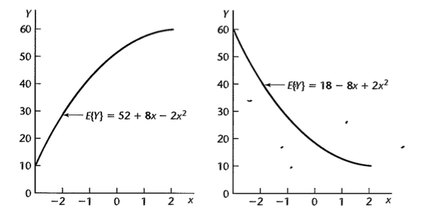
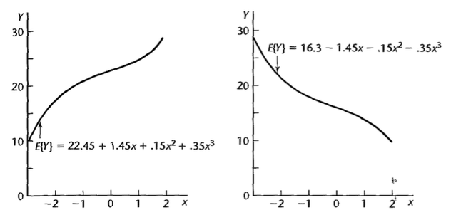
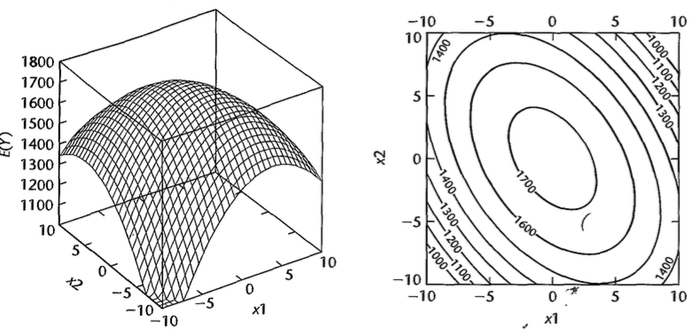
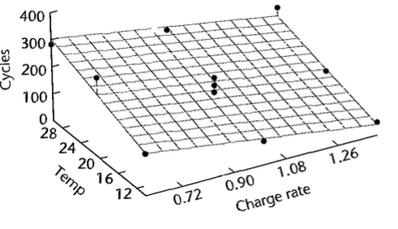
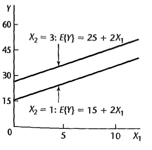
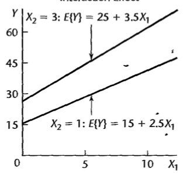

# Modelo de Regressão Polinomial

## Introdução {.build}

Podemos considerar funções polinomiais como um caso particular do modelo de regressão linear já visto.

## Modelo com um preditor - segunda ordem {.build}

$$Y=\beta_0+\beta_1X_*+\beta_2X_*^2+\varepsilon$$

em que $X_*=X-\bar{X}$.

Função de resposta quadrática.

$\beta_0$: valor esperado de $Y$ quando $X_*$ é zero, isto é, $X=\bar{X}$.

$\beta_1$: coeficiente de efeito linear.

$\beta_2$: coeficiente de efeito quadrático.


## Exemplo

<center>

</center>


## Modelo com um preditor - terceira ordem {.build}

$$Y=\beta_0+\beta_1X_*+\beta_2X_*^2+\beta_3X_*^3+\varepsilon$$

em que $X_*=X-\bar{X}$.

Exemplos:

<center>

</center>

## Modelo com dois preditores - segunda ordem {.build}


$$Y=\beta_0+\beta_1X_{1*}+\beta_2X_{1*}^2+\beta_3X_{2*}+\beta_4X_{2*}^2+\beta_5X_{1*}X_{2*}\varepsilon$$

em que $X_{1*}=X_1-\bar{X}_1$ e $X_{2*}=X_2-\bar{X}_2$.


## Exemplo

$$E(Y)=1740-4X_{1*}^2-3X_{2*}^2-3X_{1*}X_{2*}$$


<center>

</center>

## Método hierárquico de ajuste de modelo {.build}

Pode-se começar com um modelo de segunda ou terceira ordem e ir testando se os coeficientes de ordem maiores são significativos.

Por exemplo:

$$Y=\beta_0+\beta_1X_{*}+\beta_2X_*^3+\beta_3X_*^3+\varepsilon$$

Para testar se $\beta_3=0$ podemos utilizar $SQReg(X_*^3\mid X_*,X_*^2)$. Se quisermos testar se $\beta_2=\beta_3=0$: $SQReg(X_*^2,X_*^3\mid X_*)=SQReg(X_*^2\mid X_*)+SQReg(X_*^3\mid X_*, X_*^2)$

Se um termo de ordem mais alta é mantido no modelo, os de ordem mais baixa devem obrigatoriamente ser mantidos também.

## Exemplo

$Y$: número de ciclos

$X_1$: carga, $X_{1*}=(X_1-\bar{X}_1)/0.4$.

$X_2$: temperatura, $X_{2*}=(X_2-\bar{X}_2)/10$.

```{r,echo=TRUE}
dados <- read.table("./dados/CH08TA01.txt")
names(dados) <- c("Y","X1","X2")
dados$x1 <- (dados$X1-mean(dados$X1))/0.4 
dados$x2 <- (dados$X2-mean(dados$X2))/10
```

```{r,echo=FALSE}
dados
```

## Exemplo {.build}

```{r,echo=FALSE}
cor1 <- cor(dados$X1,dados$X1^2)
cor2 <- cor(dados$X2,dados$X2^2)
cor1a <- cor(dados$x1,dados$x1^2)
cor2a <- cor(dados$x2,dados$x2^2)
```

Correlação entre $X_1$ e $X_1^2$: `r round(cor1,2)`.

Correlação entre $X_{1*}$ e $X_{1*}^2$: `r round(cor1a,2)`.

Correlação entre $X_2$ e $X_2^2$: `r round(cor2,2)`.

Correlação entre $X_{2*}$ e $X_{2*}^2$: `r round(cor2a,2)`.

## Exemplo


$$Y=\beta_0+\beta_1X_{1*}+\beta_2X_{2*}+\beta_3X_{1*}^2+\beta_4X_{2*}^2+\beta_5X_{1*}X_{2*}+\varepsilon$$


```{r,echo=TRUE}
modelo <- lm(Y ~ x1 + x2 + I(x1^2) + I(x2^2) + I(x1*x2),data=dados)
summary(modelo)$coef
```


## Exemplo

```{r,echo=FALSE,fig.align='center',fig.width=5.5,fig.height=5.5,message=FALSE,warning=FALSE}
library(latex2exp)
plot(y=resid(modelo),x=fitted(modelo),xlab=TeX('$\\hat{Y}$'),ylab=TeX('$Y-\\hat{Y}$'))
```

## Exemplo

```{r,echo=FALSE,fig.align='center',fig.width=5,fig.height=5}
qqnorm(resid(modelo),xlab="Quantis teóricos",ylab="Quantis amostrais",main=" ")
```

## Exemplo {.smaller}


```{r,echo=TRUE,warning=FALSE,message=FALSE}
library(alr3)
pureErrorAnova(modelo)
```

Não rejeitamos $H_0$, isto é, não encontramos evidências para rejeitar que o modelo de segunda ordem é um bom ajuste

## Exemplo {.build .smaller}

Será que um modelo de primeira ordem já seria suficiente?

$$Y=\beta_0+\beta_1X_{1*}+\beta_2X_{2*}+\beta_3X_{1*}^2+\beta_4X_{2*}^2+\beta_5X_{1*}X_{2*}+\varepsilon$$


$H_0$: $\beta_3=\beta_4=\beta_5=0$.

$H_a$: pelo menos um entre $\beta_3, \beta_4$ e $\beta_5$ é diferente de zero.

```{r,echo=FALSE}
anova(modelo)
```

## Exemplo

* $H_0$: $\beta_q=\beta_{q+1}=\ldots=\beta_{p-1}=0$.

* $H_1$: pelo menos um $\beta_q,\ldots,\beta_{p-1}$ não é zero.

(por conveniência, a notação assume que os últimos $p-q$ coeficientes do modelo serão testados)

Estatística do teste:

$$\begin{eqnarray}
F^*&=&\frac{SQReg(X_q,\ldots, X_{p-1}\mid X_1,\ldots,X_{q-1})}{p-q}\div\frac{SQE(X_1,\ldots,X_{p-1})}{n-p}\\
&\overset{\mbox{sob $H_0$}}{\sim}&F_{p-q,n-p}
\end{eqnarray}$$


## Exemplo {.build .smaller}

$p=`r length(coef(modelo))`$

$n = `r dim(dados)[1]`$

$q=3$

$$F^*=\frac{SQReg(X_{1*}^2,X_{2*}^2,X_{1*}X_{2*}\mid X_{1*},X_{2*})/`r length(coef(modelo))-3`}{SQE(X_{1*},X_{2*},X_{1*}^2,X_{2*}^2,X_{1*}X_{2*})/`r dim(dados)[1]-length(coef(modelo))`}\overset{\mbox{sob $H_0$}}{\sim}F_{`r length(coef(modelo))-3`,`r dim(dados)[1]-length(coef(modelo))`}$$


$$\begin{eqnarray}
SQReg(X_{1*}^2,X_{2*}^2,X_{1*}X_{2*}\mid X_{1*},X_{2*}) &=& SQReg(X_{1*}^2\mid X_{1*},X_{2*})\\
&+& SQReg(X_{2*}^2\mid X_{1*},X_{2*},X_{1*}^2)\\
&+&SQReg(X_{1*}X_{2*}\mid X_{1*},X_{2*},X_{1*}^2,X_{2*}^2)\\
&=&`r round(anova(modelo)[3,2],1)` + `r round(anova(modelo)[4,2],1)` +`r anova(modelo)[5,2]`\\
&=& `r round(anova(modelo)[3,2],1) + round(anova(modelo)[4,2],1) + anova(modelo)[5,2]`
\end{eqnarray}$$

$$F_{obs}=\frac{`r round(anova(modelo)[3,2],1) + round(anova(modelo)[4,2],1) + anova(modelo)[5,2]`/`r length(coef(modelo))-3`}{`r round(anova(modelo)[6,3],1)`}=`r ((round(anova(modelo)[3,2],1) + round(anova(modelo)[4,2],1) + anova(modelo)[5,2])/(length(coef(modelo))-3))/ round(anova(modelo)[6,3],1)`$$

Comparando com $F(0.95;`r length(coef(modelo))-3`,`r dim(dados)[1]-length(coef(modelo))`)=`r round(qf(.95,df1=length(coef(modelo))-3,df2=dim(dados)[1]-length(coef(modelo))),2)`$, não encontramos evidências contra a hipótese nula.


## Exemplo

```{r,echo=TRUE}
modeloreduz <- lm(Y ~ x1 + x2,data=dados)
anova(modeloreduz,modelo)
```

## Exemplo {.build}

Modelo de primeira ordem:

$$Y=\beta_0+\beta_1X_{1*}+\beta_2X_{2*}+\varepsilon$$

```{r,echo=TRUE}
modelo1 <- lm(Y ~ x1 + x2,data=dados)
summary(modelo1)$coef
```

## Exemplo {.build}

Modelo de primeira ordem (variáveis nas escalas originais):


$$Y=\beta_0+\beta_1X_{1}+\beta_2X_{2}+\varepsilon$$

```{r,echo=TRUE}
modelo1 <- lm(Y ~ X1 + X2,data=dados)
summary(modelo1)$coef
```

## Exemplo


<center>

</center>


# Modelo de Regressão com Interação

## Efeitos de interação {.build}

Um modelo de regressão com $p-1$ variáveis preditoras com efeitos aditivos tem função de regressão da forma:

$$E(Y)=f_1(X_1)+f_2(X_2)+\ldots+f_{p-1}(X_{p-1})$$

em que $f_1,f_2,\ldots,f_{p-1}$ podem ser quaisquer funções.

Por exemplo:

$$E(Y)=\underbrace{\beta_0+\beta_1X_1+\beta_2X_1^2}_{f_1(X_1)}+\underbrace{\beta_3X_2}_{f_2(X_2)}$$

O efeito de $X_1$ e $X_2$ em $Y$ é **aditivo**.

## Efeitos de interação {.build}

Já no exemplo a seguir, o efeito não é aditivo, há efeito de interação:


$$E(Y)=\beta_0+\beta_1X_1+\beta_2X_1^2+\beta_3X_2+\beta_3X_1X_2$$


Ou exemplo:

$$E(Y)=\beta_0+\beta_1X_1+\beta_2X_2+\beta_3X_3+\beta_4X_1X_2+\beta_5X_1X_3$$

O efeito de uma variável sobre $Y$ irá depender do nível da variável com a qual ela interage.

## Interpretação: interação e efeitos lineares {.build}

$$Y=\beta_0+\beta_1X_1+\beta_2X_2+\beta_3X_1X_2+\varepsilon$$

Suponha que $X_1=a$:

$$E(Y)=\beta_0+\beta_1a+\beta_2X_2+\beta_3aX_2$$

Suponha que $X_1=a+1$:

$$E(Y)=\beta_0+\beta_1(a+1)+\beta_2X_2+\beta_3(a+1)X_2$$

Diferença no valor esperado de $Y$ quando aumentamos $X_1$ em 1 unidade:

$$\beta_0+\beta_1(a+1)+\beta_2X_2+\beta_3(a+1)X_2 - (\beta_0+\beta_1a+\beta_2X_2+\beta_3aX_2)$$

$$=\beta_1+\beta_3X_2$$

## Interpretação: interação e efeitos lineares {.build}

$$Y=\beta_0+\beta_1X_1+\beta_2X_2+\beta_3X_1X_2+\varepsilon$$

Suponha que $X_2=a$:

$$E(Y)=\beta_0+\beta_1X_1+\beta_2a+\beta_3X_1a$$

Suponha que $X_2=a+1$:

$$E(Y)=\beta_0+\beta_1X_1+\beta_2(a+1)+\beta_3X_1(a+1)$$

Diferença no valor esperado de $Y$ quando aumentamos $X_2$ em 1 unidade:

$$\beta_0+\beta_1X_1+\beta_2(a+1)+\beta_3X_1(a+1) - (\beta_0+\beta_1X_1+\beta_2a+\beta_3X_1a)$$

$$=\beta_2+\beta_3X_1$$

## Interpretação: interação e efeitos lineares {.build}

$$Y=\beta_0+\beta_1X_1+\beta_2X_2+\beta_3X_1X_2+\varepsilon$$

Diferença no valor esperado de $Y$ quando aumentamos $X_1$ em 1 unidade:

$$\frac{\partial E(Y)}{\partial X_1}=\beta_1+\beta_3X_2$$

Diferença no valor esperado de $Y$ quando aumentamos $X_2$ em 1 unidade:

$$\frac{\partial E(Y)}{\partial X_2}=\beta_2+\beta_3X_1$$


## Interpretação: interação e efeitos lineares {.build}

Modelo aditivo:

$$E(Y)=10+2X_1+5X_2$$

$\beta_1$: mudança no valor esperado de $Y$ quando $X_1$ aumenta em 1 unidade, mantendo $X_2$ constante.

<center>

</center>

Mantendo $X_2$ constante: não importa se $X_2=1$ ou $X_2=3$ o efeito é sempre $\beta_1$ no valor esperado quando $X_1$ aumenta em 1 unidade (retas paralelas).

## Interpretação: interação e efeitos lineares {.build}

Modelo com interação:

$$E(Y)=10+2X_1+5X_2 +0.5X_1X_2$$

Se $X_2=1$:

$$E(Y)=10+2X_1+5\times1 +0.5X_1\times 1=15+2.5X_1$$

Se $X_2=3$:

$$E(Y)=10+2X_1+5\times3 +0.5X_1\times 3=25+3.5X_1$$

## Interpretação: interação e efeitos lineares {.build}

Para avaliarmos o efeito de 1 unidade de aumento em $X_1$, devemos considerar o valor de $X_2$ (retas não paralelas).

<center>

</center>

## Interpretação: interação e efeitos curvilinear {.build}


## Leitura

* Applied Linear Statistical Models: Seções 8.1-8.2.

* Faraway - [Linear Models with R](http://www.maths.bath.ac.uk/~jjf23/LMR/): Seção .

* Draper & Smith - [Applied Regression Analysis](http://onlinelibrary.wiley.com/book/10.1002/9781118625590): Capítulo 12.


