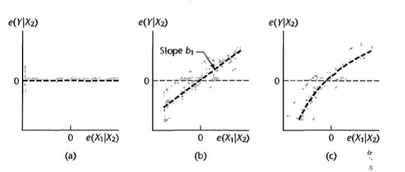
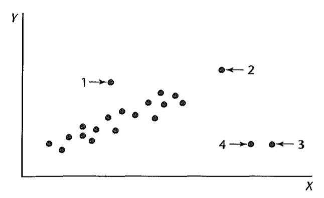
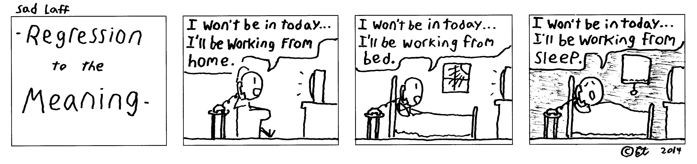

# Gráficos de Regressão Parcial


## Introdução

Vimos anteriormente:

* Gráfico dos resíduos versus variável preditora: podemos usar para checar presença de curvatura.

* Gráfico dos resíduos versus variável preditora não inclusa no modelo: decidir se deve ser incluída.

Problema: estes gráficos não mostram o efeito marginal de uma variável, dado que as demais já estão no modelo.

## Gráfico de regressão parcial

*Added-variable plots* ou *adjusted variable plots* fornecem informação sobre a importância marginal de $X_k$, considerando as demais variáveis já incluídas no modelo.

Para o efeito marginal de $X_k$, consideramos os resíduos da regressão de $Y$ nas demais variáveis e os resíduos da regressão de $X_k$ nas demais variáveis. 

O gráfico destes dois resíduos mostra a importância marginal de $X_k$ na redução da variabilidade do resíduo. E também pode fornecer informação sobre a natureza da relação marginal de $X_k$ com $Y$.


## Exemplo

Considere uma regressão múltipla de primeira ordem com duas variáveis preditoras: $X_1$ e $X_2$.

Queremos estudar o efeito de $X_1$, dado que $X_2$ já está no modelo.

* Fazemos a regressão $Y$ em $X_2$ e obtemos os resíduos: $e(Y\mid X_2)$.

* Fazemos a regressão de $X_1$ em $X_2$ e obtemos os resíduos: $e(X_1\mid X_2)$.

* Fazemos o gráfico de $e(Y\mid X_2)$ versus $e(X_1\mid X_2)$.

## Exemplo


<center>

</center>

## Exemplo: Salário de gerentes

Para cada gerente: média salarial anual nos últimos 2 anos ($X_1$), medida de aversão a risco ($X_2$) e valor do seguro de vida ($Y$).


```{r,echo=FALSE,fig.align='center',fig.height=4,fig.width=4}
dados <- read.table("dados/CH10TA01.txt")
names(dados) <- c("X1","X2","Y")
panel.cor <- function(x, y, digits=2, prefix="", cex.cor, ...)
{
    usr <- par("usr"); on.exit(par(usr))
    par(usr = c(0, 1, 0, 1))
    r <- abs(cor(x, y))
    txt <- format(c(r, 0.123456789), digits=digits)[1]
    txt <- paste(prefix, txt, sep="")
    if(missing(cex.cor)) cex.cor <- 0.8/strwidth(txt)
    text(0.5, 0.5, txt)
}
pairs(dados,upper.panel=panel.cor,lower.panel=panel.smooth)
```

## Exemplo: Salário de gerentes {.smaller}

```{r,echo=FALSE}
library(knitr)
modelo <- lm(Y ~ X1 + X2, data=dados)
kable(summary(modelo)$coef,col.names = c("Estimativa","Erro-Padrão","t","valor de p"))
```


```{r,echo=FALSE,fig.align='center',fig.height=3.5,fig.width=4,warning=FALSE,message=FALSE}
library(latex2exp)
plot(y=resid(modelo),x=dados$X1,ylab=TeX('$Y-\\hat{Y}$'),xlab=TeX('$X_1$'))
```

## Exemplo: Salário de gerentes {.smaller}

```{r,echo=TRUE}
modelo1 <- lm(Y ~ X2, data=dados)
y_x2 <- resid(modelo1)
modelo2 <- lm(X1 ~ X2, data=dados)
x1_x2 <- resid(modelo2)
```

```{r,echo=FALSE,fig.align='center',fig.height=3.5,fig.width=4,warning=FALSE,message=FALSE}
plot(y=y_x2,x=x1_x2,ylab=TeX('$e(Y| X_2)$'),xlab=TeX('$e(X_1| X_2)$'))
```


# *Outliers*

## Introdução


<center>

</center>


# *Outliers* em $Y$

## Resíduo Semi-studentizado

$$e_i^*=\frac{Y_i-\hat{Y}_i}{\sqrt{QME}}$$

Para $n$ grande, quando $|e_i^*|>4$ considera-se a $i$-ésima observação como *outlier*.

## Exemplo - Gordura corporal {.smaller}

```{r,echo=TRUE}
dat = read.table('./dados/fat.txt')
colnames(dat) <- c("X1","X2","X3","Y")
X1 = dat[,1]
X2 = dat[,2]
X3 = dat[,3]
Y = dat[,4]
modelo1 <- lm(Y ~ X1 + X2,data=dat)
rstandard(modelo1)
```


## Matriz "chapéu" {.build .smaller}

$$\mathbf{H}_{n\times n} = \mathbf{X}(\mathbf{X}^T\mathbf{X})^{-1}\mathbf{X}^T$$

$$\hat{\mathbf{Y}}=\mathbf{H}\mathbf{Y}$$

$$\mathbf{e}=(\mathbf{I}-\mathbf{H})\mathbf{Y}$$

$$Var(\mathbf{e})=\sigma^2(\mathbf{I}-\mathbf{H})$$

$$Var(e_i)=\sigma^2(1-h_{ii})$$

$$h_{ii}=\mathbf{X}_i^T(\mathbf{X}^T\mathbf{X})^{-1}\mathbf{X}_i$$

$$\mathbf{X_i}_{p\times 1}=\left(
\begin{array}{c}
1\\
X_{i,1}\\
\vdots\\
X_{i,p-1}
\end{array}
\right)
$$

$$Cov(e_i,e_j)=-h_{ij}\sigma^2\quad\quad i\neq j$$


## Resíduo Studentizado

$$\widehat{Var(e_i)}=QME(1-h_{ii})$$

$$\widehat{Cov(e_i,e_j)}=-h_{ij}QME\quad\quad i\neq j$$

Resíduo studentizado:

$$r_i=\frac{e_i}{\sqrt{QME(1-h_{ii})}}$$

## Resíduo Studentizado com observação excluída

Se uma observação é muito discrepante, ela pode influenciar no ajuste.

Procedimento:

* excluir a $i$-ésima observação

* ajustar o modelo com as $n-1$ observações restantes

* obter $\hat{Y}_{i(i)}$: o valor predito para a $i$-ésima observação quando esta foi excluída no ajuste do modelo.


$$d_i=Y_i-\hat{Y}_{i(i)}=\frac{e_i}{1-h_{ii}}$$

Obs: quanto maior $h_{ii}$, maior será $d_i$, em comparação com $e_i$.

## Resíduo Studentizado com observação excluída


$$\widehat{Var(d_i)}=QME_{(i)}(1+ \mathbf{X}_i^T (\mathbf{X}_{(i)}^T\mathbf{X}_{(i)})^{-1}\mathbf{X}_i)=\frac{QME_{(i)}}{1-h_{ii}}$$

**Resíduo Studentizado com observação excluída**

$$t_i=\frac{d_i}{\sqrt{\widehat{Var(d_i)}}}\sim t_{n-p-1}$$

podemos calcular $t_i$ sem de fato fazer ajustes separados para cada observação excluída:

$$t_i=e_i\left[ \frac{n-p-1}{SQE(1-h_{ii}-e_i^2)}\right]^{1/2}$$

## Resíduo Studentizado com observação excluída

A observação $i$ é um *outlier* se $|t_i|> t_{n-p-1}(1-\alpha/2n)$, utilizando Bonferroni.
 
 

## Exemplo - Gordura corporal {.smaller}

```{r,echo=TRUE}
e <- resid(modelo1)
h <- hatvalues(modelo1)
t <- rstudent(modelo1)
round(data.frame("e"=e,"h"=h,"t"=t),3)
```

## Exemplo - Gordura corporal {.smaller}

```{r,echo=TRUE}
alpha=0.10
n = dim(dat)[1]
p = length(coefficients(modelo1))
t_c <- qt(1-alpha/(2*n),df=n-p-1)
```

Se $|t_i|> `r round(t_c,2)`$, então $i$ é observação *outlier*.


# *Outliers* em $X$

## Matriz "chapéu"

* $0\leq h_{ii}\leq 1$

* $\sum_{i=1}^nh_{ii}=p$, lembrando que $p$ é o número de parâmetros no modelo, incluindo o intercepto.

* Alavanca (*leverage*): $h_{ii}$ mede a distância entre os valores de $X$ da $i$-ésima observação e os valores médios de $X$ para as $n$ observações.

## Exemplo

```{r,echo=TRUE}
X1 <- c(14,19,12,11)
X2 <- c(25,32,22,15)
Y <- c(301,327,246,187)
Xmatriz <- matrix(cbind(rep(1,length(X1)),X1,X2),ncol=3)
H <- Xmatriz %*% solve(t(Xmatriz)%*%Xmatriz) %*% t(Xmatriz)
hii <- diag(H)
cbind(X1,X2,hii)
```


## Exemplo

```{r,echo=FALSE,fig.align='center',fig.height=5,fig.width=5}
h <- c("h11=","h22=","h33=","h44=")
plot(x=X1,y=X2,xlim=c(10,20),ylim=c(10,35))
points(x=mean(X1),y=mean(X2),col="red")
text(x=X1,y=X2,labels=paste0(h,round(hii,3)),pos=3)
```

## Matriz "chapéu" {.build}

$\hat{\mathbf{Y}}=\mathbf{H}\mathbf{Y}$, portanto cada $\hat{Y}_i$ é uma combinação linear de todos os valores de $Y$ e o peso de cada $Y_i$ para o valor ajustado $\hat{Y}_i$ depende de $h_{ii}$.

Quanto maior $h_{ii}$, maior o peso de $Y_i$ em $\hat{Y}_i$.

$h_{ii}$ é uma função que depende apenas dos valores de $X$, portanto, mede o papel dos valores de $X$ na determinação da importância de cada $Y_i$ no valor ajustado $\hat{Y}_i$.

Quanto maior $h_{ii}$, menor a variância de $e_i$. Desta forma, quanto maior $h_{ii}$, mais próximo $\hat{Y}_i$ tenderá a estar de $Y_i$.

## Ponto de alavanca

Um valor alavanca $h_{ii}$ é considerado alto se é duas vezes maior que o valor de alavanca médio, denotado por $\hat{h}$:

$$\bar{h}=\frac{\sum_{i=1}^nh_{ii}}{n}=\frac{p}{n}$$

Desta maneira, observações em que $h_{ii}>2p/n$ são consideradas *outliers* com respeito aos valores de $X$.


## Exemplo - Gordura corporal {.smaller}

```{r,echo=TRUE}
e <- resid(modelo1)
h <- hatvalues(modelo1)
t <- rstudent(modelo1)
round(data.frame("e"=e,"h"=h,"t"=t),3)
```

## Exemplo - Gordura corporal {.smaller}

```{r,echo=FALSE,fig.align='center',fig.height=5,fig.width=5}
p=length(coef(modelo1))
n=dim(dat)[1]
plot(x=dat$X1,y=dat$X2,ylim=c(40,60),xlim=c(10,35),xlab="X1",ylab="X2")
points(x=mean(dat$X1),y=mean(dat$X2),col="red")
points(x=dat$X1[h>2*p/n],y=dat$X2[h>2*p/n],col="green")
text(x=dat$X1,y=dat$X2,labels=1:dim(dat)[1],pos=2,cex=.5)
```

$2p/n = `r 2*p/n`$

# Observações influentes

## *DFFITS*


## Leitura

* Applied Linear Statistical Models: Capítulo 10.

* Faraway - [Linear Models with R](http://www.maths.bath.ac.uk/~jjf23/LMR/): Capítulo 

* Draper & Smith - [Applied Regression Analysis](http://onlinelibrary.wiley.com/book/10.1002/9781118625590): Capítulo 8.

* Caffo - [Regression Models for Data Science in R](https://leanpub.com/regmods): Residuals, variation, diagnostics.


<center>

</center>
